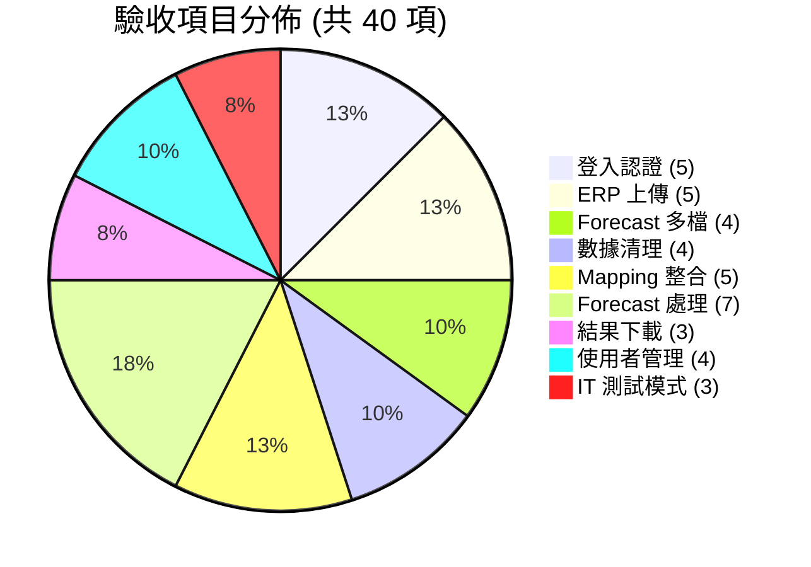
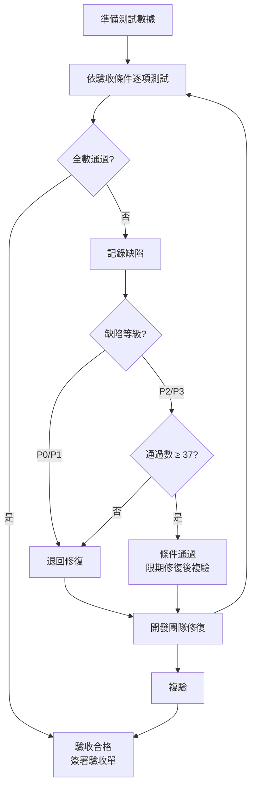

# FORECAST 數據處理系統 — ATDD 驗收測試驅動開發文件

**文件版本**: v1.0
**建立日期**: 2026-02-15
**機密等級**: 客戶文件

---

## 1. 文件說明

本文件列出系統各功能之驗收條件 (Acceptance Criteria)，作為系統交付驗收之依據。每項驗收條件通過即代表該功能符合需求規格。

---

## 2. 驗收項目總覽

---

## 3. 各功能驗收條件

### 3.1 使用者登入與認證

| 編號 | 驗收條件 | 驗證方式 |
|:----:|---------|---------|
| AC-01 | 輸入正確帳密可成功登入並進入主操作頁 | 實際操作 |
| AC-02 | 輸入錯誤密碼顯示「帳號或密碼錯誤」提示 | 實際操作 |
| AC-03 | 僅限授權使用者可登入 | 以非授權帳號嘗試登入 |
| AC-04 | 登入超過 8 小時自動登出 | 等待逾時後操作 |
| AC-05 | 所有登入 / 登出行為皆記錄於活動日誌 | 查看活動日誌頁面 |

### 3.2 ERP 淨需求上傳

| 編號 | 驗收條件 | 驗證方式 |
|:----:|---------|---------|
| AC-06 | 支援 .xls 及 .xlsx 格式上傳 | 分別上傳兩種格式 |
| AC-07 | 系統依客戶模板自動驗證必要欄位 | 上傳有效檔案 |
| AC-08 | 缺少必要欄位時顯示具體缺少的欄位名稱 | 上傳缺欄位的檔案 |
| AC-09 | 上傳的檔案依使用者獨立儲存 | 不同使用者上傳後確認互不可見 |
| AC-10 | 上傳成功/失敗皆記錄至上傳紀錄 | 查看管理後台 |

### 3.3 Forecast 多檔上傳與合併

| 編號 | 驗收條件 | 驗證方式 |
|:----:|---------|---------|
| AC-11 | 支援同時上傳多個 Forecast 檔案 | 上傳 3 個檔案 |
| AC-12 | 合併後資料列數為各檔案之和 | 開啟合併後檔案確認 |
| AC-13 | 合併後保留原始 Excel 格式（含合併儲存格） | 開啟合併後檔案確認格式 |
| AC-14 | 單一檔案可不經合併直接使用 | 上傳 1 個檔案後進入下一步 |

### 3.4 數據清理

| 編號 | 驗收條件 | 驗證方式 |
|:----:|---------|---------|
| AC-15 | 正確清除供應數量相關欄位的舊數據 | 開啟清理後檔案確認 |
| AC-16 | 正確清除庫存數量相關數據 | 開啟清理後檔案確認 |
| AC-17 | 清理後 Excel 格式完整保留（字型、邊框、填色） | 開啟清理後檔案比對格式 |
| AC-18 | 清理結果記錄至處理紀錄 | 查看管理後台 |

### 3.5 Mapping 設定與整合

| 編號 | 驗收條件 | 驗證方式 |
|:----:|---------|---------|
| AC-19 | 可設定區域、排程斷點、ETD、ETA | 在 Mapping 頁面操作 |
| AC-20 | 支援批次儲存多筆 Mapping | 一次編輯多筆後儲存 |
| AC-21 | 相同客戶/區域重複儲存時更新而非新增 | 修改後儲存，確認只有一筆 |
| AC-22 | Mapping 整合後 ERP 檔案含區域/ETD/ETA 欄位 | 開啟整合後 ERP 確認 |
| AC-23 | 不同使用者的 Mapping 設定互不可見 | 切換帳號確認 |

### 3.6 Forecast 預測處理

| 編號 | 驗收條件 | 驗證方式 |
|:----:|---------|---------|
| AC-24 | 系統正確比對客戶/廠區/料號對應至 Forecast 位置 | 開啟結果檔案確認 ETA QTY 位置 |
| AC-25 | 依排程斷點與 ETA 正確計算目標週別 | 以已知數據驗算目標日期 |
| AC-26 | 同一位置多筆數據時數量累加（非覆蓋） | 準備兩筆同位置數據，確認合計值 |
| AC-27 | 已處理的數據重跑時不重複計算 | 連續執行兩次，數值不翻倍 |
| AC-28 | Transit 在途數據同樣填入 Forecast | 確認在途數量出現於 ETA QTY |
| AC-29 | 處理後 ERP 中已分配的記錄標記為「✓」 | 開啟整合後 ERP 確認 |
| AC-30 | 500 筆數據處理時間在合理範圍內（< 5 秒） | 計時測試 |

### 3.7 結果下載

| 編號 | 驗收條件 | 驗證方式 |
|:----:|---------|---------|
| AC-31 | 可下載清理後 Forecast | 點擊下載，開啟確認 |
| AC-32 | 可下載整合後 ERP / Transit / Forecast 結果 | 分別點擊下載 |
| AC-33 | 下載行為記錄至活動日誌 | 查看活動日誌 |

### 3.8 使用者管理

| 編號 | 驗收條件 | 驗證方式 |
|:----:|---------|---------|
| AC-34 | 管理員可新增使用者帳號 | 在管理頁面新增 |
| AC-35 | 管理員可停用使用者帳號，停用後無法登入 | 停用後嘗試登入 |
| AC-36 | 一般使用者無法存取管理頁面 | 以一般帳號嘗試存取 |
| AC-37 | IT/管理員可查看活動日誌 | 存取日誌頁面 |

### 3.9 IT 測試模式

| 編號 | 驗收條件 | 驗證方式 |
|:----:|---------|---------|
| AC-38 | IT 人員可選擇目標客戶進行測試 | 在 IT 儀表板操作 |
| AC-39 | 測試時使用客戶專屬模板驗證 | 上傳檔案觀察驗證行為 |
| AC-40 | 測試結果不影響正式數據 | 確認正式使用者數據未變動 |

---

## 4. 驗收測試追蹤表

| 功能模組 | 驗收項目數 | 通過 | 未通過 | 備註 |
|----------|:--------:|:----:|:-----:|------|
| 登入認證 | 5 | 5 | 0 | 全數通過 |
| ERP 上傳 | 5 | 5 | 0 | 全數通過 |
| Forecast 多檔合併 | 4 | 4 | 0 | 全數通過 |
| 數據清理 | 4 | 4 | 0 | 全數通過 |
| Mapping 整合 | 5 | 5 | 0 | 全數通過 |
| Forecast 處理 | 7 | 7 | 0 | 全數通過 |
| 結果下載 | 3 | 3 | 0 | 全數通過 |
| 使用者管理 | 4 | 4 | 0 | 全數通過 |
| IT 測試模式 | 3 | 3 | 0 | 全數通過 |
| **合計** | **40** | **40** | **0** | **驗收合格** |

---

## 5. 驗收標準

| 等級 | 標準 | 說明 |
|------|------|------|
| **全數通過** | 40/40 驗收項目通過 | 系統驗收合格，交付使用 |
| **條件通過** | ≥ 37/40 通過，且未通過項目無 P0/P1 | 限期修復後複驗 |
| **不通過** | < 37/40 通過，或有 P0/P1 缺陷 | 退回修復後重新驗收 |

### 缺陷等級定義

| 等級 | 定義 | 範例 |
|------|------|------|
| **P0 嚴重** | 系統無法使用或數據錯誤 | 無法登入、Forecast 結果數值計算錯誤 |
| **P1 重要** | 核心功能異常 | 檔案上傳失敗、Mapping 無法儲存 |
| **P2 一般** | 次要功能或介面問題 | 日誌查詢排序異常、提示文字不清 |
| **P3 輕微** | 不影響使用的小問題 | 介面對齊偏差、多餘空白 |

---

## 6. 驗收流程

