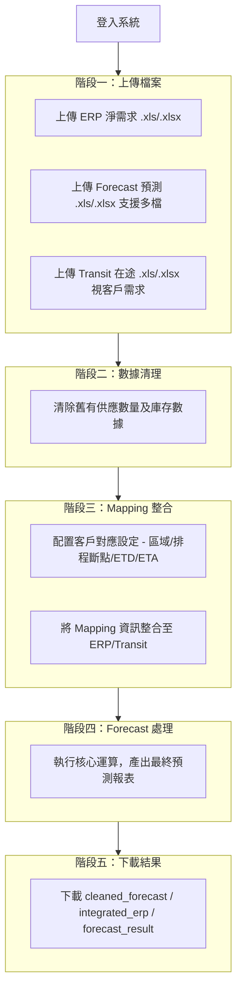

# FORECAST 數據處理系統 — 產品需求文件 (PRD)

**文件版本**: v1.0
**建立日期**: 2026-02-12
**專案名稱**: FORECAST 數據處理系統 (Business Forecasting PC)
**文件狀態**: 初版

---

## 1. 產品概述

### 1.1 產品願景

FORECAST 數據處理系統是一套企業級供應鏈預測數據整合平台，旨在自動化處理 ERP 淨需求、預測預估及在途貨運數據，取代傳統人工 Excel 操作流程，大幅提升數據處理效率與正確性。

### 1.2 產品目標

| 目標 | 說明 |
|------|------|
| 自動化數據整合 | 將 ERP、Forecast、Transit 三類 Excel 數據自動整合為完整預測報表 |
| 降低人工錯誤 | 透過系統化流程取代手動 Excel 操作，減少人為疏失 |
| 多客戶支援 | 支援 Pegatron（和碩）、Quanta（廣達）等不同客戶之特殊邏輯 |
| 稽核追蹤 | 完整記錄所有操作行為，供事後查核 |
| 效能優化 | 大量數據批次處理，支援 50,000+ 筆資料 |

### 1.3 目標使用者

| 角色 | 說明 | 權限範圍 |
|------|------|----------|
| **一般使用者 (User)** | 日常操作人員，負責上傳檔案並執行數據處理流程 | 僅限自身公司數據操作 |
| **IT 人員 (IT)** | 測試與維護人員，驗證系統功能與客戶模板正確性 | 測試模式、日誌查看、使用者管理 |
| **管理員 (Admin)** | 系統管理者，管理使用者帳號及全域設定 | 完整系統存取權限 |

---

## 2. 功能需求

### 2.1 使用者認證與授權

#### FR-001：使用者登入
- **描述**: 使用者以帳號密碼登入系統
- **驗收條件**:
  - 支援 MySQL 資料庫帳號驗證
  - 密碼以加鹽雜湊 (salted hash) 儲存
  - Session 逾時時間為 8 小時
  - 登入限制為 Pegatron 使用者

#### FR-002：角色權限控制
- **描述**: 依據使用者角色（Admin / IT / User）限制功能存取
- **驗收條件**:
  - Admin 可存取所有功能
  - IT 可存取測試模式、日誌、使用者管理
  - User 僅可操作自身公司數據
  - 未登入使用者自動導向登入頁

#### FR-003：活動日誌記錄
- **描述**: 系統自動記錄所有使用者操作行為
- **驗收條件**:
  - 記錄 20+ 種操作類型（登入、登出、上傳、處理等）
  - 包含 IP 位址與 User Agent 資訊
  - 支援依時間、使用者、操作類型查詢

---

### 2.2 檔案上傳模組

#### FR-010：ERP 淨需求上傳
- **描述**: 使用者上傳 ERP 淨需求 Excel 檔案
- **驗收條件**:
  - 支援 .xls 及 .xlsx 格式
  - 依客戶專屬模板進行格式驗證
  - 驗證失敗顯示明確錯誤訊息
  - 上傳成功後存入使用者專屬目錄 (`uploads/{user_id}/{timestamp}/`)

#### FR-011：Forecast 預測上傳
- **描述**: 使用者上傳 Forecast 預測 Excel 檔案
- **驗收條件**:
  - 支援單一或多檔案上傳
  - 多檔案自動合併（保留合併儲存格格式）
  - 依客戶模板進行格式驗證

#### FR-012：Transit 在途上傳
- **描述**: 使用者上傳 Transit 在途貨運 Excel 檔案
- **驗收條件**:
  - 部分客戶為必要上傳（如 Pegatron），部分為選填
  - 依客戶模板進行格式驗證
  - Pegatron 客戶須依廠區/區域檢查是否需要 Transit

---

### 2.3 數據處理流程

#### FR-020：Forecast 數據清理
- **描述**: 處理前清除舊有預測數據
- **驗收條件**:
  - K 欄為「供應數量」時，清除 L~AW 欄位數據
  - I 欄包含「庫存數量」時，清除下一行 I 欄數據
  - 保留 Excel 原有格式

#### FR-021：ERP Mapping 整合
- **描述**: 將 ERP 數據與客戶 Mapping 設定整合
- **驗收條件**:
  - 讀取使用者的客戶對應設定（區域、排程斷點、ETD、ETA）
  - 將 Mapping 欄位寫入 ERP 及 Transit 檔案
  - 支援 JSON + Excel 雙格式儲存

#### FR-022：Forecast 預測處理
- **描述**: 核心預測運算——將 ERP/Transit 數據對應至 Forecast 週報結構
- **驗收條件**:
  - 依據 ETA 及排程斷點計算目標日期
  - 將數量填入 Forecast 對應之「ETA QTY」列
  - 支援數量累加邏輯（不覆蓋既有數據）
  - 分配追蹤機制（標記「已分配」防止重複處理）
  - Pegatron：基於廠區 (Plant) 的區域比對
  - 支援「本週」「下週」「下下週」等 ETA 文字解析

---

### 2.4 客戶 Mapping 管理

#### FR-030：Mapping 設定介面
- **描述**: 使用者配置客戶名稱與區域的對應關係
- **驗收條件**:
  - 視覺化表格編輯介面
  - 可設定：區域 (Region)、排程斷點 (Schedule Breakpoint)、ETD、ETA
  - 支援單筆及批次儲存
  - 每位使用者維護獨立 Mapping 設定

#### FR-031：Mapping 查看（管理員）
- **描述**: 管理員可查看所有使用者的 Mapping 設定
- **驗收條件**:
  - 以使用者為單位分組顯示
  - 支援篩選與搜尋

---

### 2.5 結果下載

#### FR-040：處理結果下載
- **描述**: 使用者下載處理完成的 Excel 檔案
- **驗收條件**:
  - 提供下列檔案下載：
    - `cleaned_forecast.xlsx`（清理後數據）
    - `integrated_erp.xlsx`（整合 Mapping 後 ERP）
    - `integrated_transit.xlsx`（整合 Mapping 後 Transit，選填）
    - `forecast_result.xlsx`（最終處理結果）
  - 檔案保留期限 30 天

---

### 2.6 管理功能

#### FR-050：使用者管理
- **描述**: 管理員管理系統使用者帳號
- **驗收條件**:
  - 新增 / 編輯 / 停用使用者帳號
  - 設定角色（Admin / IT / User）
  - 設定所屬公司
  - 記錄最後登入時間

#### FR-051：IT 測試模式
- **描述**: IT 人員可模擬特定客戶進行測試
- **驗收條件**:
  - 可選擇目標客戶進行測試
  - 使用客戶專屬模板驗證
  - 測試結果存入 IT 使用者目錄

#### FR-052：處理規則管理
- **描述**: 管理可配置的數據處理規則
- **驗收條件**:
  - 按規則類別分類（上傳、清理、Mapping、ERP、Transit、Forecast、輸出）
  - 支援啟用/停用個別規則
  - 規則設定以 JSON 格式儲存

---

## 3. 非功能性需求

### 3.1 效能需求

| 項目 | 規格 |
|------|------|
| 單檔案上傳上限 | 50 MB |
| 資料處理量 | 支援 50,000+ 筆記錄 |
| 處理效能 | 批次處理引擎較傳統方式提升 20 倍 |
| Session 逾時 | 8 小時 |

### 3.2 相容性需求

| 項目 | 規格 |
|------|------|
| 瀏覽器 | Microsoft Edge（系統偵測並阻擋 Chrome） |
| 檔案格式 | .xls / .xlsx |
| 作業系統 | Windows / Linux 部署支援 |
| 字元集 | UTF-8（utf8mb4），完整繁體中文支援 |

### 3.3 安全性需求

| 項目 | 說明 |
|------|------|
| 密碼儲存 | 加鹽雜湊 (SHA-256) |
| Session 管理 | Flask Session，8 小時逾時自動登出 |
| 檔案隔離 | 各使用者獨立目錄，互不可存取 |
| 操作稽核 | 所有關鍵操作皆記錄至活動日誌 |
| 環境變數 | 敏感設定（資料庫密碼、金鑰）由 .env 管理 |

### 3.4 可用性需求

| 項目 | 說明 |
|------|------|
| 語言 | 繁體中文介面 |
| 流程引導 | 五階段步驟式操作流程 |
| 錯誤提示 | 檔案驗證失敗時顯示明確錯誤訊息 |
| 響應式設計 | 支援不同螢幕尺寸 |

---

## 4. 客戶特殊邏輯

### 4.1 Pegatron（和碩）

| 特性 | 說明 |
|------|------|
| 廠區比對 | Forecast F 欄之 Plant 欄位用於區域比對（如 "3A32"） |
| MRP ID | Forecast G 欄之 MRP ID 用於數據比對 |
| Transit 必要性 | 依廠區/區域判斷是否需上傳 Transit |
| 區域 Mapping | 基於廠區代碼的區域對應邏輯 |

### 4.2 Quanta（廣達）

| 特性 | 說明 |
|------|------|
| 多檔合併 | 支援多個 Forecast 檔案合併上傳 |
| 簡化比對 | 基於區域的簡單比對邏輯 |
| Transit 選填 | 所有 Transit 檔案皆為選填 |

---

## 5. 使用者操作流程

---

## 6. 未來擴展方向

| 方向 | 說明 |
|------|------|
| 多客戶擴展 | 支援更多客戶的特殊處理邏輯 |
| 自動排程 | 定時自動執行預測處理流程 |
| 數據視覺化 | Dashboard 呈現預測趨勢與統計 |
| API 整合 | 與 ERP 系統直接對接，免除手動上傳 |
| 多語系支援 | 新增英文介面 |
| 跨瀏覽器支援 | 移除 Chrome 限制，全面支援主流瀏覽器 |

---

## 7. 術語表

| 術語 | 說明 |
|------|------|
| ERP 淨需求 | 企業資源規劃系統產出之淨需求數據 |
| Forecast | 預測預估報表，以週為單位之預測數據結構 |
| Transit | 在途貨運數據，記錄已出貨但未到達之貨物 |
| Mapping | 客戶名稱與區域、交期之對應關係設定 |
| Schedule Breakpoint | 排程斷點，以週中某日為分界計算交期 |
| ETD (Estimated Time of Departure) | 預計出發日 |
| ETA (Estimated Time of Arrival) | 預計到達日 |
| ETA QTY | Forecast 中記錄預計到貨數量之列 |
| Plant | 廠區代碼，用於 Pegatron 之區域比對 |
| MRP ID | 物料需求規劃識別碼 |
