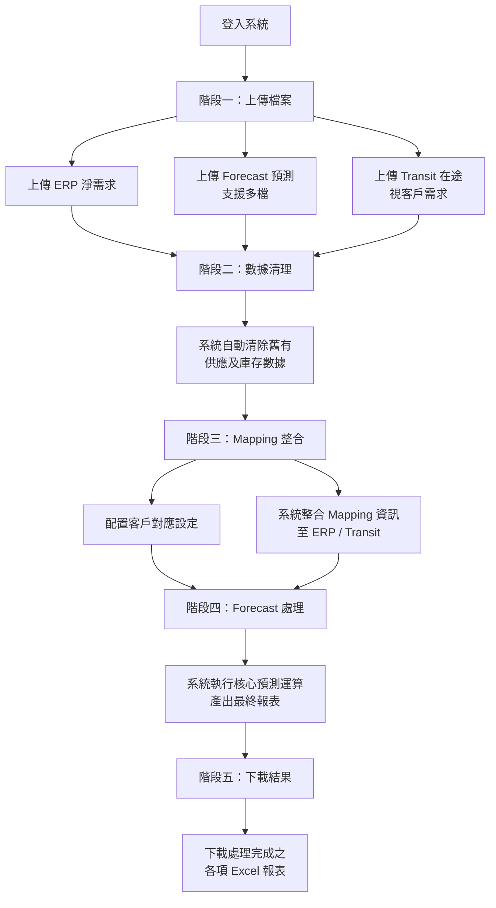

# FORECAST 數據處理系統 — 產品需求文件 (PRD)

**文件版本**: v1.0
**建立日期**: 2026-02-12
**專案名稱**: FORECAST 數據處理系統
**機密等級**: 客戶文件

---

## 1. 產品概述

### 1.1 產品願景

FORECAST 數據處理系統是一套企業級供應鏈預測數據整合平台，旨在自動化處理 ERP 淨需求、預測預估及在途貨運數據，取代傳統人工 Excel 操作流程，大幅提升數據處理效率與正確性。

### 1.2 解決的痛點

| 現有問題 | 系統解決方案 |
|----------|-------------|
| 人工 Excel 操作耗時且易出錯 | 自動化五階段處理流程，減少人為疏失 |
| 多來源數據難以整合 | 統一匯入 ERP、Forecast、Transit 三類數據 |
| 不同客戶邏輯各異，難以標準化 | 內建多客戶處理邏輯，靈活配置 |
| 操作過程無紀錄，難以追溯 | 完整稽核日誌，所有操作皆可追蹤 |
| 大量數據處理效率低落 | 高效能處理引擎，支援大規模數據批次運算 |

### 1.3 產品目標

- **自動化數據整合**：將 ERP、Forecast、Transit 三類 Excel 數據自動整合為完整預測報表
- **降低人工錯誤**：透過系統化流程取代手動操作
- **多客戶支援**：支援不同客戶之特殊處理邏輯與模板
- **完整稽核追蹤**：所有操作行為皆記錄留存
- **高效能運算**：支援 50,000 筆以上資料之批次處理

---

## 2. 目標使用者與角色

| 角色 | 說明 | 主要功能 |
|------|------|----------|
| **一般使用者** | 日常操作人員 | 上傳檔案、執行處理流程、下載結果 |
| **IT 人員** | 測試與維護人員 | 系統測試、日誌查看、使用者管理 |
| **管理員** | 系統管理者 | 使用者帳號管理、全域設定、Mapping 總覽 |

---

## 3. 功能需求

### 3.1 使用者認證與權限管理

| 功能 | 說明 |
|------|------|
| 帳號登入 | 使用者以帳號密碼登入系統 |
| 角色權限控制 | 依角色（管理員 / IT / 一般使用者）限制功能存取範圍 |
| Session 管理 | 登入後 Session 有效期限為 8 小時，逾時自動登出 |
| 操作日誌 | 系統自動記錄所有使用者操作（登入、上傳、處理等） |

### 3.2 檔案上傳

| 功能 | 說明 |
|------|------|
| ERP 淨需求上傳 | 上傳 ERP 淨需求 Excel 檔案（.xls / .xlsx） |
| Forecast 預測上傳 | 上傳 Forecast 預測 Excel 檔案，支援多檔上傳與自動合併 |
| Transit 在途上傳 | 上傳 Transit 在途貨運 Excel 檔案（依客戶需求，部分為必要、部分為選填） |
| 格式驗證 | 系統依客戶專屬模板自動驗證檔案格式，驗證失敗顯示明確提示 |

### 3.3 數據處理流程

系統提供五階段步驟式處理流程：

**階段一：檔案上傳**
- 上傳 ERP、Forecast、Transit 三類 Excel 檔案
- 自動格式驗證

**階段二：數據清理**
- 清除舊有預測數據（供應數量、庫存數量相關欄位）
- 保留 Excel 原有格式

**階段三：Mapping 整合**
- 使用者配置客戶對應設定（區域、排程斷點、ETD、ETA）
- 將 Mapping 資訊整合至 ERP 及 Transit 數據

**階段四：Forecast 處理**
- 系統自動將 ERP / Transit 數據對應至 Forecast 週報結構
- 依據 ETA 及排程斷點計算目標日期並填入數量
- 支援數量累加、分配追蹤（防止重複處理）

**階段五：結果下載**
- 下載處理完成之 Excel 報表

### 3.4 客戶 Mapping 管理

| 功能 | 說明 |
|------|------|
| Mapping 設定 | 視覺化表格介面，配置客戶與區域之對應關係 |
| 可設定欄位 | 區域 (Region)、排程斷點、ETD、ETA |
| 獨立配置 | 每位使用者維護獨立的 Mapping 設定 |
| 批次操作 | 支援單筆及批次儲存 |

### 3.5 結果下載

處理完成後，使用者可下載以下報表：

| 檔案 | 說明 |
|------|------|
| 清理後 Forecast | 經數據清理後的 Forecast 報表 |
| 整合後 ERP | 已整合 Mapping 欄位的 ERP 報表 |
| 整合後 Transit | 已整合 Mapping 欄位的 Transit 報表（視客戶需求） |
| Forecast 處理結果 | 最終處理完成之預測報表 |

### 3.6 管理功能

| 功能 | 說明 |
|------|------|
| 使用者管理 | 新增 / 編輯 / 停用使用者帳號，設定角色與所屬公司 |
| IT 測試模式 | IT 人員可模擬特定客戶進行處理流程測試 |
| 活動日誌查詢 | 依時間、使用者、操作類型查詢歷史操作紀錄 |
| 處理規則管理 | 可配置之數據處理規則（依規則類別分類，支援啟用/停用） |
| Mapping 總覽 | 管理員可查看所有使用者的 Mapping 設定 |

---

## 4. 客戶差異化支援

系統內建多客戶差異化處理能力，可依客戶需求調整處理邏輯：

| 能力 | 說明 |
|------|------|
| 客戶專屬模板 | 各客戶可配置獨立的 Excel 格式驗證模板 |
| 差異化比對邏輯 | 支援基於廠區 (Plant) 或區域 (Region) 等不同維度之數據比對 |
| Transit 需求控制 | 可依客戶設定 Transit 為必要或選填 |
| 多檔案合併 | 部分客戶支援多個 Forecast 檔案合併上傳 |
| 擴展性 | 可快速擴展支援新客戶之特殊處理需求 |

---

## 5. 非功能性需求

### 5.1 效能需求

| 項目 | 規格 |
|------|------|
| 資料處理量 | 支援 50,000+ 筆記錄之批次處理 |
| 處理效能 | 高效能處理引擎，大幅優化運算速度 |
| 檔案大小 | 建議單檔上限 50 MB |

### 5.2 相容性

| 項目 | 規格 |
|------|------|
| 瀏覽器 | Microsoft Edge |
| 檔案格式 | .xls / .xlsx |
| 語言 | 繁體中文介面 |

### 5.3 安全性

| 項目 | 說明 |
|------|------|
| 帳號安全 | 密碼加密儲存，不以明文保存 |
| 存取控制 | 角色權限分級管理 |
| 資料隔離 | 各使用者資料獨立隔離，互不可存取 |
| 操作稽核 | 所有關鍵操作皆記錄至稽核日誌 |
| 敏感資訊保護 | 系統金鑰與機敏設定不進入版本控制 |

### 5.4 可用性

| 項目 | 說明 |
|------|------|
| 操作引導 | 五階段步驟式流程，清晰引導使用者操作 |
| 錯誤提示 | 檔案驗證失敗時顯示明確錯誤訊息 |
| 響應式設計 | 支援不同螢幕尺寸 |

---

## 6. 使用者操作流程

---

## 7. 系統畫面概覽

| 頁面 | 說明 |
|------|------|
| 登入頁 | 帳號密碼輸入，進入系統 |
| 主操作頁 | 五階段步驟式操作介面，包含上傳、處理、下載功能 |
| Mapping 設定頁 | 視覺化表格編輯客戶對應關係 |
| 管理員面板 | 系統管理與總覽 |
| IT 儀表板 | 測試模式與系統監控 |
| 使用者管理頁 | 帳號 CRUD 操作 |
| 活動日誌頁 | 歷史操作紀錄查詢 |
| 處理規則頁 | 規則設定與啟停 |

---

## 8. 未來擴展方向

| 方向 | 說明 |
|------|------|
| 更多客戶支援 | 可持續擴展新客戶之差異化處理邏輯 |
| 自動排程 | 定時自動執行預測處理流程 |
| 數據視覺化 | Dashboard 呈現預測趨勢與統計分析 |
| ERP 系統對接 | 與客戶 ERP 系統 API 直接整合，免除手動上傳 |
| 多語系支援 | 新增英文等多語言介面 |

---

## 9. 術語表

| 術語 | 說明 |
|------|------|
| ERP 淨需求 | 企業資源規劃系統產出之淨需求數據 |
| Forecast | 預測預估報表，以週為單位之預測數據結構 |
| Transit | 在途貨運數據，記錄已出貨但未到達之貨物資訊 |
| Mapping | 客戶名稱與區域、交期之對應關係設定 |
| Schedule Breakpoint | 排程斷點，以週中某日為分界計算交期 |
| ETD | 預計出發日 (Estimated Time of Departure) |
| ETA | 預計到達日 (Estimated Time of Arrival) |
