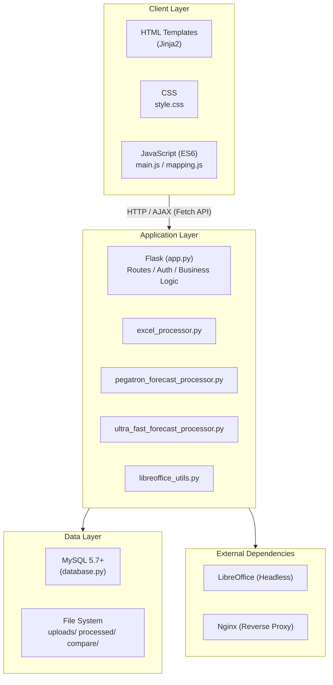
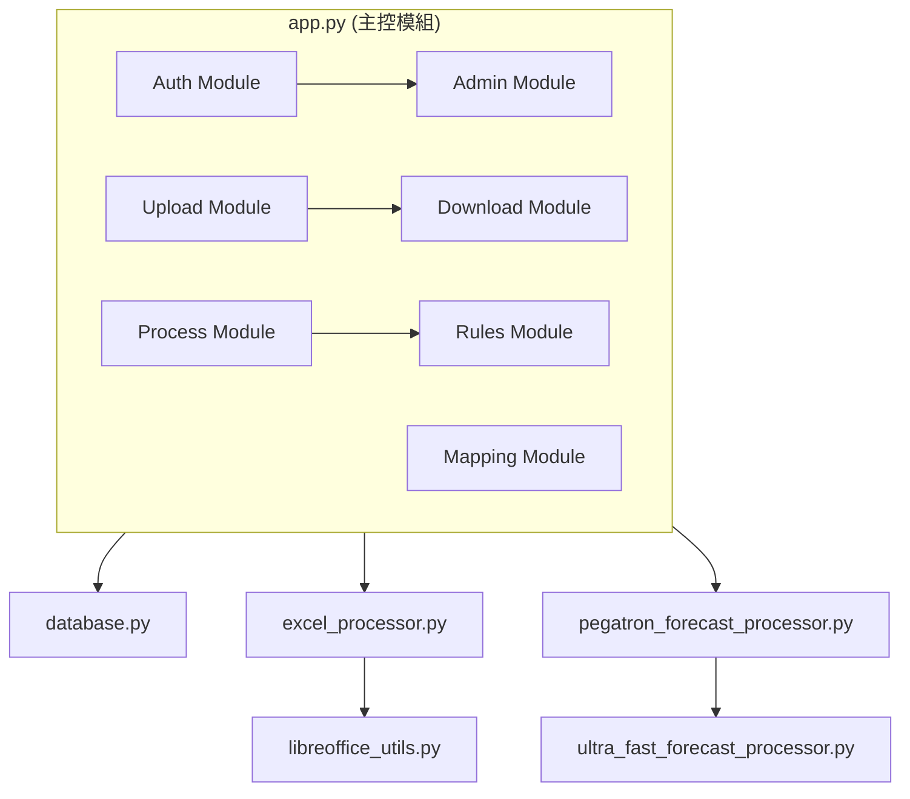
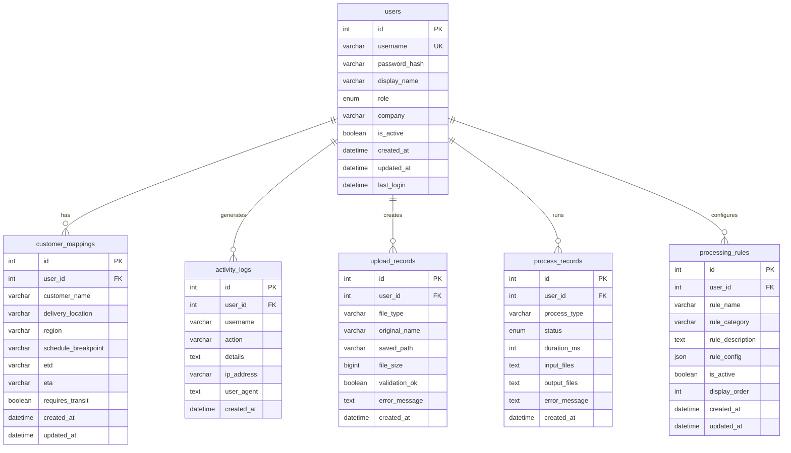
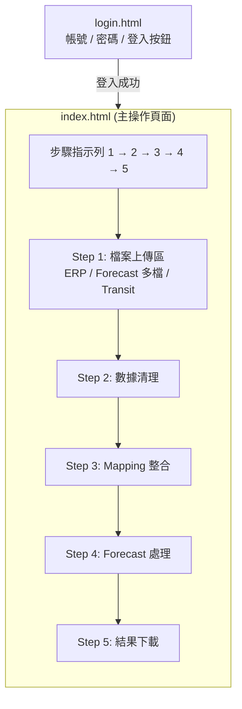
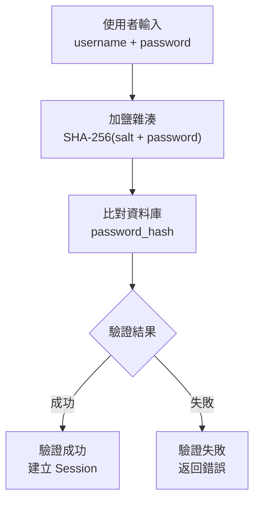
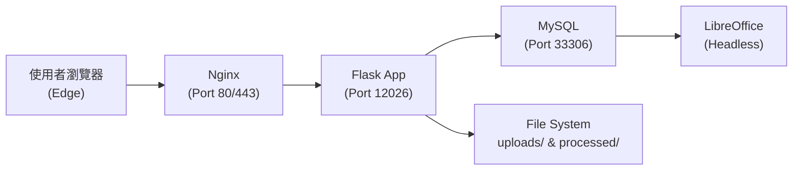
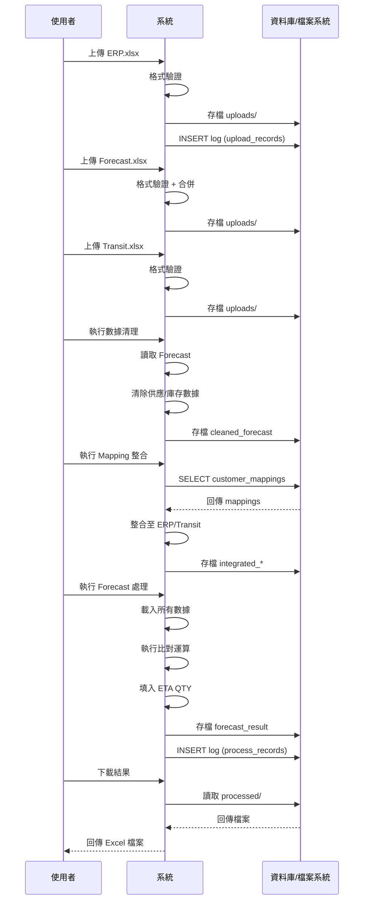

# FORECAST 數據處理系統 — 系統設計文件 (SDD)

**文件版本**: v1.0
**建立日期**: 2026-02-12
**專案名稱**: FORECAST 數據處理系統 (Business Forecasting PC)
**文件狀態**: 初版

---

## 1. 系統架構概覽

### 1.1 架構模式

本系統採用 **單體式 MVC 架構 (Monolithic MVC)**，以 Flask 作為核心框架，前端使用傳統 Server-Side Rendering 搭配 AJAX 互動。



### 1.2 技術堆疊

| 層級 | 技術 | 版本 |
|------|------|------|
| **Web Framework** | Flask | 3.0.3 |
| **Template Engine** | Jinja2 | (Flask 內建) |
| **Data Processing** | pandas | 2.2.2 |
| **Excel I/O** | openpyxl | 3.1.5 |
| **Legacy Excel** | xlrd | 2.0.1 |
| **Database Driver** | PyMySQL | 1.1.0 |
| **Environment Config** | python-dotenv | 1.0.0 |
| **WSGI** | Werkzeug | 3.0.3 |
| **Database** | MySQL | 5.7+ |
| **Reverse Proxy** | Nginx | latest |
| **Document Conversion** | LibreOffice | (Headless mode) |
| **Frontend** | HTML5 / CSS3 / JavaScript ES6 | — |
| **Icons** | Font Awesome | 6.0.0 |

---

## 2. 目錄結構

```
business_forecasting_pc/
│
├── 核心應用程式
│   ├── app.py                              # Flask 主應用（路由、控制器、商業邏輯）
│   ├── database.py                         # 資料庫存取層（DAO）
│   ├── excel_processor.py                  # Excel 通用處理工具
│   ├── pegatron_forecast_processor.py      # Pegatron 專用 Forecast 處理器
│   ├── ultra_fast_forecast_processor.py    # 高效能批次處理引擎
│   ├── libreoffice_utils.py               # LibreOffice 跨平台轉檔工具
│   └── init_processing_rules.py           # 處理規則初始化腳本
│
├── 前端
│   ├── templates/                          # Jinja2 HTML 模板
│   │   ├── index.html                     #   主操作頁面
│   │   ├── login.html                     #   登入頁面
│   │   ├── mapping.html                   #   Mapping 設定頁面
│   │   ├── admin.html                     #   管理員儀表板
│   │   ├── it_dashboard.html              #   IT 儀表板
│   │   ├── logs.html                      #   活動日誌
│   │   ├── users_manage.html              #   使用者管理
│   │   ├── mappings_view.html             #   Mapping 總覽
│   │   ├── rules.html                     #   處理規則管理
│   │   └── test_function.html             #   測試功能
│   └── static/
│       ├── css/style.css                  #   主樣式表
│       ├── js/main.js                     #   主頁面互動邏輯
│       ├── js/mapping.js                  #   Mapping 頁面邏輯
│       ├── js/browser-check.js            #   瀏覽器偵測（阻擋 Chrome）
│       └── logo/                          #   Logo 圖片資源
│
├── 數據管理
│   ├── compare/                            # 格式驗證模板
│   │   ├── erp.xlsx                       #   通用 ERP 模板
│   │   ├── transit.xlsx                   #   通用 Transit 模板
│   │   ├── forecast.xlsx                  #   通用 Forecast 模板
│   │   ├── pegatron/                      #   Pegatron 專用模板
│   │   └── quanta/                        #   Quanta 專用模板
│   ├── uploads/                            # 使用者上傳檔案（{user_id}/{timestamp}/）
│   └── processed/                          # 處理結果檔案（{user_id}/{timestamp}/）
│
├── 部署與設定
│   ├── .env                                # 環境變數（資料庫、金鑰）
│   ├── .env.example                        # 環境變數範本
│   ├── requirements.txt                    # Python 依賴套件
│   ├── nginx.conf                          # Nginx 反向代理設定
│   ├── start_app.bat                       # Windows 啟動腳本
│   └── init-db/                            # 資料庫初始化腳本
│
└── 文件
    ├── README.md                           # 使用說明
    ├── DEPLOYMENT_GUIDE.md                 # 部署指南
    └── 架构分析文档.md                      # 架構分析
```

---

## 3. 模組設計

### 3.1 模組總覽



### 3.2 模組詳細設計

#### 3.2.1 app.py — 主控模組 (4,694 行)

**職責**: Flask 應用程式進入點，包含所有 HTTP 路由、認證邏輯與商業流程控制。

**路由分組**:

| 分組 | 路由 | 方法 | 說明 |
|------|------|------|------|
| **認證** | `/login` | GET/POST | 登入頁面與處理 |
| | `/api/login` | POST | API 登入端點 |
| | `/logout` | GET | 登出 |
| | `/api/logout` | POST | API 登出端點 |
| **檔案上傳** | `/upload_erp` | POST | 上傳 ERP 檔案 |
| | `/upload_forecast` | POST | 上傳 Forecast 檔案 |
| | `/merge_forecast` | POST | 合併多個 Forecast 檔案 |
| | `/upload_transit` | POST | 上傳 Transit 檔案 |
| **數據處理** | `/process/cleanup` | POST | Forecast 數據清理 |
| | `/process/erp_mapping` | POST | ERP Mapping 整合 |
| | `/run_forecast` | POST | 執行 Forecast 處理 |
| **Mapping** | `/mapping` | GET | Mapping 設定頁面 |
| | `/api/mapping` | GET/POST | Mapping 數據 CRUD |
| | `/api/mapping/list` | POST | 批次儲存 Mapping |
| **下載** | `/download/<filename>` | GET | 下載處理結果 |
| **管理** | `/admin` | GET | 管理員面板 |
| | `/it` | GET | IT 儀表板 |
| | `/users_manage` | GET | 使用者管理 |
| | `/logs` | GET | 活動日誌 |
| | `/mappings_view` | GET | Mapping 總覽 |
| | `/rules` | GET | 處理規則管理 |

**認證裝飾器**:

```python
@login_required          # 需要登入
@admin_required          # 需要 Admin 角色
@it_or_admin_required    # 需要 IT 或 Admin 角色
```

**核心處理流程**:

```
upload_erp()          →  格式驗證 → 存檔 → 記錄日誌
upload_forecast()     →  格式驗證 → (合併) → 存檔 → 記錄日誌
upload_transit()      →  格式驗證 → 存檔 → 記錄日誌
process_cleanup()     →  讀取 Forecast → 清理供應/庫存數據 → 存檔
process_erp_mapping() →  讀取 Mapping → 整合至 ERP/Transit → 存檔
run_forecast()        →  載入所有數據 → 執行比對運算 → 填入 ETA QTY → 存檔
```

---

#### 3.2.2 database.py — 資料庫存取層 (2,687 行)

**職責**: 封裝所有 MySQL 操作，提供資料庫連線管理與 CRUD 操作。

**資料表結構**:

```sql
-- 使用者表
CREATE TABLE users (
    id              INT AUTO_INCREMENT PRIMARY KEY,
    username        VARCHAR(50) UNIQUE NOT NULL,
    password_hash   VARCHAR(255) NOT NULL,
    display_name    VARCHAR(100),
    role            ENUM('admin', 'it', 'user') DEFAULT 'user',
    company         VARCHAR(100),
    is_active       BOOLEAN DEFAULT TRUE,
    created_at      DATETIME DEFAULT CURRENT_TIMESTAMP,
    updated_at      DATETIME ON UPDATE CURRENT_TIMESTAMP,
    last_login      DATETIME
);

-- 客戶 Mapping 表
CREATE TABLE customer_mappings (
    id                  INT AUTO_INCREMENT PRIMARY KEY,
    user_id             INT NOT NULL,
    customer_name       VARCHAR(200) NOT NULL,
    delivery_location   VARCHAR(200),
    region              VARCHAR(100),
    schedule_breakpoint VARCHAR(50),
    etd                 VARCHAR(50),
    eta                 VARCHAR(50),
    requires_transit    BOOLEAN DEFAULT FALSE,
    created_at          DATETIME DEFAULT CURRENT_TIMESTAMP,
    updated_at          DATETIME ON UPDATE CURRENT_TIMESTAMP,
    UNIQUE KEY (user_id, customer_name, region),
    FOREIGN KEY (user_id) REFERENCES users(id)
);

-- 活動日誌表
CREATE TABLE activity_logs (
    id          INT AUTO_INCREMENT PRIMARY KEY,
    user_id     INT,
    username    VARCHAR(50),
    action      VARCHAR(50) NOT NULL,
    details     TEXT,
    ip_address  VARCHAR(45),
    user_agent  TEXT,
    created_at  DATETIME DEFAULT CURRENT_TIMESTAMP
);

-- 上傳記錄表
CREATE TABLE upload_records (
    id              INT AUTO_INCREMENT PRIMARY KEY,
    user_id         INT NOT NULL,
    file_type       VARCHAR(20) NOT NULL,
    original_name   VARCHAR(255),
    saved_path      VARCHAR(500),
    file_size       BIGINT,
    validation_ok   BOOLEAN DEFAULT FALSE,
    error_message   TEXT,
    created_at      DATETIME DEFAULT CURRENT_TIMESTAMP
);

-- 處理記錄表
CREATE TABLE process_records (
    id              INT AUTO_INCREMENT PRIMARY KEY,
    user_id         INT NOT NULL,
    process_type    VARCHAR(50) NOT NULL,
    status          ENUM('running', 'success', 'failed'),
    duration_ms     INT,
    input_files     TEXT,
    output_files    TEXT,
    error_message   TEXT,
    created_at      DATETIME DEFAULT CURRENT_TIMESTAMP
);

-- 處理規則表
CREATE TABLE processing_rules (
    id              INT AUTO_INCREMENT PRIMARY KEY,
    user_id         INT,
    rule_name       VARCHAR(100) NOT NULL,
    rule_category   VARCHAR(50) NOT NULL,
    rule_description TEXT,
    rule_config     JSON,
    is_active       BOOLEAN DEFAULT TRUE,
    display_order   INT DEFAULT 0,
    created_at      DATETIME DEFAULT CURRENT_TIMESTAMP,
    updated_at      DATETIME ON UPDATE CURRENT_TIMESTAMP
);
```

**主要函式**:

| 函式 | 說明 |
|------|------|
| `init_database()` | 建立/升級資料表結構（含遷移邏輯） |
| `get_db_connection()` | 取得 MySQL 連線（含自動重連） |
| `verify_user(username, password)` | 驗證使用者帳密 |
| `get_customer_mappings(user_id)` | 取得客戶 Mapping 設定 |
| `save_customer_mappings(user_id, data)` | 儲存 Mapping 設定 |
| `log_activity(user_id, action, details)` | 記錄活動日誌 |
| `log_upload(user_id, file_type, ...)` | 記錄上傳行為 |
| `log_process(user_id, process_type, ...)` | 記錄處理結果 |
| `get_all_users()` | 取得所有使用者（管理用） |
| `create_user(...)` | 新增使用者 |
| `update_user(...)` | 更新使用者資訊 |
| `get_processing_rules(user_id)` | 取得處理規則 |

---

#### 3.2.3 pegatron_forecast_processor.py — Pegatron 專用處理器 (430 行)

**職責**: 處理 Pegatron 客戶的 Transit + ERP → Forecast ETA QTY 整合。

**核心演算法**:

```
輸入: ERP 數據, Transit 數據, Forecast 報表, Mapping 設定

1. 載入 ERP/Transit 數據列表
2. 對每筆 ERP/Transit 記錄:
   a. 取得客戶名稱 → 查找 Mapping 設定
   b. 取得 Plant 欄位 → 比對區域
   c. 取得 ETA 文字（如「本週五」）
   d. 依排程斷點計算本週末日期
   e. 解析 ETA 為目標絕對日期
   f. 尋找 Forecast 中對應的週欄位
   g. 累加數量至對應的 ETA QTY 列
   h. 標記該記錄為「已分配」(✓)

3. 輸出處理後的 Forecast 報表
```

**日期解析邏輯**:

| ETA 文字 | 解析規則 |
|----------|---------|
| 本週一~日 | 排程斷點所在週的對應星期幾 |
| 下週一~日 | 排程斷點所在週 +7 天的對應星期幾 |
| 下下週一~日 | 排程斷點所在週 +14 天的對應星期幾 |

---

#### 3.2.4 ultra_fast_forecast_processor.py — 高效能處理引擎 (869 行)

**職責**: 高效能批次處理引擎，處理大量 ERP/Transit 對 Forecast 的數據填入。

**效能優化策略**:

| 策略 | 說明 |
|------|------|
| 批次 openpyxl 操作 | 減少逐格讀寫開銷，統一批次處理 |
| 記憶體內建索引 | 預先建立 Forecast 結構索引，加速查找 |
| 分配狀態追蹤 | 避免重複運算已處理之記錄 |
| 直接欄位定位 | 預先定位目標欄位位置，避免重複搜尋 |

**處理流程**:

```
1. 載入 Forecast → 建立 Block 結構索引
   ├── 解析標題列 → 定位週日期欄位
   ├── 尋找所有「ETA QTY」列位置
   └── 建立 (客戶, 區域, MRP) → Block 的映射表

2. 載入 ERP 數據 → 建立待分配清單
   ├── 讀取淨需求數量
   ├── 關聯 Mapping 設定
   └── 過濾已分配記錄

3. （選填）載入 Transit 數據 → 合併至待分配清單

4. 批次寫入 Forecast
   ├── 對每筆待分配記錄 → 計算目標 (列, 欄)
   ├── 累加數量至目標儲存格
   └── 標記為「已分配」

5. 儲存輸出檔案
```

---

#### 3.2.5 excel_processor.py — Excel 通用處理 (179 行)

**職責**: 提供 Excel 檔案的通用讀寫與格式驗證功能。

**主要函式**:

| 函式 | 說明 |
|------|------|
| `validate_excel_format(file, template)` | 依模板驗證上傳檔案格式 |
| `read_excel_data(file_path)` | 讀取 Excel 為 DataFrame |
| `merge_excel_files(files, output)` | 合併多個 Excel 檔案（保留合併儲存格） |

---

#### 3.2.6 libreoffice_utils.py — LibreOffice 工具 (521 行)

**職責**: 跨平台 Excel 格式轉換，使用 LibreOffice Headless 模式。

**支援平台**:

| 平台 | LibreOffice 路徑 |
|------|------------------|
| Windows | `C:\Program Files\LibreOffice\program\soffice.exe` |
| Linux | `/usr/bin/libreoffice` 或 `/snap/bin/libreoffice` |

**主要函式**:

| 函式 | 說明 |
|------|------|
| `convert_xls_to_xlsx(input, output)` | .xls → .xlsx 轉換（保留公式） |
| `convert_xlsx_to_xls(input, output)` | .xlsx → .xls 轉換 |
| `validate_libreoffice()` | 驗證 LibreOffice 安裝狀態 |
| `cleanup_old_xls(directory)` | 清理舊格式暫存檔 |

---

## 4. 資料庫設計

### 4.1 ER 圖



### 4.2 索引策略

| 資料表 | 索引 | 類型 |
|--------|------|------|
| `users` | `username` | UNIQUE |
| `customer_mappings` | `(user_id, customer_name, region)` | UNIQUE |
| `activity_logs` | `(user_id, created_at)` | INDEX |
| `activity_logs` | `action` | INDEX |
| `upload_records` | `(user_id, created_at)` | INDEX |
| `process_records` | `(user_id, created_at)` | INDEX |
| `processing_rules` | `(user_id, rule_category)` | INDEX |

### 4.3 資料庫連線管理

```python
# 連線參數（來自 .env）
DB_HOST     = "mysql.theaken.com"
DB_PORT     = 33306
DB_NAME     = "db_business_forecasting"
DB_USER     = "A_business_forecasting"
CHARSET     = "utf8mb4"

# 連線池行為
- 自動重連機制（偵測斷線後重新建立連線）
- 查詢逾時處理
- 連線失敗之 Graceful Degradation
```

---

## 5. API 設計

### 5.1 API 端點清單

#### 認證 API

```
POST /api/login
Request:  { "username": "string", "password": "string" }
Response: { "success": true, "user": { "id", "username", "role", "company" } }
          { "success": false, "message": "帳號或密碼錯誤" }

POST /api/logout
Response: { "success": true }
```

#### 檔案上傳 API

```
POST /upload_erp
Content-Type: multipart/form-data
Body: file (Excel)
Response: { "success": true, "filename": "...", "path": "..." }
          { "success": false, "error": "格式驗證失敗: ..." }

POST /upload_forecast
Content-Type: multipart/form-data
Body: files[] (Excel, 支援多檔)
Response: { "success": true, "files": [...] }

POST /merge_forecast
Response: { "success": true, "merged_file": "..." }

POST /upload_transit
Content-Type: multipart/form-data
Body: file (Excel)
Response: { "success": true, "filename": "..." }
```

#### 數據處理 API

```
POST /process/cleanup
Response: { "success": true, "cleaned_file": "..." }

POST /process/erp_mapping
Response: { "success": true, "integrated_files": [...] }

POST /run_forecast
Response: { "success": true, "result_file": "forecast_result.xlsx" }
```

#### Mapping API

```
GET  /api/mapping?user_id=1
Response: { "success": true, "data": [ { "customer_name", "region", ... } ] }

POST /api/mapping
Request:  { "customer_name", "region", "schedule_breakpoint", "etd", "eta" }
Response: { "success": true }

POST /api/mapping/list
Request:  { "mappings": [ { ... }, { ... } ] }
Response: { "success": true, "count": 10 }
```

#### 使用者管理 API

```
GET  /api/users
Response: { "success": true, "users": [...] }

POST /api/users
Request:  { "username", "password", "display_name", "role", "company" }
Response: { "success": true, "user_id": 1 }

PUT  /api/users/<id>
Request:  { "display_name", "role", "is_active" }
Response: { "success": true }
```

#### 日誌 API

```
GET /api/logs?user_id=1&action=login&start=2026-01-01&end=2026-01-31
Response: { "success": true, "logs": [...], "total": 100 }
```

---

## 6. 前端設計

### 6.1 頁面架構



### 6.2 前端互動流程

```javascript
// main.js 核心流程
1. 使用者選擇檔案 → 觸發 change 事件
2. Fetch API 上傳至對應端點 → 顯示進度/結果
3. 上傳完成 → 啟用下一步驟按鈕
4. 點擊處理按鈕 → POST 至處理 API → 等待回應
5. 處理完成 → 啟用下載按鈕
6. 點擊下載 → window.location 跳轉至下載 URL
```

### 6.3 瀏覽器相容性

- **強制使用 Edge**: `browser-check.js` 偵測 Chrome 瀏覽器並顯示阻擋 Modal
- 提供「以 Edge 開啟」按鈕
- Fallback: Edge 下載連結

---

## 7. 安全設計

### 7.1 認證機制



### 7.2 Session 管理

| 項目 | 設定值 |
|------|--------|
| 儲存方式 | Flask Server-Side Session |
| 逾時時間 | 8 小時 |
| 加密金鑰 | `FLASK_SECRET_KEY` (環境變數) |
| Session 內容 | user_id, username, role, company, login_time |

### 7.3 檔案安全

| 機制 | 說明 |
|------|------|
| 目錄隔離 | 各使用者獨立目錄 `uploads/{user_id}/` |
| 格式驗證 | 僅接受 .xls / .xlsx |
| 大小限制 | 建議上限 50MB |
| 自動清理 | 30 天過期檔案自動刪除 |

### 7.4 環境變數保護

```
.env 檔案包含:
- DB_HOST, DB_PORT, DB_NAME, DB_USER, DB_PASSWORD
- PASSWORD_SALT
- FLASK_SECRET_KEY

.env 已加入 .gitignore，不進入版本控制
```

---

## 8. 部署架構

### 8.1 部署拓撲



### 8.2 Nginx 設定

```nginx
server {
    listen 80;

    # 靜態檔案快取策略
    location /static/css/ {
        expires 1h;                    # CSS 快取 1 小時
    }
    location /static/js/ {
        expires 1h;                    # JS 快取 1 小時（含 ?v= 版本參數）
    }
    location /static/logo/ {
        expires 24h;                   # 圖片快取 24 小時
    }

    # HTML 不快取（強制刷新）
    location / {
        proxy_pass http://127.0.0.1:12026;
        add_header Cache-Control "no-cache";
    }

    # 上傳/處理檔案不快取
    location /uploads/ { add_header Cache-Control "no-cache"; }
    location /processed/ { add_header Cache-Control "no-cache"; }
}
```

### 8.3 環境需求

| 項目 | 規格 |
|------|------|
| Python | 3.8+ |
| MySQL | 5.7+ |
| LibreOffice | Headless 模式 |
| OS | Windows 或 Linux |
| 磁碟空間 | 建議 10GB+（含上傳/處理檔案） |

### 8.4 啟動流程

```
1. 載入 .env 環境變數
2. init_database() — 建立/升級資料表
3. Flask app 啟動於指定 Port
4. Nginx 反向代理至 Flask
```

---

## 9. 效能設計

### 9.1 處理效能優化

| 優化項目 | 方式 | 效果 |
|----------|------|------|
| 批次 Excel 操作 | `ultra_fast_forecast_processor.py` 統一批次讀寫 | 20x 效能提升 |
| 記憶體索引 | 預先建立 Forecast Block 索引映射表 | 減少重複搜尋 |
| 分配追蹤 | 標記已處理記錄避免重複運算 | 避免冗餘計算 |
| 欄位定位 | 預解析標題列定位目標欄位 | O(1) 欄位查找 |

### 9.2 快取策略

| 資源類型 | 快取時間 | 機制 |
|----------|---------|------|
| CSS/JS | 1 小時 | Nginx Cache + `?v=timestamp` 版本參數 |
| 圖片 | 24 小時 | Nginx Cache |
| HTML | 不快取 | `no-cache` Header |
| 上傳/處理檔案 | 不快取 | `no-cache` Header |

---

## 10. 錯誤處理

### 10.1 錯誤處理策略

| 場景 | 處理方式 |
|------|---------|
| 檔案格式錯誤 | 返回明確欄位錯誤訊息，引導使用者修正 |
| 資料庫連線失敗 | 自動重連機制，失敗時回傳 500 錯誤 |
| 處理中斷 | 記錄失敗日誌，保留中間檔案供除錯 |
| Session 過期 | 自動導向登入頁 |
| LibreOffice 不可用 | 檢測並回報安裝狀態 |

### 10.2 日誌記錄

**操作類型清單 (20+ 種)**:

| 類別 | 操作碼 |
|------|--------|
| 認證 | `login`, `logout`, `login_failed` |
| 上傳 | `upload_erp`, `upload_forecast`, `upload_transit` |
| 上傳失敗 | `upload_erp_failed`, `upload_forecast_failed`, `upload_transit_failed` |
| 處理 | `cleanup_success`, `cleanup_failed` |
| | `mapping_success`, `mapping_failed` |
| | `forecast_success`, `forecast_failed` |
| 管理 | `create_user`, `update_user`, `delete_user` |
| Mapping | `save_mapping`, `delete_mapping` |
| 下載 | `download_file` |

---

## 11. 資料流程圖

### 11.1 完整數據處理流程



---

## 12. 已知限制與技術債

| 項目 | 說明 | 風險等級 |
|------|------|---------|
| 單體架構 | `app.py` 包含 4,694 行，所有邏輯集中 | 中 |
| Chrome 阻擋 | 強制使用者改用 Edge，影響使用體驗 | 低 |
| 資料庫相依 | 無法離線運行，缺少資料庫連線則系統不可用 | 中 |
| LibreOffice 相依 | .xls 格式處理依賴外部軟體 | 低 |
| 密碼安全 | 使用 SHA-256 而非 bcrypt/argon2 | 中 |
| 無單元測試 | 缺乏自動化測試覆蓋 | 高 |
| 無 API 文件 | API 未使用 OpenAPI/Swagger 標準化 | 低 |
| 硬編碼邏輯 | 部分客戶邏輯直接寫在程式碼中 | 中 |
