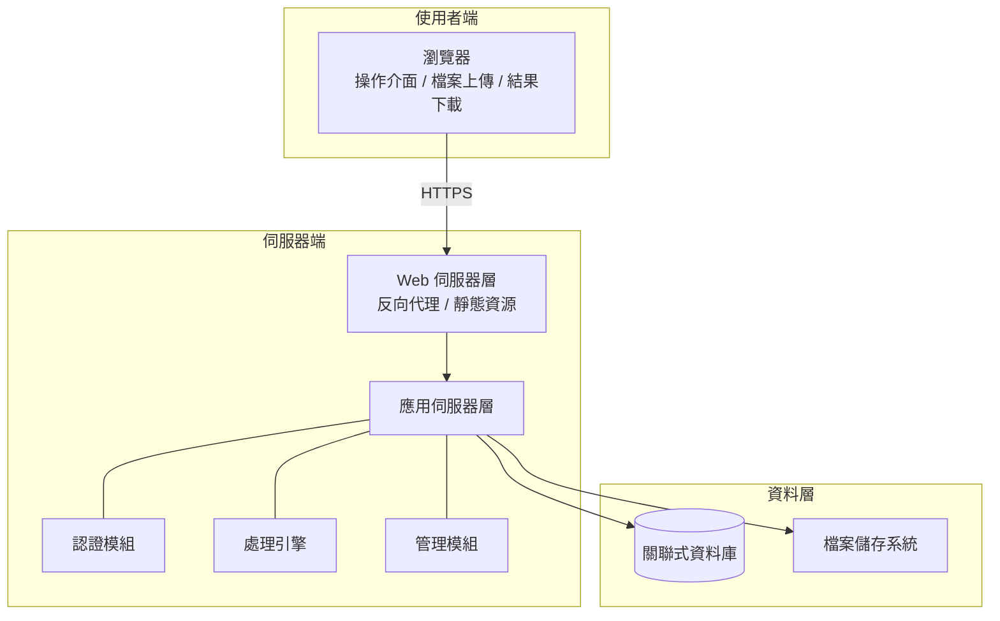
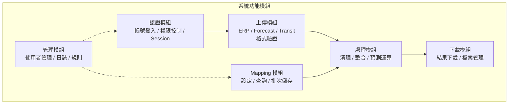
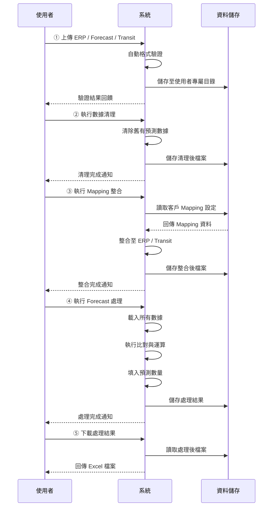
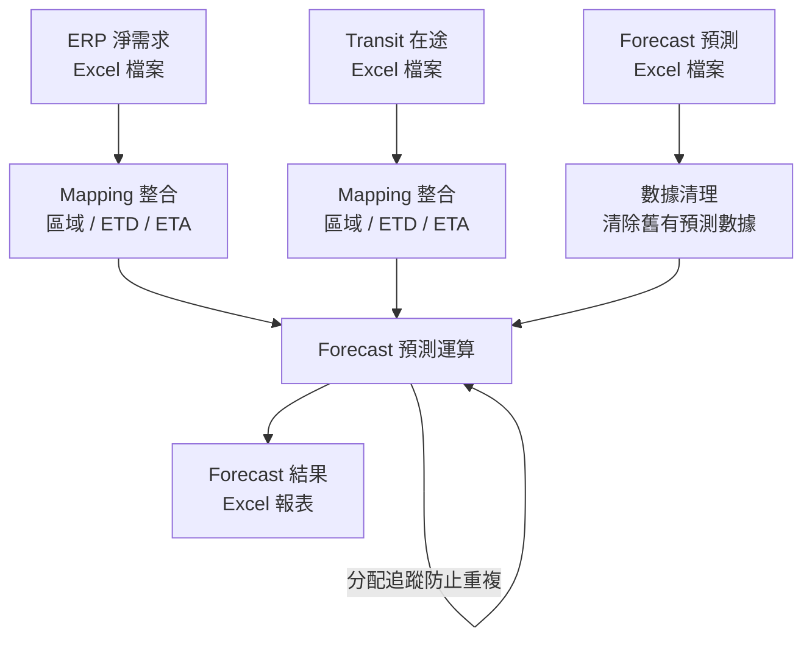
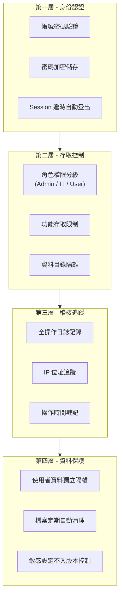
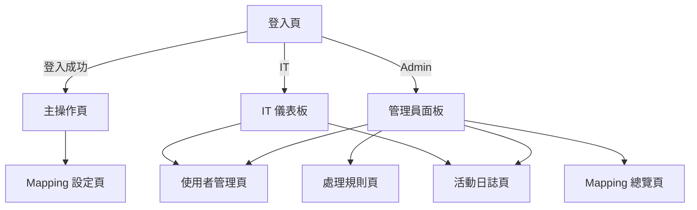
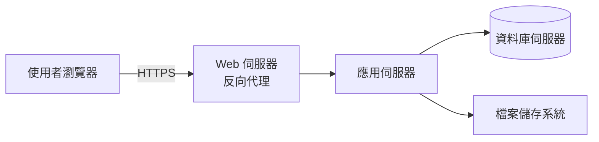

# FORECAST 數據處理系統 — 系統設計文件 (SDD)

**文件版本**: v1.0
**建立日期**: 2026-02-12
**專案名稱**: FORECAST 數據處理系統
**機密等級**: 客戶文件

---

## 1. 系統架構概覽

### 1.1 架構模式

本系統採用 **B/S 架構 (Browser/Server)**，使用者透過瀏覽器操作，後端伺服器統一處理業務邏輯與數據運算。

### 1.2 技術選型摘要

| 層級 | 選型方向 |
|------|---------|
| 前端 | 網頁應用（HTML5 / CSS3 / JavaScript） |
| 後端 | Python Web 框架 |
| 資料庫 | 關聯式資料庫（MySQL） |
| 數據處理 | Python 數據分析生態系 |
| 檔案處理 | Excel 讀寫引擎 |
| 部署 | Web 伺服器 + 反向代理 |

---

## 2. 功能模組設計

### 2.1 模組架構

### 2.2 各模組說明

#### 認證模組

| 功能 | 說明 |
|------|------|
| 帳號登入 | 使用者以帳號密碼登入，密碼經加密比對 |
| 角色權限控制 | 三級角色（管理員 / IT / 一般使用者），各有不同存取範圍 |
| Session 管理 | 登入後建立 Session，8 小時自動逾時登出 |
| 操作日誌 | 所有登入、登出行為自動記錄 |

#### 上傳模組

| 功能 | 說明 |
|------|------|
| 檔案接收 | 支援 .xls / .xlsx 格式，單檔建議上限 50 MB |
| 格式驗證 | 依客戶專屬模板驗證欄位結構與格式正確性 |
| 多檔合併 | Forecast 支援多檔上傳後自動合併，保留原始格式 |
| 檔案管理 | 上傳檔案依使用者獨立目錄儲存，30 天自動清理 |

#### 處理模組

| 處理階段 | 說明 |
|----------|------|
| 數據清理 | 清除舊有供應數量及庫存相關數據，保留 Excel 格式 |
| Mapping 整合 | 將客戶對應設定（區域、ETD、ETA 等）整合至 ERP / Transit 數據 |
| Forecast 預測運算 | 將 ERP / Transit 數據比對至 Forecast 週報結構，自動計算目標日期並填入對應數量 |

#### Mapping 模組

| 功能 | 說明 |
|------|------|
| Mapping 設定 | 視覺化表格介面，編輯客戶與區域之對應關係 |
| 可配置欄位 | 區域、排程斷點、ETD、ETA、Transit 需求 |
| 使用者獨立 | 每位使用者維護獨立的 Mapping 設定 |

#### 下載模組

| 功能 | 說明 |
|------|------|
| 結果下載 | 提供清理後 Forecast、整合後 ERP/Transit、最終預測結果等多份報表下載 |
| 檔案保留 | 處理結果保留 30 天 |

#### 管理模組

| 功能 | 說明 |
|------|------|
| 使用者管理 | 帳號新增 / 編輯 / 停用，角色與公司設定 |
| 活動日誌 | 依時間、使用者、操作類型查詢歷史紀錄 |
| 處理規則 | 可配置之處理規則管理，按類別分組、支援啟停 |
| IT 測試模式 | IT 人員可模擬特定客戶執行測試 |

---

## 3. 數據處理流程

### 3.1 核心處理流程

### 3.2 數據整合邏輯

---

## 4. 資料管理

### 4.1 資料分類

| 資料類別 | 說明 | 儲存方式 |
|----------|------|---------|
| 使用者帳號 | 帳號、角色、所屬公司 | 資料庫 |
| 客戶 Mapping | 客戶與區域對應設定 | 資料庫 |
| 操作日誌 | 所有使用者操作紀錄 | 資料庫 |
| 上傳檔案 | 使用者上傳之 Excel 原始檔案 | 檔案系統 |
| 處理結果 | 系統處理後之 Excel 報表 | 檔案系統 |
| 驗證模板 | 客戶專屬 Excel 格式模板 | 檔案系統 |

### 4.2 資料保留政策

| 資料類別 | 保留期限 |
|----------|---------|
| 使用者帳號 | 永久（可停用） |
| 客戶 Mapping | 永久（可修改） |
| 操作日誌 | 永久 |
| 上傳檔案 | 30 天 |
| 處理結果 | 30 天 |

### 4.3 資料隔離

- 各使用者的上傳檔案與處理結果存放於獨立目錄
- 使用者僅能存取自身數據，無法查看其他使用者資料
- 管理員可查看所有使用者之 Mapping 設定與活動日誌

---

## 5. 安全設計

### 5.1 安全防護層級

### 5.2 存取控制矩陣

| 功能 | 一般使用者 | IT 人員 | 管理員 |
|------|:---------:|:------:|:-----:|
| 檔案上傳與處理 | ✓ | ✓ | ✓ |
| Mapping 設定（自身） | ✓ | ✓ | ✓ |
| 結果下載 | ✓ | ✓ | ✓ |
| IT 測試模式 | — | ✓ | ✓ |
| 活動日誌查詢 | — | ✓ | ✓ |
| 使用者管理 | — | ✓ | ✓ |
| Mapping 總覽（全部） | — | — | ✓ |
| 系統設定 | — | — | ✓ |

---

## 6. 系統介面設計

### 6.1 頁面結構

### 6.2 主操作頁流程引導

主操作頁採用五階段步驟式設計，引導使用者依序完成：

- 每個階段完成後自動啟用下一階段按鈕
- 操作過程即時顯示處理狀態與結果回饋
- 錯誤發生時顯示明確提示訊息

---

## 7. 部署與運行環境

### 7.1 部署架構

### 7.2 環境需求

| 項目 | 需求 |
|------|------|
| 伺服器 | Linux 或 Windows Server |
| 執行環境 | Python 3.8 以上 |
| 資料庫 | MySQL 5.7 以上 |
| 瀏覽器 | Microsoft Edge |
| 網路 | HTTPS 加密連線 |

### 7.3 系統容量規劃

| 項目 | 建議規格 |
|------|---------|
| 磁碟空間 | 10 GB 以上（含上傳與處理檔案） |
| 單檔大小限制 | 50 MB |
| 檔案保留期限 | 30 天自動清理 |
| 資料處理上限 | 50,000+ 筆記錄 |

---

## 8. 系統品質屬性

### 8.1 可靠性

| 項目 | 說明 |
|------|------|
| 資料庫連線 | 具備自動重連機制 |
| 錯誤處理 | 處理失敗時記錄日誌並回傳明確錯誤訊息 |
| 分配追蹤 | 防止重複處理同一筆數據 |

### 8.2 可維護性

| 項目 | 說明 |
|------|------|
| 模組化設計 | 各功能模組職責分離，便於維護 |
| 可配置規則 | 處理規則可透過介面設定，無需修改程式碼 |
| 客戶模板 | 新客戶可透過新增模板快速支援 |
| 活動日誌 | 完整操作紀錄供問題排查使用 |

### 8.3 可擴展性

| 項目 | 說明 |
|------|------|
| 多客戶架構 | 系統設計支援快速新增客戶及其專屬處理邏輯 |
| 處理規則引擎 | 可動態配置處理規則，無需重新部署 |
| 模板驗證機制 | 新客戶僅需新增對應 Excel 模板即可使用 |

---

## 9. 術語表

| 術語 | 說明 |
|------|------|
| ERP 淨需求 | 企業資源規劃系統產出之淨需求數據 |
| Forecast | 預測預估報表，以週為單位之預測數據結構 |
| Transit | 在途貨運數據，記錄已出貨但未到達之貨物資訊 |
| Mapping | 客戶名稱與區域、交期之對應關係設定 |
| Schedule Breakpoint | 排程斷點，以週中某日為分界計算交期 |
| ETD | 預計出發日 (Estimated Time of Departure) |
| ETA | 預計到達日 (Estimated Time of Arrival) |
| ETA QTY | Forecast 中記錄預計到貨數量之欄位 |
| B/S 架構 | 瀏覽器/伺服器架構 (Browser/Server) |
