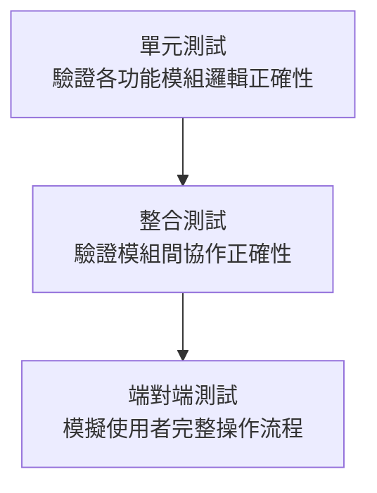
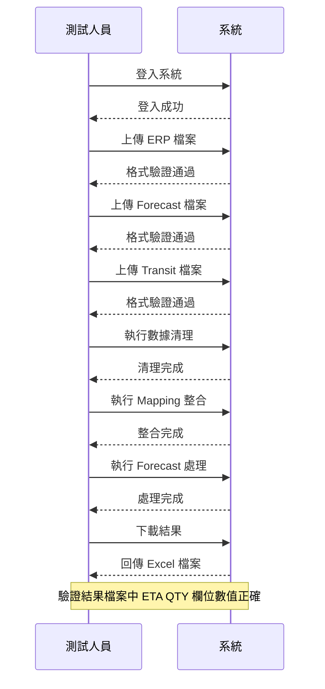

# FORECAST 數據處理系統 — TDD 測試驅動開發文件

**文件版本**: v1.0
**建立日期**: 2026-02-15
**機密等級**: 客戶文件

---

## 1. 測試策略概覽

本系統採用三層測試架構，確保各功能模組在交付前達到品質標準。

---

## 2. 測試範圍與案例

### 2.1 使用者認證測試

| 測試項目 | 測試說明 | 預期結果 |
|----------|---------|---------|
| 正確帳密登入 | 輸入正確帳號與密碼 | 登入成功，進入主頁 |
| 錯誤密碼登入 | 輸入錯誤密碼 | 顯示「帳號或密碼錯誤」 |
| 不存在帳號登入 | 輸入不存在的帳號 | 顯示「帳號或密碼錯誤」 |
| 停用帳號登入 | 已停用帳號嘗試登入 | 無法登入 |
| Session 逾時 | 登入超過 8 小時後操作 | 自動登出並導向登入頁 |
| 權限控制 | 一般使用者存取管理功能 | 存取被拒絕 |

### 2.2 檔案上傳測試

| 測試項目 | 測試說明 | 預期結果 |
|----------|---------|---------|
| 有效 ERP 格式 | 上傳符合模板的 ERP 檔案 | 驗證通過，上傳成功 |
| 缺少必要欄位 | 上傳缺少「淨需求」欄位的檔案 | 驗證失敗，顯示缺少欄位名稱 |
| 多餘欄位 | 上傳含額外欄位的檔案 | 驗證通過（不影響） |
| Forecast 多檔合併 | 上傳 3 個 Forecast 後合併 | 合併成功，資料列數為三者之和 |
| 合併保留格式 | 合併含合併儲存格的 Forecast | 合併後保留原始格式 |
| Transit 必要性檢查 | 需要 Transit 的客戶未上傳 | 系統提示需上傳 |

### 2.3 數據清理測試

| 測試項目 | 測試說明 | 預期結果 |
|----------|---------|---------|
| 清除供應數量 | 清理供應數量相關欄位 | 目標欄位清空，其餘不變 |
| 清除庫存數量 | 清理庫存數量相關數據 | 目標資料清空，其餘不變 |
| 格式保留 | 清理後檢查 Excel 格式 | 字型、邊框、填色完整保留 |

### 2.4 Mapping 整合測試

| 測試項目 | 測試說明 | 預期結果 |
|----------|---------|---------|
| 儲存 Mapping | 設定客戶對應關係並儲存 | 儲存成功，可再次讀取 |
| 批次儲存 | 一次儲存 5 筆 Mapping | 全部儲存成功 |
| 重複 KEY 更新 | 儲存相同客戶/區域的 Mapping | 更新既有設定而非新增 |
| 使用者隔離 | 不同使用者設定各自的 Mapping | 互不可見 |
| ERP 整合 | 執行 Mapping 整合 | Mapping 欄位正確寫入 ERP |

### 2.5 Forecast 預測處理測試

| 測試項目 | 測試說明 | 預期結果 |
|----------|---------|---------|
| 日期解析 - 本週 | ETA 為「本週五」 | 正確計算為當週五之日期 |
| 日期解析 - 下週 | ETA 為「下週二」 | 正確計算為下週二之日期 |
| 日期解析 - 下下週 | ETA 為「下下週二」 | 正確計算為下下週二之日期 |
| 排程斷點計算 | 排程出貨日與斷點比對 | 正確歸入對應週別 |
| Block 比對 | 依客戶/廠區/料號比對 | 找到正確的 Forecast 位置 |
| 數量累加 | 同一位置多筆數據 | 數量累加（非覆蓋） |
| 空儲存格寫入 | 目標位置無既有數據 | 直接寫入數量 |
| 已分配跳過 | 已處理過的記錄 | 跳過不重複計算 |
| 分配標記 | 處理完成的 ERP 記錄 | 標記為「已分配」 |
| Transit 整合 | 包含在途數據的處理 | 在途數據同樣填入 Forecast |

### 2.6 結果下載測試

| 測試項目 | 測試說明 | 預期結果 |
|----------|---------|---------|
| 下載 Forecast 結果 | 點擊下載按鈕 | 成功下載 Excel 檔案 |
| 檔案格式正確 | 下載後開啟檔案 | 為有效的 .xlsx 格式 |

### 2.7 管理功能測試

| 測試項目 | 測試說明 | 預期結果 |
|----------|---------|---------|
| 新增使用者 | 管理員建立新帳號 | 帳號建立成功 |
| 停用使用者 | 管理員停用帳號 | 該帳號無法再登入 |
| 活動日誌查詢 | 依條件查詢操作紀錄 | 正確回傳符合條件的紀錄 |
| IT 測試模式 | IT 模擬客戶測試 | 使用客戶模板，不影響正式數據 |

---

## 3. 完整流程測試

### 3.1 端對端測試流程

---

## 4. 測試品質目標

| 指標 | 目標值 |
|------|-------|
| 測試覆蓋率 | ≥ 80% |
| 關鍵路徑覆蓋 | 100%（五階段流程） |
| 嚴重缺陷（P0/P1） | 0 件 |
| 一般缺陷（P2） | ≤ 3 件（上線前修復） |
| 回歸測試通過率 | 100% |

---

## 5. 測試數據

系統使用以下測試數據進行驗證：

| 測試數據 | 說明 |
|----------|------|
| 標準 ERP 檔案 | 含 50 筆訂單明細的有效 ERP 數據 |
| 標準 Forecast 檔案 | 含 4 個產品區塊的 FCST 報表 |
| 標準 Transit 檔案 | 含 20 筆在途記錄 |
| 無效格式檔案 | 缺少必要欄位，用於測試格式驗證 |
| 大量數據檔案 | 500+ 筆記錄，用於測試效能 |
