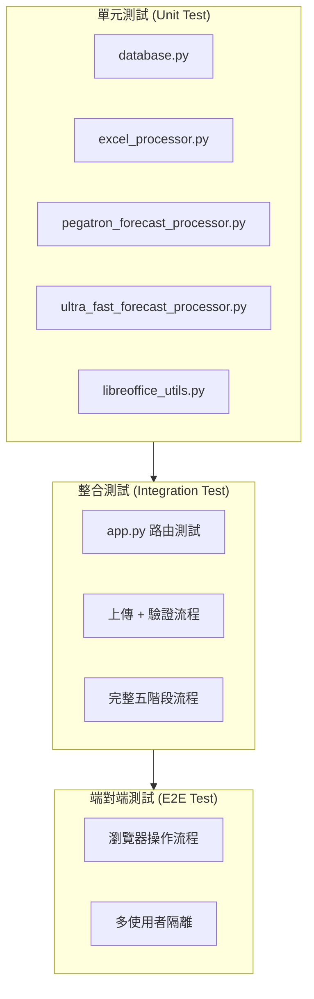

# FORECAST 數據處理系統 — TDD 測試驅動開發文件

**文件版本**: v1.0
**建立日期**: 2026-02-15
**機密等級**: 內部文件

---

## 1. 測試架構概覽



---

## 2. 單元測試

### 2.1 database.py 測試

```python
# test_database.py

class TestVerifyUser:
    """測試使用者驗證"""

    def test_verify_user_correct_password(self):
        """正確密碼應回傳使用者資料"""
        # Arrange
        create_test_user("testuser", "password123", role="user", company="Pegatron")
        # Act
        result = verify_user("testuser", "password123")
        # Assert
        assert result is not None
        assert result["username"] == "testuser"
        assert result["role"] == "user"
        assert result["company"] == "Pegatron"

    def test_verify_user_wrong_password(self):
        """錯誤密碼應回傳 None"""
        create_test_user("testuser", "password123")
        result = verify_user("testuser", "wrongpass")
        assert result is None

    def test_verify_user_nonexistent(self):
        """不存在的帳號應回傳 None"""
        result = verify_user("no_such_user", "password123")
        assert result is None

    def test_verify_user_inactive(self):
        """停用帳號應回傳 None"""
        create_test_user("inactive_user", "pass", is_active=False)
        result = verify_user("inactive_user", "pass")
        assert result is None

    def test_password_hash_uses_salt(self):
        """密碼雜湊應使用 PASSWORD_SALT"""
        import hashlib
        salt = os.getenv("PASSWORD_SALT")
        expected = hashlib.sha256((salt + "password123").encode()).hexdigest()
        user = get_user_by_username("testuser")
        assert user["password_hash"] == expected


class TestCustomerMappings:
    """測試客戶 Mapping CRUD"""

    def test_save_and_get_mapping(self):
        """儲存後應可讀取 Mapping"""
        data = [{"customer_name": "和碩", "region": "MAINTEK-新寧",
                 "schedule_breakpoint": "禮拜三", "etd": "下週二", "eta": "下下週二"}]
        save_customer_mappings(user_id=1, data=data)
        result = get_customer_mappings(user_id=1)
        assert len(result) == 1
        assert result[0]["customer_name"] == "和碩"
        assert result[0]["schedule_breakpoint"] == "禮拜三"

    def test_upsert_on_duplicate_key(self):
        """相同 (user_id, customer_name, region) 應 UPDATE 而非 INSERT"""
        data = [{"customer_name": "和碩", "region": "MAINTEK-新寧",
                 "schedule_breakpoint": "禮拜三", "etd": "下週二", "eta": "下下週二"}]
        save_customer_mappings(user_id=1, data=data)
        data[0]["eta"] = "下週五"
        save_customer_mappings(user_id=1, data=data)
        result = get_customer_mappings(user_id=1)
        assert len(result) == 1
        assert result[0]["eta"] == "下週五"

    def test_user_isolation(self):
        """不同使用者的 Mapping 互不可見"""
        save_customer_mappings(user_id=1, data=[{"customer_name": "A", "region": "R1"}])
        save_customer_mappings(user_id=2, data=[{"customer_name": "B", "region": "R2"}])
        result_1 = get_customer_mappings(user_id=1)
        result_2 = get_customer_mappings(user_id=2)
        assert all(m["customer_name"] == "A" for m in result_1)
        assert all(m["customer_name"] == "B" for m in result_2)


class TestActivityLog:
    """測試活動日誌"""

    def test_log_activity(self):
        """記錄活動後應可查詢"""
        log_activity(user_id=1, action="login", details="test login")
        logs = get_activity_logs(user_id=1, action="login")
        assert len(logs) >= 1
        assert logs[0]["action"] == "login"

    def test_log_includes_timestamp(self):
        """日誌應包含 created_at 時間戳"""
        log_activity(user_id=1, action="test", details="")
        logs = get_activity_logs(user_id=1, action="test")
        assert logs[0]["created_at"] is not None
```

### 2.2 excel_processor.py 測試

```python
# test_excel_processor.py

class TestValidateExcelFormat:
    """測試 Excel 格式驗證"""

    def test_valid_erp_format(self):
        """符合模板的 ERP 檔案應驗證通過"""
        template = "compare/pegatron/erp.xlsx"
        test_file = create_test_excel(columns=["客戶簡稱", "客戶採購單編號", "客料", "淨需求", "送貨地點", "排程出貨日期", "倉庫"])
        result = validate_excel_format(test_file, template)
        assert result["valid"] is True

    def test_missing_required_column(self):
        """缺少必要欄位應驗證失敗"""
        template = "compare/pegatron/erp.xlsx"
        test_file = create_test_excel(columns=["客戶簡稱", "客料"])  # 缺少多個欄位
        result = validate_excel_format(test_file, template)
        assert result["valid"] is False
        assert "淨需求" in result["missing_columns"]

    def test_extra_columns_allowed(self):
        """多餘欄位不影響驗證"""
        template = "compare/pegatron/erp.xlsx"
        test_file = create_test_excel(columns=["客戶簡稱", "客料", "淨需求", "送貨地點",
                                                "排程出貨日期", "倉庫", "客戶採購單編號", "額外欄位"])
        result = validate_excel_format(test_file, template)
        assert result["valid"] is True


class TestMergeExcelFiles:
    """測試多檔合併"""

    def test_merge_two_files(self):
        """合併兩個檔案後列數應為兩者之和"""
        file1 = create_test_excel(rows=10)
        file2 = create_test_excel(rows=15)
        output = merge_excel_files([file1, file2], "merged.xlsx")
        wb = openpyxl.load_workbook(output)
        assert wb.active.max_row >= 25

    def test_merge_preserves_merged_cells(self):
        """合併後應保留原始 merged cells"""
        file1 = create_excel_with_merged_cells()
        output = merge_excel_files([file1], "merged.xlsx")
        wb = openpyxl.load_workbook(output)
        assert len(wb.active.merged_cells.ranges) > 0
```

### 2.3 pegatron_forecast_processor.py 測試

```python
# test_pegatron_forecast_processor.py

class TestDateParsing:
    """測試日期解析邏輯"""

    def test_parse_this_week_friday(self):
        """「本週五」應回傳排程斷點所在週的週五"""
        # 排程斷點=禮拜三, 排程出貨日=2026/01/21 (週三)
        # 本週五 = 2026/01/23
        result = parse_eta_date("本週五", breakpoint_date=date(2026, 1, 21))
        assert result == date(2026, 1, 23)

    def test_parse_next_week_tuesday(self):
        """「下週二」應回傳排程斷點所在週 +7 天的週二"""
        # 排程斷點週末=2026/01/21 (三), 下週二 = 2026/01/27
        result = parse_eta_date("下週二", breakpoint_date=date(2026, 1, 21))
        assert result == date(2026, 1, 27)

    def test_parse_week_after_next_tuesday(self):
        """「下下週二」應回傳排程斷點所在週 +14 天的週二"""
        # 排程斷點週末=2026/01/21 (三), 下下週二 = 2026/02/03
        result = parse_eta_date("下下週二", breakpoint_date=date(2026, 1, 21))
        assert result == date(2026, 2, 3)


class TestScheduleBreakpoint:
    """測試排程斷點計算"""

    def test_breakpoint_wednesday(self):
        """排程出貨日在禮拜三之前，應歸入前一週"""
        # 2026/01/20 是週二，斷點是禮拜三
        # 應歸入 01/13~01/19 那週（前一週）
        result = get_week_end_date(date(2026, 1, 20), "禮拜三")
        assert result == date(2026, 1, 14)  # 前一週的週三

    def test_breakpoint_monday(self):
        """排程斷點為禮拜一時的週末日計算"""
        result = get_week_end_date(date(2026, 1, 19), "禮拜一")
        assert result == date(2026, 1, 19)  # 週一本身


class TestForecastBlockMatching:
    """測試 Forecast Block 比對"""

    def test_match_by_plant_mrp_pn(self):
        """應依 Plant + MRP ID + PN Model 比對 Forecast Block"""
        forecast_blocks = build_test_forecast_blocks()
        result = find_block(forecast_blocks, plant="3A32", mrp_id="A00Y", pn_model="0703-00AG000")
        assert result is not None
        assert result["plant"] == "3A32"

    def test_no_match_returns_none(self):
        """找不到對應 Block 應回傳 None"""
        forecast_blocks = build_test_forecast_blocks()
        result = find_block(forecast_blocks, plant="9999", mrp_id="XXXX", pn_model="INVALID")
        assert result is None


class TestQuantityAccumulation:
    """測試數量累加邏輯"""

    def test_accumulate_quantity(self):
        """同一儲存格應累加而非覆蓋"""
        ws = create_test_worksheet()
        ws.cell(row=5, column=20).value = 300  # 既有值
        write_eta_qty(ws, row=5, col=20, qty=200)
        assert ws.cell(row=5, column=20).value == 500

    def test_write_to_empty_cell(self):
        """空儲存格直接寫入"""
        ws = create_test_worksheet()
        write_eta_qty(ws, row=5, col=20, qty=200)
        assert ws.cell(row=5, column=20).value == 200


class TestAllocationTracking:
    """測試分配追蹤"""

    def test_mark_allocated(self):
        """處理後 ERP 記錄應標記為已分配"""
        erp_row = {"allocated": False, "qty": 100}
        process_erp_row(erp_row, forecast_ws, mapping)
        assert erp_row["allocated"] is True

    def test_skip_already_allocated(self):
        """已分配記錄應被跳過"""
        erp_row = {"allocated": True, "qty": 100}
        original_value = forecast_ws.cell(row=5, column=20).value
        process_erp_row(erp_row, forecast_ws, mapping)
        assert forecast_ws.cell(row=5, column=20).value == original_value  # 值不變
```

### 2.4 ultra_fast_forecast_processor.py 測試

```python
# test_ultra_fast_forecast_processor.py

class TestBlockIndexing:
    """測試 Forecast Block 索引建立"""

    def test_build_block_index(self):
        """應正確建立 (客戶, 區域, MRP) → Block 映射"""
        wb = load_test_forecast()
        index = build_block_index(wb.active)
        assert ("3A32", "A00Y", "0703-00AG000") in index
        assert index[("3A32", "A00Y", "0703-00AG000")]["eta_qty_row"] > 0

    def test_week_column_detection(self):
        """應正確偵測 Forecast 週日期欄位位置"""
        wb = load_test_forecast()
        week_cols = detect_week_columns(wb.active)
        assert len(week_cols) > 50  # 至少 50 週
        assert all(isinstance(d, date) for d in week_cols.keys())

    def test_eta_qty_row_detection(self):
        """應正確找到每個 Block 的 ETA QTY 列"""
        wb = load_test_forecast()
        blocks = detect_blocks(wb.active)
        for block in blocks:
            assert "eta_qty_row" in block
            assert block["eta_qty_row"] > 0


class TestBatchProcessing:
    """測試批次處理效能"""

    def test_process_500_erp_rows(self):
        """500 筆 ERP 應在 5 秒內處理完成"""
        import time
        erp_data = generate_test_erp(rows=500)
        forecast_wb = load_test_forecast()
        start = time.time()
        process_batch(erp_data, forecast_wb, mappings)
        duration = time.time() - start
        assert duration < 5.0

    def test_process_preserves_format(self):
        """批次處理後 Excel 格式應保留"""
        forecast_wb = load_test_forecast()
        original_font = forecast_wb.active.cell(row=1, column=1).font.copy()
        process_batch(erp_data, forecast_wb, mappings)
        assert forecast_wb.active.cell(row=1, column=1).font == original_font
```

### 2.5 libreoffice_utils.py 測試

```python
# test_libreoffice_utils.py

class TestXlsConversion:
    """測試 .xls ↔ .xlsx 轉換"""

    def test_xls_to_xlsx(self):
        """轉換後檔案應為有效 .xlsx"""
        output = convert_xls_to_xlsx("test_data/sample.xls", "output/sample.xlsx")
        assert os.path.exists(output)
        wb = openpyxl.load_workbook(output)  # 應可正常開啟
        assert wb.active.max_row > 0

    def test_preserves_data_after_conversion(self):
        """轉換後數據應一致"""
        output = convert_xls_to_xlsx("test_data/sample.xls", "output/sample.xlsx")
        wb = openpyxl.load_workbook(output)
        assert wb.active.cell(row=1, column=1).value is not None

    def test_validate_libreoffice_installed(self):
        """應偵測 LibreOffice 安裝狀態"""
        result = validate_libreoffice()
        assert isinstance(result, bool)
```

---

## 3. 整合測試

### 3.1 路由整合測試

```python
# test_app_routes.py

class TestAuthRoutes:
    """認證路由整合測試"""

    def test_login_success_creates_session(self, client):
        """成功登入應建立 Session"""
        response = client.post("/api/login", json={"username": "user01", "password": "pass123"})
        assert response.status_code == 200
        data = response.get_json()
        assert data["success"] is True
        with client.session_transaction() as sess:
            assert "user_id" in sess

    def test_protected_route_requires_login(self, client):
        """未登入存取受保護路由應導向登入頁"""
        response = client.get("/")
        assert response.status_code == 302
        assert "/login" in response.headers["Location"]

    def test_admin_route_forbidden_for_user(self, client):
        """一般使用者存取管理路由應被拒絕"""
        login_as(client, role="user")
        response = client.get("/users_manage")
        assert response.status_code in [302, 403]


class TestUploadRoutes:
    """上傳路由整合測試"""

    def test_upload_erp_valid_file(self, client):
        """上傳有效 ERP 檔案應成功"""
        login_as(client, role="user", company="Pegatron")
        with open("test_data/valid_erp.xlsx", "rb") as f:
            response = client.post("/upload_erp", data={"file": (f, "erp.xlsx")},
                                   content_type="multipart/form-data")
        assert response.get_json()["success"] is True

    def test_upload_erp_invalid_format(self, client):
        """上傳無效格式應回傳錯誤"""
        login_as(client, role="user", company="Pegatron")
        with open("test_data/invalid_erp.xlsx", "rb") as f:
            response = client.post("/upload_erp", data={"file": (f, "erp.xlsx")},
                                   content_type="multipart/form-data")
        data = response.get_json()
        assert data["success"] is False
        assert "格式驗證失敗" in data["error"]
```

### 3.2 完整流程整合測試

```python
# test_full_pipeline.py

class TestFullPipeline:
    """五階段完整流程整合測試"""

    def test_pegatron_full_flow(self, client):
        """Pegatron 完整五階段流程"""
        login_as(client, role="user", company="Pegatron")

        # Stage 1: Upload
        upload_result = upload_file(client, "/upload_erp", "test_data/pegatron_erp.xlsx")
        assert upload_result["success"]
        upload_result = upload_file(client, "/upload_forecast", "test_data/pegatron_forecast.xlsx")
        assert upload_result["success"]
        upload_result = upload_file(client, "/upload_transit", "test_data/pegatron_transit.xlsx")
        assert upload_result["success"]

        # Stage 2: Cleanup
        cleanup_result = client.post("/process/cleanup").get_json()
        assert cleanup_result["success"]

        # Stage 3: Mapping integration
        mapping_result = client.post("/process/erp_mapping").get_json()
        assert mapping_result["success"]

        # Stage 4: Forecast processing
        forecast_result = client.post("/run_forecast").get_json()
        assert forecast_result["success"]

        # Stage 5: Download
        download_response = client.get(f"/download/forecast_result.xlsx")
        assert download_response.status_code == 200
        assert "spreadsheetml" in download_response.content_type
```

---

## 4. 測試覆蓋率目標

| 模組 | 目標覆蓋率 | 重點測試範圍 |
|------|:---------:|-------------|
| database.py | ≥ 80% | 使用者驗證、Mapping CRUD、日誌記錄 |
| excel_processor.py | ≥ 85% | 格式驗證、多檔合併、merged cells 保留 |
| pegatron_forecast_processor.py | ≥ 90% | 日期解析、Block 比對、數量累加、分配追蹤 |
| ultra_fast_forecast_processor.py | ≥ 85% | 索引建立、批次處理、格式保留 |
| libreoffice_utils.py | ≥ 70% | 格式轉換、安裝偵測 |
| app.py (路由) | ≥ 75% | 認證、上傳、處理、權限控制 |

---

## 5. 測試資料管理

| 項目 | 路徑 | 說明 |
|------|------|------|
| ERP 測試檔 | `test_data/pegatron_erp.xlsx` | 含 50 筆訂單的有效 ERP |
| Forecast 測試檔 | `test_data/pegatron_forecast.xlsx` | 含 4 個 Block 的 FCST |
| Transit 測試檔 | `test_data/pegatron_transit.xlsx` | 含 20 筆在途記錄 |
| 無效格式檔 | `test_data/invalid_erp.xlsx` | 缺少必要欄位 |
| .xls 格式檔 | `test_data/sample.xls` | 舊格式測試 |
