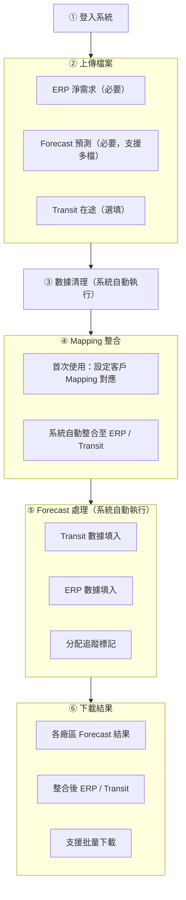

# FORECAST 數據處理系統 — 光寶科技客製化擴展 PRD

**文件版本**: v1.0
**建立日期**: 2026-03-11
**專案名稱**: FORECAST 數據處理系統 — 光寶科技 (Liteon) 客製化擴展
**機密等級**: 客戶文件

---

## 1. 專案概述

### 1.1 專案背景

FORECAST 數據處理系統已成功運行於多家客戶，本次擴展針對 **光寶科技 (Liteon)** 之業務流程與數據格式進行客製化整合，使光寶科技供應鏈管理團隊能透過系統自動化處理 ERP 淨需求、在途貨運 (Transit) 與 Forecast 預測數據。

### 1.2 專案目標

| 目標 | 說明 |
|------|------|
| 完整支援光寶數據格式 | 支援光寶特有的 ERP / Transit / Forecast Excel 格式 |
| 雙訂單類型處理 | 支援「一般訂單 (11)」與「HUB 調撥 (32)」兩類訂單之差異化處理 |
| 多廠區多檔案處理 | 支援同時處理多個廠區 (Plant) 之 Forecast 檔案 |
| 精準日期計算 | 依排程斷點與 ETD/ETA 邏輯自動計算目標交期 |
| 分配追蹤與防重複 | 確保同一筆 ERP/Transit 數據不被重複填入 |

### 1.3 與現有系統之關係

本次擴展為系統新增客戶支援，**不影響**現有客戶之任何功能與流程。光寶科技使用獨立帳號登入，系統依帳號自動識別並啟用對應的處理邏輯。

---

## 2. 功能需求

### 2.1 檔案上傳（階段一）

光寶科技需上傳以下三類 Excel 檔案：

| 檔案類型 | 是否必要 | 說明 |
|----------|:--------:|------|
| ERP 淨需求 | 必要 | 包含淨需求量、排程出貨日期、客戶簡稱、送貨地點、倉庫等欄位 |
| Forecast 預測 | 必要 | 以廠區 (Plant) 為單位之預測報表，支援**多檔上傳**（每個廠區/採購員各一份） |
| Transit 在途 | 選填 | 在途貨運數據，含訂單品項、地點、數量、預計到貨日 |

**多檔上傳**：光寶 Forecast 依廠區 (Plant) 與採購員 (Buyer) 分為多份檔案，系統支援一次上傳所有檔案並批次處理。

### 2.2 數據清理（階段二）

系統自動清除 Forecast 檔案中舊有的供應數量與庫存數據，保留 Excel 原始格式與 Demand 資料。

### 2.3 Mapping 整合（階段三）

#### 2.3.1 Mapping 設定介面

光寶科技之 Mapping 設定包含以下欄位：

| 欄位 | 說明 | 範例 |
|------|------|------|
| 客戶簡稱 | ERP 中的客戶名稱 | 光寶科技股份有限公司 |
| 訂單型態 | 區分一般訂單 (11) 或 HUB 調撥 (32) | 11 |
| 送貨地點 | 一般訂單 (11) 之送貨地點 | TB01 |
| 倉庫 | HUB 調撥 (32) 之倉庫代碼 | HUB_A |
| 廠區 (Region) | 對應 Forecast 之廠區代碼 (Plant) | 15K0 |
| 排程斷點 | 以週中某日為基準的交期分界點 | 禮拜一 |
| ETD | 預計出發日之週次與星期 | 下週四 |
| ETA | 預計到達日之週次與星期 | 下下週二 |
| 日期算法 | 指定使用 ETD 或 ETA 作為目標日期計算基準 | ETA |
| Transit 需求 | 該客戶是否需要 Transit 數據 | 是 |

#### 2.3.2 訂單類型差異化

| 訂單型態 | 比對依據 | 說明 |
|:--------:|---------|------|
| **11（一般訂單）** | 客戶簡稱 + 送貨地點 | 以送貨地點確定廠區對應 |
| **32（HUB 調撥）** | 客戶簡稱 + 倉庫代碼 | 以倉庫代碼確定廠區對應 |

#### 2.3.3 ERP Mapping 整合

系統將 Mapping 設定自動整合至 ERP 數據，新增以下欄位：

| 新增欄位 | 說明 |
|----------|------|
| 客戶需求地區 | 對應 Forecast 之廠區代碼 (Plant) |
| 排程出貨日期斷點 | 排程斷點（星期幾） |
| ETD | 填入對應的 ETD 週次+星期 |
| ETA | 填入對應的 ETA 週次+星期 |
| 日期算法(ETD/ETA) | 該筆數據使用 ETD 或 ETA 計算 |

#### 2.3.4 Transit Mapping 整合

Transit 數據透過 ERP 的送貨地點/倉庫反向查詢 Mapping，自動標註廠區代碼。

---

### 2.4 Forecast 處理（階段四）

#### 2.4.1 Forecast 檔案結構

光寶科技之 Forecast 採用 **Daily + Weekly + Monthly** 三段式日期結構：

| 區段 | 欄位範圍 | 說明 |
|------|---------|------|
| 每日 (Daily) | 前 31 欄 | 逐日預測（精確到天） |
| 每週 (Weekly) | 中 22 欄 | 逐週預測（以週為單位） |
| 每月 (Monthly) | 後 6 欄 | 逐月預測（以月為單位） |

每筆料號 (Material) 佔三列資料：

| 列 | 用途 |
|----|------|
| Demand | 客戶需求量（唯讀，不修改） |
| **Commit** | **供應承諾量（系統填入目標欄位）** |
| Accumulate Shortage | 累計短缺量（自動計算，不修改） |

#### 2.4.2 Transit 數據填入邏輯

```
比對條件：
  Transit 客戶需求地區 = Forecast 廠區代碼 (Plant)
  Transit 訂單品項 = Forecast 料號 (Material)

填入方式：
  將 Transit 數量 × 1000 填入 Commit 列對應的 ETA 日期欄位

日期對應策略（依精度遞減）：
  ① 優先填入精確日期（每日欄位）
  ② 若無對應日期，填入所屬週（每週欄位）
  ③ 若無對應週，填入所屬月（每月欄位）
```

#### 2.4.3 ERP 數據填入邏輯

```
比對條件：
  ERP 客戶需求地區 = Forecast 廠區代碼 (Plant)
  ERP 客戶料號 = Forecast 料號 (Material)

日期計算流程：
  ① 取得排程出貨日期
  ② 依排程斷點計算所屬週期終點
  ③ 依「日期算法」欄位決定使用 ETD 或 ETA
  ④ 解析對應文字（例：下週四）計算目標日期
  ⑤ 驗證：目標日期不得早於排程出貨日期

填入方式：
  將 ERP 淨需求量 × 1000 填入 Commit 列對應的目標日期欄位

日期對應策略：
  同 Transit，依 每日 → 每週 → 每月 遞減對應
```

#### 2.4.4 多檔案處理機制

| 功能 | 說明 |
|------|------|
| 批次處理 | 一次處理所有上傳之 Forecast 檔案 |
| 分配追蹤 | ERP/Transit 數據填入後標記為「已分配」，後續檔案不重複使用 |
| 數量累加 | 同一 Commit 儲存格若有多筆來源數據，數量自動累加 |
| 獨立輸出 | 每個 Forecast 檔案各自輸出為獨立結果檔案 |

#### 2.4.5 輸出檔案命名

每份結果檔案以 **廠區代碼 + 採購員代碼** 命名，例如：

```
forecast_15K0_P43.xlsx
forecast_15K0_P49.xlsx
forecast_F820_T12.xlsx
```

此命名方式確保同一廠區但不同採購員之檔案不會互相覆蓋。

---

### 2.5 結果下載（階段五）

處理完成後，使用者可下載以下檔案：

| 檔案 | 說明 |
|------|------|
| Forecast 處理結果（多檔） | 每個廠區/採購員各一份，已填入 ERP 與 Transit 數據 |
| 整合後 ERP | 已整合 Mapping 欄位之 ERP 報表 |
| 整合後 Transit | 已整合 Mapping 欄位之 Transit 報表 |
| 清理後 Forecast | 經數據清理後的原始 Forecast 檔案 |

支援**批量下載**，一鍵下載所有結果檔案。

---

## 3. 處理結果摘要

系統處理完成後，顯示以下統計資訊：

| 統計項目 | 說明 |
|----------|------|
| 處理檔案數 | 成功 / 總計 檔案數量 |
| ERP 成功填寫 | ERP 數據成功填入 Forecast 之筆數 |
| ERP 跳過記錄 | 因資料不完整或無法比對而跳過之筆數 |
| Transit 成功填寫 | Transit 數據成功填入 Forecast 之筆數 |
| Transit 跳過記錄 | 因資料不完整或無法比對而跳過之筆數 |

---

## 4. 操作流程總覽



---

## 5. 非功能性需求

| 項目 | 規格 |
|------|------|
| 處理效能 | 支援同時處理 20+ 個 Forecast 檔案 |
| 資料處理量 | 單次處理 1,000+ 筆 ERP / Transit 數據 |
| 數據正確性 | 分配追蹤機制確保無重複填入 |
| 檔案相容性 | 保留 Excel 原始格式（字型、框線、合併儲存格等） |
| 資料隔離 | 光寶科技數據與其他客戶完全隔離 |
| 操作稽核 | 所有處理操作皆記錄至系統日誌 |

---

## 6. 術語對照表

| 術語 | 說明 |
|------|------|
| Plant（廠區） | Forecast 檔案中的廠區代碼，如 15K0、F820 |
| Buyer（採購員） | Forecast 檔案中的採購員代碼，如 P43、T12 |
| 訂單型態 11 | 一般訂單，以送貨地點為比對依據 |
| 訂單型態 32 | HUB 調撥訂單，以倉庫代碼為比對依據 |
| Mapping | 客戶名稱與廠區、交期之對應關係設定 |
| 排程斷點 | 以週中某日為分界點，決定排程所屬週期 |
| ETD | 預計出發日 (Estimated Time of Departure) |
| ETA | 預計到達日 (Estimated Time of Arrival) |
| 日期算法 | 指定以 ETD 或 ETA 作為日期計算基準 |
| Commit | Forecast 中記錄供應承諾數量之列 |
| Daily / Weekly / Monthly | Forecast 日期結構之三個精度區段 |
| 已分配 | 標記已被使用過的 ERP/Transit 數據，防止重複處理 |
