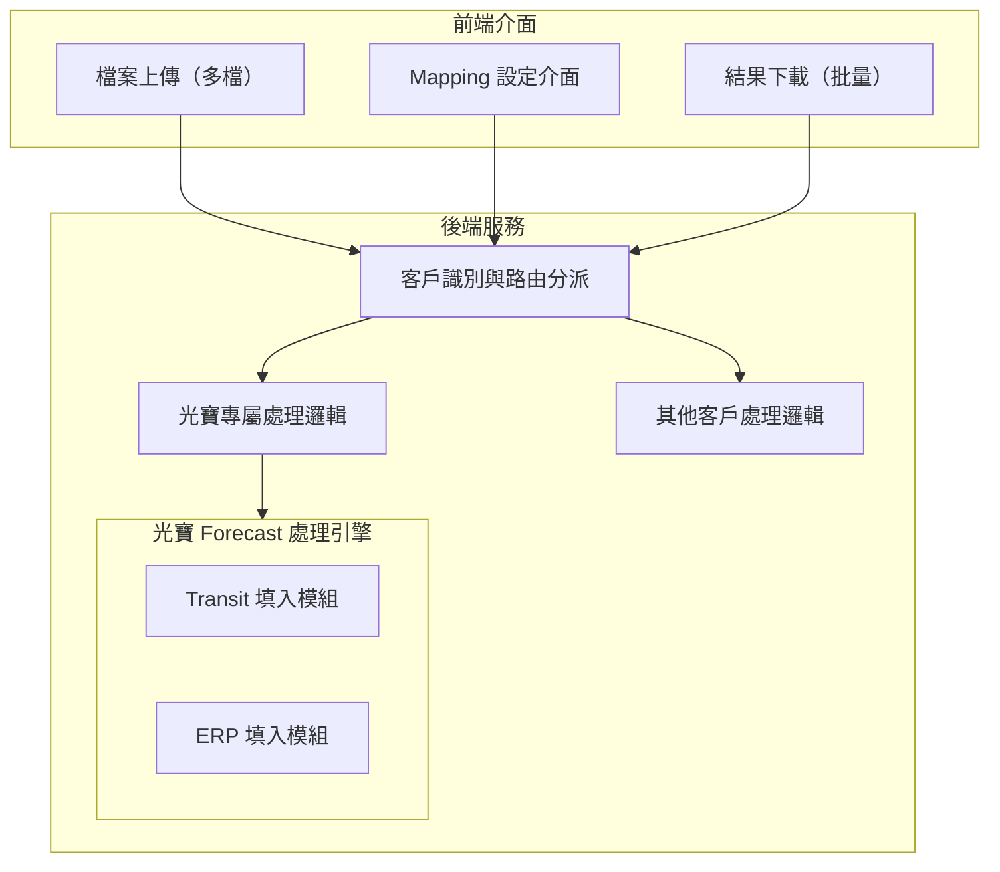
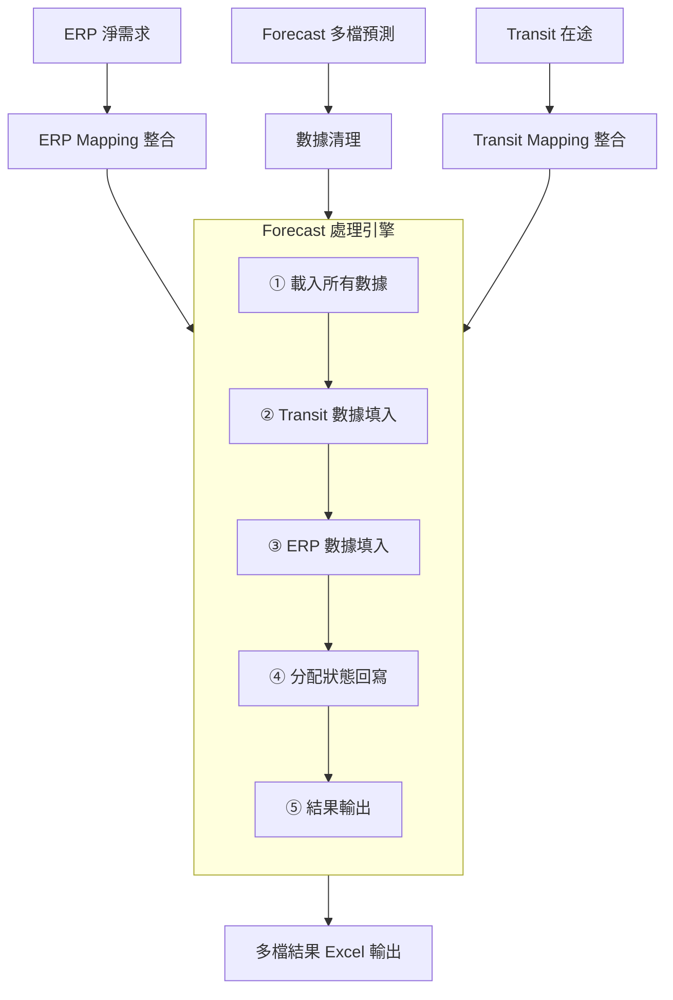
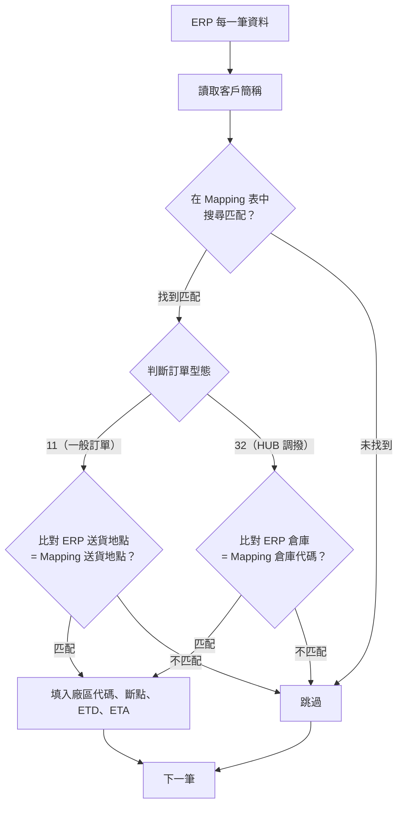
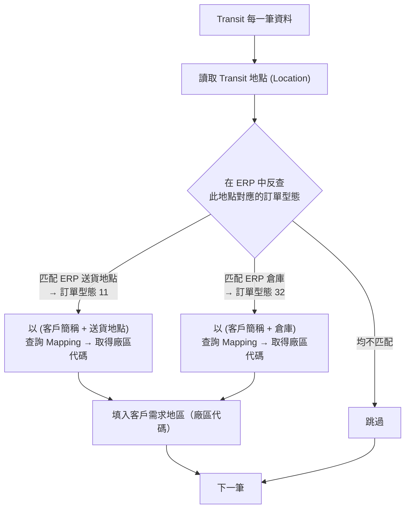
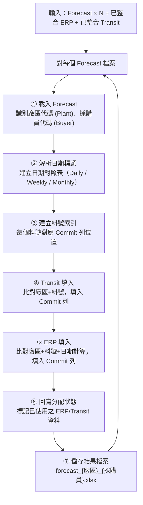
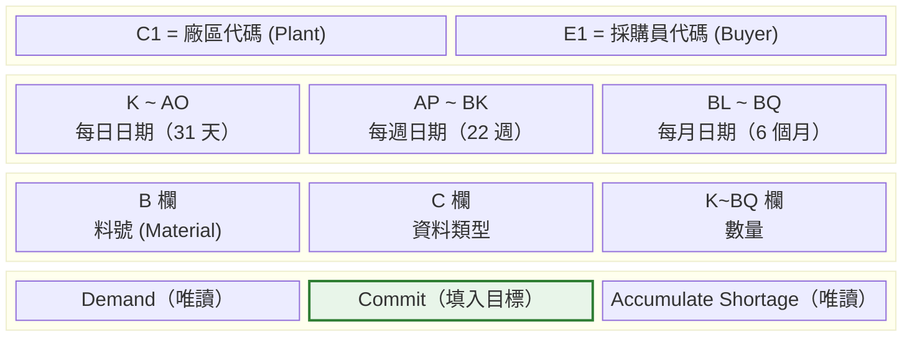
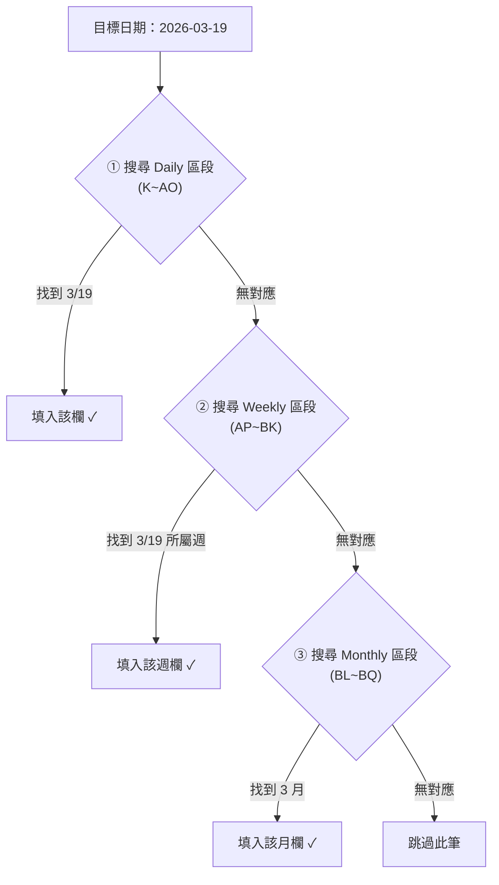
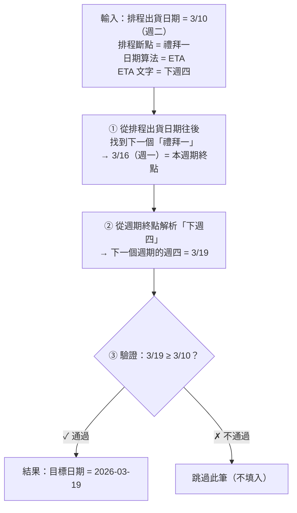
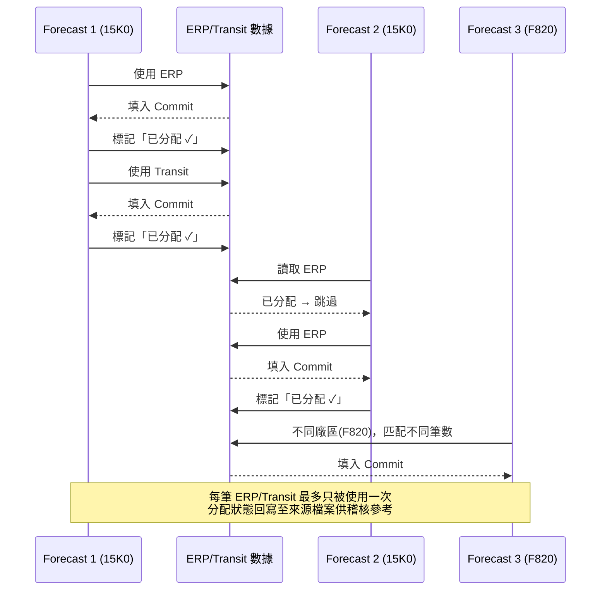
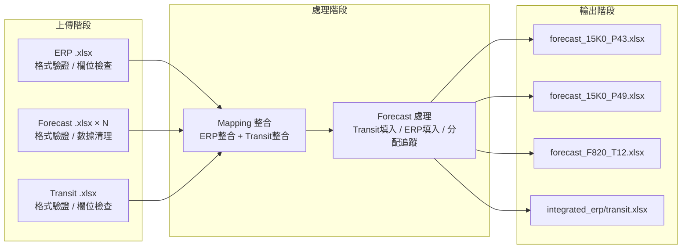

# FORECAST 數據處理系統 — 光寶科技客製化擴展 SDD

**文件版本**: v1.0
**建立日期**: 2026-03-11
**專案名稱**: FORECAST 數據處理系統 — 光寶科技 (Liteon) 客製化擴展
**機密等級**: 客戶文件

---

## 1. 設計概述

### 1.1 擴展範圍

本次客製化擴展在現有系統架構上新增光寶科技專屬處理邏輯，涵蓋以下模組：

| 擴展模組 | 說明 |
|----------|------|
| ERP Mapping 整合 | 新增雙訂單類型 (11/32) 之差異化比對邏輯 |
| Transit Mapping 整合 | 新增在途數據反向查詢 ERP 送貨地點/倉庫之比對邏輯 |
| Forecast 處理引擎 | 新增專屬處理器，支援 Daily+Weekly+Monthly 三段式日期結構 |
| Mapping 設定介面 | 擴展四個新欄位（訂單型態、送貨地點、倉庫、日期算法） |
| 下載模組 | 支援多檔案批量下載 |

### 1.2 設計原則

| 原則 | 說明 |
|------|------|
| 零影響擴展 | 新增功能不修改現有客戶之任何處理邏輯 |
| 帳號自動識別 | 系統依登入帳號自動切換對應之處理邏輯 |
| 模組化設計 | 光寶專屬處理器為獨立模組，易於維護與測試 |
| 格式保留 | 處理過程完整保留 Excel 原始格式 |

---

## 2. 系統架構

### 2.1 模組關係圖

### 2.2 處理流程架構

---

## 3. Mapping 整合設計

### 3.1 ERP Mapping 流程

### 3.2 Transit Mapping 流程

---

## 4. Forecast 處理引擎設計

### 4.1 處理總流程

### 4.2 Forecast 檔案結構解析

> **Sheet**: `Daily+Weekly+Monthly` | **Row 7** = 日期標頭 | **Row 8+** = 數據列（每個料號 3 列一組）

### 4.3 日期對應策略

系統將目標日期對應至 Forecast 欄位時，採用**精度遞減**策略：

### 4.4 ERP 日期計算邏輯

ERP 目標日期的計算基於排程出貨日期、斷點、及 ETD/ETA 文字描述：

**支援的日期文字格式**：

| 文字 | 說明 | 範例 |
|------|------|------|
| 本週X | 當前週期內的星期X | 本週五 |
| 下週X | 下一個週期的星期X | 下週四 |
| 下下週X | 再下一個週期的星期X | 下下週二 |

**安全機制**：計算結果若早於排程出貨日期，該筆數據將被跳過（不填入）。

### 4.5 數量填入規則

| 規則 | 說明 |
|------|------|
| 單位轉換 | ERP/Transit 原始數量 × 1000 後填入 Forecast |
| 數量累加 | 同一儲存格若有多筆來源，數量自動累加 |
| 保留原值 | 若 Commit 儲存格已有原始數值，新增數量疊加於上 |
| 零值處理 | 數量為 0 之資料不填入 |

### 4.6 分配追蹤機制

---

## 5. Mapping 設定介面設計

### 5.1 欄位配置

光寶科技之 Mapping 表格新增四個專屬欄位，介面自動判斷並展開：

| 客戶簡稱 | 訂單型態 | 送貨地點 | 倉庫 | 廠區 | 排程斷點 | ETD | ETA | 日期算法 | Transit需求 |
|---------|:-------:|---------|------|------|---------|------|------|:-------:|:----------:|
| 光寶科技... | 11 | TB01 | | 15K0 | 禮拜一 | 下週四 | 下週四 | ETA | 是 |
| 光寶科技... | 32 | | HUB_A | 15K0 | 禮拜一 | 下週四 | 下週四 | ETA | 是 |

### 5.2 操作方式

| 操作 | 說明 |
|------|------|
| 新增 | 點擊「新增客戶」按鈕，新增一列空白設定 |
| 編輯 | 直接於表格欄位內編輯 |
| 儲存 | 支援單筆及批次儲存 |
| 刪除 | 刪除不需要的設定列 |
| 分頁 | 每頁顯示 10 筆，支援分頁切換 |

---

## 6. 輸出檔案設計

### 6.1 結果檔案命名規則

命名格式：`forecast_{Plant}_{Buyer}.xlsx`

| 範例檔名 | 廠區 | 採購員 |
|----------|------|--------|
| forecast_15K0_P43.xlsx | 15K0 | P43 |
| forecast_15K0_P49.xlsx | 15K0 | P49 |
| forecast_F820_T12.xlsx | F820 | T12 |

### 6.2 結果檔案內容

| 項目 | 說明 |
|------|------|
| 格式保留 | 完整保留原始 Excel 格式（字型、色彩、框線、合併儲存格） |
| Demand 列 | 保持原始數據不變 |
| Commit 列 | 填入 ERP 及 Transit 之供應承諾數量 |
| Shortage 列 | 保持原始數據不變 |

### 6.3 批量下載

處理完成後，下載區域顯示所有結果檔案清單：

| 檔案名稱 | ERP 填入 | Transit 填入 | 操作 |
|----------|:-------:|:-----------:|:----:|
| **批量下載全部檔案（共 23 個）** | | | **下載全部** |
| forecast_15K0_P43.xlsx | 52 筆 | 3 筆 | 下載 |
| forecast_15K0_P49.xlsx | 48 筆 | 2 筆 | 下載 |
| forecast_F820_T12.xlsx | 61 筆 | 5 筆 | 下載 |
| ... | | | |

---

## 7. 數據流總覽

---

## 8. 品質保證

### 8.1 數據正確性保證

| 保證項目 | 機制 |
|----------|------|
| 廠區比對一致性 | ERP/Transit 之廠區代碼必須完全匹配 Forecast 之 Plant |
| 料號比對一致性 | ERP 客戶料號 / Transit 訂單品項必須完全匹配 Forecast 料號 |
| 日期安全檢查 | 計算日期不得早於排程出貨日期，違反則跳過 |
| 防重複填入 | 分配追蹤確保同一筆數據只被使用一次 |
| 數量單位統一 | 統一以 × 1000 轉換，確保單位一致 |

### 8.2 異常處理

| 異常情境 | 處理方式 |
|----------|---------|
| ERP/Transit 找不到匹配的 Forecast 料號 | 跳過該筆，不影響其他筆 |
| 日期欄位缺失或格式錯誤 | 跳過該筆，記錄至處理統計 |
| 目標日期超出 Forecast 日期範圍 | 嘗試週/月遞減匹配，仍無匹配則跳過 |
| 單一檔案處理失敗 | 記錄失敗原因，繼續處理其餘檔案 |
| Mapping 設定不完整 | 該筆數據跳過，不影響其他已設定之筆 |

---

## 9. 與現有系統整合

### 9.1 共用元件

| 元件 | 說明 |
|------|------|
| 使用者認證 | 使用系統統一認證機制，光寶為獨立帳號 |
| 檔案上傳模組 | 共用既有上傳與格式驗證架構 |
| Mapping 資料庫 | 共用 Mapping 資料表結構，擴展新欄位 |
| 活動日誌 | 所有操作自動記錄至統一日誌系統 |
| 檔案管理 | 共用自動清理機制 |
| IT 測試模式 | IT 人員可透過測試模式模擬光寶帳號進行測試 |

### 9.2 獨立元件

| 元件 | 說明 |
|------|------|
| Forecast 處理引擎 | 光寶專屬，獨立模組 |
| ERP Mapping 邏輯 | 雙訂單類型比對，為光寶特有 |
| Transit Mapping 邏輯 | 反向查詢 ERP 地點，為光寶特有 |
| Mapping 介面擴展 | 四個新欄位僅光寶帳號顯示 |

---

## 10. 術語表

| 術語 | 說明 |
|------|------|
| Plant（廠區） | Forecast 中的廠區代碼，用於區分不同生產據點 |
| Buyer（採購員） | Forecast 中的採購員代碼 |
| Region | Mapping 中的廠區代碼，對應 Forecast 的 Plant |
| 訂單型態 11 | 一般訂單，以送貨地點為比對鍵 |
| 訂單型態 32 | HUB 調撥訂單，以倉庫代碼為比對鍵 |
| 排程斷點 | 定義每個排程週期的結束日（星期幾） |
| ETD / ETA | 預計出發日 / 預計到達日 |
| Commit | Forecast 中記錄供應承諾量的資料列 |
| Daily / Weekly / Monthly | Forecast 日期結構的三個精度層級 |
| 已分配 | 用於標記已被處理過的 ERP/Transit 資料 |
| B/S 架構 | 瀏覽器/伺服器架構 (Browser/Server) |
