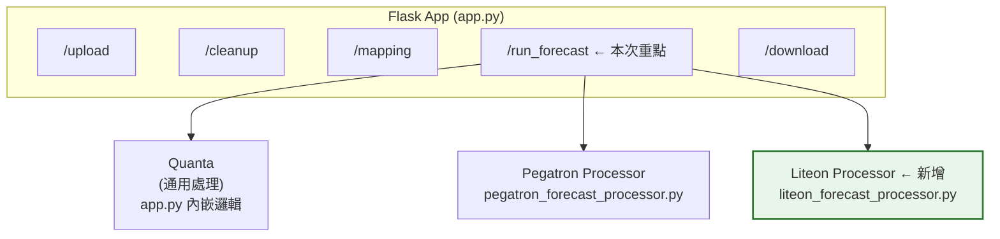
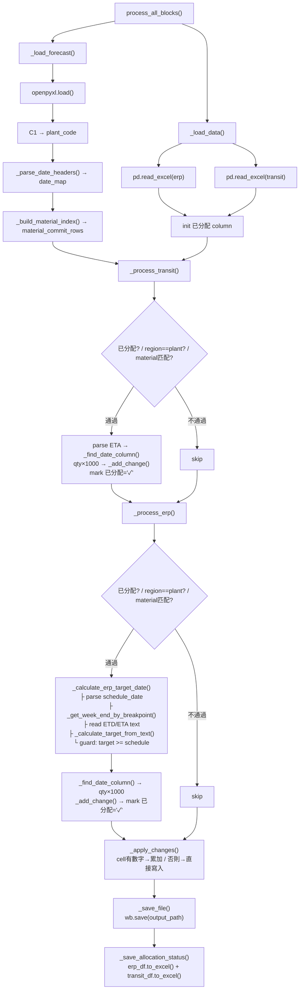
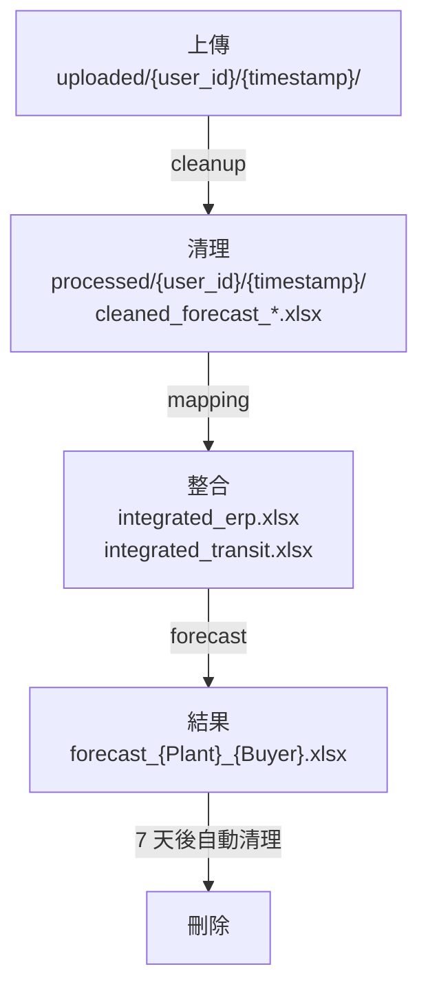

# FORECAST 數據處理系統 — 光寶科技客製化擴展 SDD（工程師版）

**文件版本**: v1.0
**建立日期**: 2026-03-11
**專案名稱**: FORECAST 數據處理系統 — 光寶科技 (Liteon) 客製化擴展
**機密等級**: 內部工程文件
**客戶代碼**: user_id=6, username=liteon

---

## 1. 系統架構設計

### 1.1 現有架構概覽



### 1.2 光寶擴展的檔案變更清單

```
新增檔案:
  liteon_forecast_processor.py    ← Forecast 處理器（561 行）

修改檔案:
  app.py                          ← 路由分派 + ERP/Transit Mapping
  static/js/mapping.js            ← Mapping UI 擴展
  templates/mapping.html           ← 動態表頭
  database.py                      ← Mapping 存儲欄位擴展

測試檔案:
  test/test_liteon_forecast.py
  test/test_liteon_mapping.py
  test/test_liteon_transit_mapping.py
```

---

## 2. 模組設計

### 2.1 客戶路由分派 (app.py)

路由中使用 `is_liteon` 旗標分派到光寶專用處理邏輯。三個階段各有獨立的 `elif is_liteon:` 分支。

#### 2.1.1 ERP Mapping 分支

**位置**: `app.py:2756-2837`

```python
elif is_liteon:
    # 1. 載入 mapping records
    mapping_records = get_customer_mappings_raw(mapping_user_id)

    # 2. 建立雙 lookup 表
    liteon_lookup_11 = {}  # (customer_name, delivery_location) -> {region, breakpoint, etd, eta, date_calc_type}
    liteon_lookup_32 = {}  # (customer_name, warehouse)          -> {region, breakpoint, etd, eta, date_calc_type}

    for m in mapping_records:
        order_type = str(m.get('order_type', '')).strip()
        if order_type == '11':
            key = (customer_name, delivery_location)
            liteon_lookup_11[key] = mapping_values
        elif order_type == '32':
            key = (customer_name, warehouse)
            liteon_lookup_32[key] = mapping_values

    # 3. 動態查找 ERP 欄位
    delivery_col = find_column_by_name(erp_df, '送貨地點')       # AG
    order_type_col = find_column_by_name(erp_df, '訂單型態')      # AM
    warehouse_col = find_column_by_name(erp_df, '倉庫', required=False)  # AL

    # 4. 逐行映射
    def get_liteon_mapping(row, field):
        ot_prefix = row[order_type_col][:2]  # "11一般訂單" → "11"
        if ot_prefix == '11':
            key = (customer, delivery)
            return liteon_lookup_11.get(key, {}).get(field, '')
        elif ot_prefix == '32':
            key = (customer, warehouse)
            return liteon_lookup_32.get(key, {}).get(field, '')

    # 5. 批次套用
    erp_df['客戶需求地區'] = erp_df.apply(get_liteon_mapping, 'region')
    erp_df['排程出貨日期斷點'] = erp_df.apply(get_liteon_mapping, 'schedule_breakpoint')
    erp_df['ETD'] = erp_df.apply(get_liteon_mapping, 'etd')
    erp_df['ETA'] = erp_df.apply(get_liteon_mapping, 'eta')
    erp_df['日期算法'] = erp_df.apply(get_liteon_mapping, 'date_calc_type')
```

**設計決策**：
- 使用 tuple `(customer_name, location/warehouse)` 作為 lookup key，因為光寶的 Mapping 是 **多鍵** 比對（不像 Quanta/Pegatron 只用客戶簡稱單鍵）
- 訂單型態使用前 2 字元截取（`[:2]`），因為 ERP 原始資料格式為 "11一般訂單" 而非 "11"

#### 2.1.2 Transit Mapping 分支

**位置**: `app.py:2942-3006`

```python
elif is_liteon:
    # 1. 從 Mapping 建立 location→region 和 warehouse→region lookup
    dl_to_region = {}   # delivery_location → region
    wh_to_region = {}   # warehouse → region

    # 2. 從 ERP 建立 location→order_type lookup
    erp_location_to_type = {}  # AG值 → "11"/"32"
    for _, row in erp_df.iterrows():
        ag = row[erp_ag_col]    # 送貨地點
        am = row[erp_am_col]    # 訂單型態
        erp_location_to_type[ag] = am[:2]

    # 3. Transit 比對（依固定 index）
    transit_d_col = transit_df.columns[3]   # Location (D欄)
    transit_k_col = transit_df.columns[10]  # K欄

    def get_liteon_transit_region(row):
        location = row[transit_d_col]                    # Transit D
        ot = erp_location_to_type.get(location, '')      # 反查訂單型態
        k_val = row[transit_k_col]                        # Transit K
        if ot == '11':
            return dl_to_region.get(k_val, '')
        elif ot == '32':
            return wh_to_region.get(k_val, '')
        else:
            return dl_to_region.get(k_val, '') or wh_to_region.get(k_val, '')

    transit_df['客戶需求地區'] = transit_df.apply(get_liteon_transit_region, axis=1)
    transit_df['已分配'] = ''
```

**設計決策**：
- Transit 欄位使用**固定 index**（3 和 10）而非名稱查找，因為 Transit 檔案的欄位名稱不穩定
- 反向查詢機制：Transit → ERP 送貨地點 → 訂單型態 → Mapping → 廠區代碼
- Fallback：若 ERP 查不到訂單型態，兩個 lookup 都試

#### 2.1.3 Forecast 處理分支

**位置**: `app.py:3226-3326`

```python
if is_liteon:
    from liteon_forecast_processor import LiteonForecastProcessor

    for idx, forecast_file in enumerate(multi_cleaned_files, 1):
        # 讀取 C1 (Plant) + E1 (Buyer) 作為檔名
        _tmp_wb = openpyxl.load_workbook(forecast_file, read_only=True)
        _tmp_ws = _tmp_wb['Daily+Weekly+Monthly']
        plant_code = str(_tmp_ws.cell(row=1, column=3).value or '').strip()
        buyer_code = str(_tmp_ws.cell(row=1, column=5).value or '').strip()
        _tmp_wb.close()

        output_filename = f'forecast_{plant_code}_{buyer_code}.xlsx'

        processor = LiteonForecastProcessor(
            forecast_file=forecast_file,
            erp_file=integrated_erp,
            transit_file=integrated_transit if has_transit else None,
            output_folder=processed_folder,
            output_filename=output_filename
        )
        success = processor.process_all_blocks()
        # 累計統計...

    return jsonify({
        'success': True,
        'multi_file': True,
        'files': processed_files,      # list of {input, output, erp_filled, transit_filled, file_size}
        'total_erp_filled': total_erp_filled,
        'total_transit_filled': total_transit_filled,
        ...
    })
```

**設計決策**：
- 使用 `read_only=True` 讀取 C1/E1 後立即關閉，避免佔用記憶體
- 每個 Forecast 檔案各自實例化 Processor，但共享 ERP/Transit 檔案路徑
- 分配狀態透過 Excel 檔案回寫/重讀實現跨檔案追蹤

---

### 2.2 LiteonForecastProcessor 設計

**位置**: `liteon_forecast_processor.py`（561 行）

#### 2.2.1 類別結構

```python
class LiteonForecastProcessor:
    # --- 常數 ---
    SHEET_NAME = 'Daily+Weekly+Monthly'
    PLANT_CELL_ROW = 1, PLANT_CELL_COL = 3  # C1
    DATE_HEADER_ROW = 7
    DATA_START_ROW = 8
    MATERIAL_COL = 2      # Column B
    DATA_MEASURES_COL = 3  # Column C
    DAILY_START_COL = 11  (K)  ~ DAILY_END_COL = 41  (AO)
    WEEKLY_START_COL = 42 (AP) ~ WEEKLY_END_COL = 63  (BK)
    MONTHLY_START_COL = 64 (BL) ~ MONTHLY_END_COL = 69 (BQ)

    # --- 狀態 ---
    wb: Workbook               # openpyxl workbook
    ws: Worksheet              # 'Daily+Weekly+Monthly' sheet
    plant_code: str            # C1 值
    date_map: dict[int, date]  # col_index → date
    material_commit_rows: dict[str, int]  # material → commit_row_number
    pending_changes: list[dict]  # [{row, col, value}, ...]
    erp_df: DataFrame
    transit_df: DataFrame

    # --- 統計 ---
    total_filled: int           # ERP 填入數
    total_skipped: int          # ERP 跳過數
    total_transit_filled: int   # Transit 填入數
    total_transit_skipped: int  # Transit 跳過數
```

#### 2.2.2 方法一覽

| 方法 | 行數 | 輸入 | 輸出 | 說明 |
|------|------|------|------|------|
| `__init__()` | 51-73 | 5 params | - | 初始化路徑、統計、狀態 |
| `process_all_blocks()` | 75-114 | - | bool | 主入口，依序呼叫 7 個步驟 |
| `_load_forecast()` | 116-134 | - | - | 載入 workbook、取 Plant、解析結構 |
| `_parse_date_headers()` | 136-150 | - | - | Row 7 日期標頭 → date_map |
| `_parse_date_value()` | 152-172 | cell_val | date/None | 日期格式轉換（多格式支援） |
| `_build_material_index()` | 174-185 | - | - | Material → Commit row 對照 |
| `_load_data()` | 187-207 | - | - | 載入 ERP/Transit DataFrame |
| `_find_date_column()` | 209-243 | target_date | col/None | 日→週→月遞減查找 |
| `_add_change()` | 245-251 | row, col, value | - | 佇列變更（同儲存格累加） |
| `_process_transit()` | 253-315 | - | - | Transit 比對+填入 |
| `_process_erp()` | 317-395 | - | - | ERP 比對+日期計算+填入 |
| `_calculate_erp_target_date()` | 397-452 | row, cols | date/None | 日期計算核心 |
| `_get_week_end_by_breakpoint()` | 454-478 | schedule, text | date/None | 斷點→週期終點 |
| `_calculate_target_from_text()` | 480-526 | week_end, text | date/None | 中文文字→目標日期 |
| `_apply_changes()` | 528-538 | - | - | 批次寫入 worksheet |
| `_save_file()` | 540-544 | - | - | 儲存 Excel |
| `_save_allocation_status()` | 546-561 | - | - | 回寫已分配到 ERP/Transit |

#### 2.2.3 資料流詳細



---

### 2.3 日期計算子系統

這是光寶擴展中最複雜的部分，因為涉及排程斷點週期和中文文字解析。

#### 2.3.1 _get_week_end_by_breakpoint

```
Purpose: 從排程出貨日期找到當前週期的斷點日（週期終點）

Input:  schedule_date = 2026-03-10 (Tuesday, weekday=1)
        breakpoint_text = "禮拜一"   (Monday, weekday=0)

Process:
  target_weekday = 0 (Monday)
  current_weekday = 1 (Tuesday)
  days_ahead = (0 - 1) % 7 = 6
  week_end = 2026-03-10 + 6 days = 2026-03-16 (Monday)

Output: 2026-03-16

Edge case: schedule_date 本身就是斷點日
  days_ahead = (0 - 0) % 7 = 0
  week_end = schedule_date → 正確
```

#### 2.3.2 _calculate_target_from_text

```
Purpose: 從 week_end + 文字描述計算目標日期

Key insight:
  - week_end（斷點日）是週期的「最後一天」
  - 目標 weekday 在週期「開始～斷點日」之間
  - 所以 target_weekday 相對於 breakpoint_weekday 一定是 <= 0 或正好是 0
  - 若 (target - breakpoint) % 7 > 0，代表算出的差值跳到了下一個週期
  - 需要減 7 拉回同一週期

Formula:
  breakpoint_weekday = week_end.weekday()
  days_diff = (target_weekday - breakpoint_weekday) % 7
  if days_diff > 0:
      days_diff -= 7

  target_date = week_end + timedelta(days = 7 * weeks_offset + days_diff)

Complete example matrix (breakpoint = Monday/0):

  Text           weeks_offset  target_wd  days_diff    formula              result
  ──────────────────────────────────────────────────────────────────────────────────
  "本週五"        0             4(Fri)     (4-0)%7=4    4>0 → 4-7=-3       3/16+0-3 = 3/13(Fri) ✓
  "本週一"        0             0(Mon)     (0-0)%7=0    0=0 → 0            3/16+0+0 = 3/16(Mon) ✓
  "下週四"        1             3(Thu)     (3-0)%7=3    3>0 → 3-7=-4       3/16+7-4 = 3/19(Thu) ✓
  "下週一"        1             0(Mon)     (0-0)%7=0    0=0 → 0            3/16+7+0 = 3/23(Mon) ✓
  "下下週二"      2             1(Tue)     (1-0)%7=1    1>0 → 1-7=-6       3/16+14-6 = 3/24(Tue) ✓

Complete example matrix (breakpoint = Thursday/3):

  Text           weeks_offset  target_wd  days_diff    formula              result
  ──────────────────────────────────────────────────────────────────────────────────
  "本週一"        0             0(Mon)     (0-3)%7=4    4>0 → 4-7=-3       we+0-3   = we-3(Mon) ✓
  "本週四"        0             3(Thu)     (3-3)%7=0    0=0 → 0            we+0+0   = we(Thu)   ✓
  "下週二"        1             1(Tue)     (1-3)%7=5    5>0 → 5-7=-2       we+7-2   = we+5(Tue) ✓
```

#### 2.3.3 日期安全防護

```python
# _calculate_erp_target_date() 最後
if target_date is not None and target_date < schedule_date:
    return None  # 跳過此筆，不填入
```

場景：當 "本週X" 計算結果早於排程出貨日期（例如出貨日是週四，但 "本週二" 算出的日期在出貨日之前），此筆會被安全跳過。

---

### 2.4 Mapping UI 設計

#### 2.4.1 mapping.js 擴展

**關鍵函式**:

```javascript
// 偵測是否有光寶欄位
function hasLiteonFields() {
    // 檢查 mappingData 中是否有 order_type、delivery_location、warehouse 欄位
    // 用於動態決定是否展開額外 4 欄
}

// 表頭動態渲染
function renderMappingTableList() {
    if (hasLiteonFields()) {
        // 插入 4 個額外欄位：訂單型態、送貨地點、倉庫、日期算法
        // 加上 .liteon-expanded class
    }
}

// 儲存時攜帶光寶欄位
function saveCurrentPageEdits() {
    // 抓取額外欄位值:
    //   order_type: select ("11"/"32")
    //   delivery_location: text input
    //   warehouse: text input
    //   date_calc_type: select ("ETD"/"ETA")
}
```

#### 2.4.2 database.py 擴展

```python
# save_customer_mappings_list() 新增欄位存儲
# 在寫入 mapping record 時，額外處理：
#   order_type, delivery_location, warehouse, date_calc_type
```

---

## 3. 資料庫設計

### 3.1 Mapping 資料表擴展

光寶使用的 Mapping 記錄比其他客戶多 4 個欄位，儲存在同一張 mapping 表中：

| 欄位名 | 資料類型 | 必填 | 說明 |
|--------|---------|:----:|------|
| customer_name | VARCHAR | Y | 客戶簡稱 |
| region | VARCHAR | Y | 廠區代碼 (Plant) |
| schedule_breakpoint | VARCHAR | N | 排程斷點 |
| etd | VARCHAR | N | ETD 文字 |
| eta | VARCHAR | N | ETA 文字 |
| requires_transit | BOOLEAN | N | 是否需要 Transit |
| **order_type** | VARCHAR | N | **光寶專用** - "11"/"32" |
| **delivery_location** | VARCHAR | N | **光寶專用** - 送貨地點 |
| **warehouse** | VARCHAR | N | **光寶專用** - 倉庫代碼 |
| **date_calc_type** | VARCHAR | N | **光寶專用** - "ETD"/"ETA" |

### 3.2 資料隔離

- 各使用者的 Mapping 以 `user_id` 隔離
- 檔案以 `processed/{user_id}/{timestamp}/` 目錄隔離
- 光寶 user_id=6 的數據不會與 Quanta (3) 或 Pegatron (5) 交叉

---

## 4. 檔案系統設計

### 4.1 目錄結構

```
processed/
└── 6/                              ← Liteon user_id
    └── 20260311_203430/            ← 處理時間戳
        ├── integrated_erp.xlsx      ← Mapping 後的 ERP（含已分配欄位）
        ├── integrated_transit.xlsx   ← Mapping 後的 Transit（含已分配欄位）
        ├── cleaned_forecast_1.xlsx   ← 清理後的原始 Forecast
        ├── cleaned_forecast_2.xlsx
        ├── ...
        ├── cleaned_forecast_23.xlsx
        ├── forecast_15K0_P43.xlsx    ← 處理結果（ERP+Transit 已填入）
        ├── forecast_15K0_P49.xlsx
        ├── forecast_F820_T12.xlsx
        └── ...
```

### 4.2 檔案生命週期



---

## 5. 錯誤處理設計

### 5.1 分層錯誤處理

| 層級 | 錯誤類型 | 處理方式 |
|------|---------|---------|
| Route 層 | 整體路由異常 | try/except → JSON 回傳錯誤訊息 |
| Processor 層 | 單一檔案處理失敗 | 記入 failed_files，繼續處理下一檔 |
| Row 層 | ERP/Transit 單行異常 | per-row try/except，跳過並繼續 |
| Column 層 | 欄位缺失 | 檢查 + 明確錯誤訊息 |
| Date 層 | 日期解析失敗 | return None，跳過該筆 |

### 5.2 關鍵錯誤情境

```python
# 情境 1: Forecast Sheet 不存在
if self.SHEET_NAME not in self.wb.sheetnames:
    raise ValueError(f"Sheet '{self.SHEET_NAME}' not found")

# 情境 2: ERP 必要欄位缺失
for col_name in [region_col, part_col]:
    if col_name not in self.erp_df.columns:
        print(f"ERP 缺少 '{col_name}' 欄位，跳過")
        return

# 情境 3: ERP 單行處理錯誤（不中斷整體）
for idx, row in self.erp_df.iterrows():
    try:
        # ... 處理邏輯 ...
    except Exception as e:
        self.total_skipped += 1
        continue  # 跳過此行，繼續下一行

# 情境 4: 日期格式無法解析
def _parse_date_value(self, val):
    # 嘗試 datetime、date、多種字串格式
    # 全部失敗 → return None（caller 會跳過此筆）

# 情境 5: 分配狀態回寫失敗
try:
    self.erp_df.to_excel(self.erp_file, index=False)
except Exception as e:
    print(f"警告: ERP 已分配狀態更新失敗: {e}")
    # 不拋出，因為 Forecast 結果已儲存成功
```

---

## 6. 效能設計

### 6.1 批次處理策略

| 策略 | 說明 |
|------|------|
| 延遲寫入 | 所有變更先存入 `pending_changes`，最後一次性寫入 |
| 同儲存格累加 | `_add_change()` 在記憶體中累加，避免多次讀寫 |
| read_only 讀取 | 讀取 C1/E1 時使用 `read_only=True` |
| DataFrame 批次操作 | ERP/Transit 使用 pandas apply，非逐行 Python 迴圈 |

### 6.2 實測效能

| 場景 | 數據量 | 處理時間 |
|------|--------|---------|
| 23 個 Forecast 檔案 | ~1,300 筆 ERP + 44 筆 Transit | < 30 秒 |
| 單檔處理 | ~60 筆 ERP + 2 筆 Transit | < 2 秒 |

---

## 7. 安全設計

### 7.1 資料存取控制

| 控制項目 | 實現 |
|---------|------|
| 帳號隔離 | user_id=6 只能存取自己的 processed/6/ 目錄 |
| IT 測試 | IT 可用 test_customer_id 模擬光寶帳號 |
| Session 控制 | 8 小時自動登出 |
| 檔案清理 | 7 天自動刪除過期處理結果 |

### 7.2 稽核追蹤

所有處理操作記錄到 activity_log：
- `log_process(user_id, 'forecast', 'success', detail, duration)`
- `log_activity(user_id, username, 'forecast_success', detail, ip, ua)`

---

## 8. 與 Pegatron Processor 的差異比較

| 面向 | Pegatron | Liteon |
|------|----------|--------|
| Mapping 鍵 | 客戶簡稱（單鍵） | 客戶簡稱 + 送貨地點/倉庫（雙鍵） |
| 訂單類型 | 無區分 | 11(一般) / 32(HUB調撥) |
| Forecast 結構 | BY天 + BY周 | BY天 + BY周 + BY月 |
| Forecast 單位 | Forecast 值 × 1000 | Forecast 值 × 1000 |
| 日期計算 | 斷點 + ETD/ETA | 斷點 + **日期算法選擇(ETD或ETA)** + ETD/ETA |
| 多檔案 | 支援 | 支援（每 Plant+Buyer 各一份） |
| Processor 位置 | pegatron_forecast_processor.py | liteon_forecast_processor.py |
| Transit 地點 | Transit Location 直接匹配 Mapping | Transit Location → ERP 送貨地點 → 訂單型態 → Mapping |
| 數量欄位 | ERP 淨需求 | ERP 淨需求 |
| 輸出命名 | forecast_{Plant}.xlsx | forecast_{Plant}_{Buyer}.xlsx |

---

## 9. 測試方案

### 9.1 測試腳本

| 腳本 | 位置 | 測試內容 |
|------|------|---------|
| test_liteon_forecast.py | test/ | 完整 Forecast 處理（23 檔案 × Transit + ERP） |
| test_liteon_mapping.py | test/ | ERP Mapping 11/32 雙型態比對 |
| test_liteon_transit_mapping.py | test/ | Transit 反向查詢 + 區域比對 |

### 9.2 驗證重點

| 驗證項目 | 預期 | 實際 |
|---------|------|------|
| Transit 匹配率 | >95% | 97.7% (43/44) |
| ERP 填入數 | >1000 | 1,240+ |
| 日期計算正確性 | 手動驗算通過 | ✓ |
| 分配不重複 | 每筆只用一次 | ✓ |
| 輸出檔案命名 | forecast_{Plant}_{Buyer}.xlsx | ✓ |
| Excel 格式保留 | 字型/框線/合併不變 | ✓ |

### 9.3 使用測試腳本

```bash
cd d:/github/business_forecasting_lite
python test/test_liteon_forecast.py
# 結果輸出到 test/liteon_forecast_output/
```

---

## 10. 已知技術債務

| 項目 | 描述 | 優先級 |
|------|------|:------:|
| Transit 固定 index | Transit 欄位使用硬編碼 index(3,10) 而非名稱查找 | 中 |
| ERP/Transit 格式損失 | 回寫已分配時用 pandas to_excel，丟失原始 Excel 格式 | 低 |
| 無單元測試 | 目前只有整合測試，缺少日期計算的單元測試 | 中 |
| 錯誤統計粗糙 | total_skipped 不區分具體跳過原因 | 低 |
