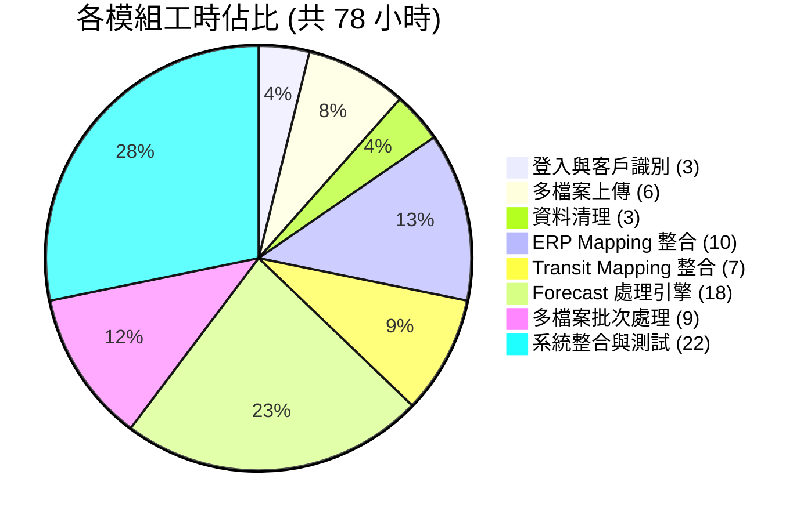
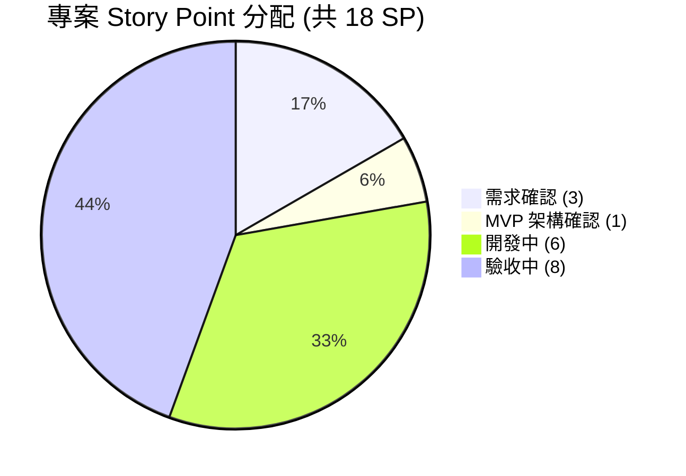

# 強茂光寶 Forecast 業務系統

本系統為強茂光寶 Forecast 業務系統，基於現有 FORECAST 數據處理平台進行光寶科技 (Liteon) 客製化擴展，支援雙訂單類型 (一般訂單/HUB 調撥) 差異化處理、多檔案 Forecast 批次處理、Transit 反向查詢與 ETD/ETA 日期算法選擇，大幅提升光寶供應鏈管理之作業效率並降低人工錯誤。

##### 專案開發人員 : 智合科技 - 張文雄
##### 專案連結 : 開發中

---

## 一、技術模組

| 層級 | 技術 |
|------|------|
| **後端框架** | Flask 3.0.3 |
| **資料庫** | MySQL 5.7+ / 8.0 |
| **資料處理** | pandas, numpy, openpyxl |
| **前端** | 原生 HTML5 + CSS3 + JavaScript |
| **Web 服務器** | Nginx |
| **Office 整合** | LibreOffice (格式保留) |

---

## 二、核心功能模組 (8 大模組)

| 模組 | 複雜度 | 說明 |
|------|--------|------|
| **1. 登入與客戶識別** | 低 | 新增光寶帳號、環境變數控制登入客戶顯示、客戶自動識別 |
| **2. 多檔案上傳系統** | 中 | 多份 Forecast 檔案同時上傳（依廠區/採購員分檔）、格式驗證 |
| **3. 資料清理引擎** | 中 | 共用清理邏輯、Commit/Shortage 列清空、格式保留 |
| **4. ERP Mapping 整合** | 高 | 雙訂單類型 (11/32) 差異化比對、4 個新增欄位、動態 UI |
| **5. Transit Mapping 整合** | 高 | 透過 ERP 送貨地點反向查詢、自動標註廠區代碼 |
| **6. Forecast 處理引擎** | 高 | 核心處理器、排程斷點計算、ETD/ETA 日期算法選擇、三段式日期對應 |
| **7. 多檔案批次處理** | 高 | 多檔案循序處理、ERP/Transit 分配追蹤防重複、數量累加 |
| **8. 系統整合與測試** | 中高 | 前後端整合、多檔下載 UI、整合測試、部署上線 |

---

## 三、專案特色與亮點

1. **雙訂單類型智慧比對** - 自動區分一般訂單 (11) 與 HUB 調撥 (32)，採用不同比對鍵值策略
2. **日期算法選擇機制** - 每筆 Mapping 可獨立設定 ETD 或 ETA 作為目標日期計算基準
3. **Transit 反向查詢** - Transit 無直接廠區資訊時，透過 ERP 送貨地點反向推導廠區代碼
4. **多檔案批次處理** - 一次處理 20+ 份 Forecast 檔案，分配追蹤確保數據不重複填入
5. **三段式日期結構** - 支援 Daily (31天) + Weekly (22週) + Monthly (6月) 之日期遞減對應
6. **格式保留技術** - LibreOffice 整合保留 Excel 原始字型、框線、合併儲存格格式
7. **獨立客戶隔離** - 光寶數據與其他客戶完全隔離，互不影響

---

## 四、功能模組說明

### A. 登入與客戶識別

| 功能項目 | 說明 |
|----------|------|
| 新增光寶帳號 | 建立光寶科技客戶帳號，系統自動識別啟用專屬處理邏輯 |
| 環境變數登入控制 | 透過環境變數控制登入頁面顯示的客戶清單 |

### B. 多檔案上傳系統

| 功能項目 | 說明 |
|----------|------|
| 多檔 Forecast 上傳 | 支援多個廠區/採購員 Forecast 檔案同時上傳 |
| ERP 淨需求上傳 | 支援含訂單型態、送貨地點、倉庫等欄位之 ERP 檔案 |
| Transit 在途上傳 | 支援在途貨運數據上傳（選填） |
| 檔案格式驗證 | 自動驗證 Forecast 表頭結構與 ERP/Transit 欄位完整性 |

### C. 資料清理引擎

| 功能項目 | 說明 |
|----------|------|
| 自動清理引擎 | 清除 Forecast 中 Commit 列與 Accumulate Shortage 列之舊有數據 |
| 格式保留處理 | 清理後保留原始 Excel 格式（合併儲存格、字型、框線） |

### D. ERP Mapping 整合

| 功能項目 | 說明 |
|----------|------|
| 雙訂單類型比對 | 型態 11 以 (客戶簡稱+送貨地點) 比對；型態 32 以 (客戶簡稱+倉庫) 比對 |
| 新增 Mapping 欄位 | 訂單型態、送貨地點、倉庫、日期算法 (ETD/ETA) 四個欄位 |
| Mapping UI 擴展 | 前端動態表格支援新增欄位之顯示、編輯與儲存 |
| ERP 自動整合 | 依 Mapping 結果自動新增客戶需求地區、排程斷點、ETD、ETA 等欄位 |

### E. Transit Mapping 整合

| 功能項目 | 說明 |
|----------|------|
| 反向查詢邏輯 | Transit Location → ERP 送貨地點 → 訂單類型 → Mapping → 廠區代碼 |
| 廠區代碼標註 | 自動為 Transit 數據標註對應之 Forecast 廠區代碼 |
| 異常處理 | 無法比對時標記並記錄，不中斷整體處理流程 |

### F. Forecast 處理引擎

| 功能項目 | 說明 |
|----------|------|
| 核心處理器 | 獨立 LiteonForecastProcessor 類別，含日期解析、料號比對、數值填入 |
| 排程斷點計算 | 依排程斷點（禮拜X）計算排程出貨日期所屬週期終點 |
| ETD/ETA 日期計算 | 解析中文日期文字（本週X/下週X/下下週X）計算目標日期 |
| 日期算法選擇 | 依 Mapping 設定自動選擇 ETD 或 ETA 進行目標日期計算 |
| 三段式日期對應 | Daily → Weekly → Monthly 遞減精度日期對應策略 |
| Transit 數據填入 | Transit 數量 × 1000 填入 Commit 列對應 ETA 日期欄位 |
| ERP 數據填入 | ERP 淨需求 × 1000 填入 Commit 列對應目標日期欄位 |

### G. 多檔案批次處理

| 功能項目 | 說明 |
|----------|------|
| 批次處理流程 | 循序處理所有上傳之 Forecast 檔案，各自輸出獨立結果 |
| 分配追蹤機制 | ERP/Transit 數據填入後標記「已分配」，後續檔案不重複使用 |
| 數量累加邏輯 | 同一 Commit 儲存格若有多筆來源數據，數量自動累加 |
| 結果檔案命名 | 以 forecast_{廠區代碼}_{採購員代碼}.xlsx 格式命名輸出 |

### H. 系統整合與測試

| 功能項目 | 說明 |
|----------|------|
| 前後端整合 | API 路由擴展、前端多檔案下載支援、處理統計顯示 |
| UI 介面調整 | 多檔案下載區塊、處理結果摘要、進度回饋 |
| 整合測試 | Forecast 處理、ERP Mapping、Transit Mapping 完整整合測試 |
| 部署上線 | 系統部署、環境設定、客戶帳號建立 |

---

## 五、工時總計

### 工時分佈圖

| 模組 | 小時 |
|------|------|
| A. 登入與客戶識別 | 3 |
| B. 多檔案上傳系統 | 6 |
| C. 資料清理引擎 | 3 |
| D. ERP Mapping 整合 | 10 |
| E. Transit Mapping 整合 | 7 |
| F. Forecast 處理引擎 | 18 |
| G. 多檔案批次處理 | 9 |
| H. 系統整合與測試 | 22 |
| **合計** | **78 小時** |

---

### 專案 Story Point 分配

本專案總計 **18 SP**，各階段分配如下：

| 階段 | SP | 佔比 |
|------|:--:|------|
| 需求確認 | 3 | 16.7% |
| MVP 架構確認 | 1 | 5.6% |
| 開案確認 | 0 | 0% |
| 開發中 | 6 | 33.3% |
| 驗收中 | 8 | 44.4% |
| 已結案 | 0 | 0% |
| **合計** | **18** | **100%** |

---

## 六、交付項目

1. 完整的光寶 Forecast 業務系統（客製化擴展）
2. 系統操作手冊

---

*報告日期: 2026-03-11*
