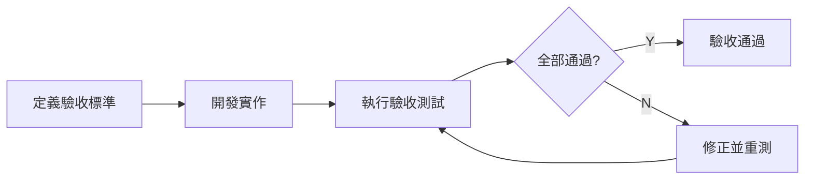
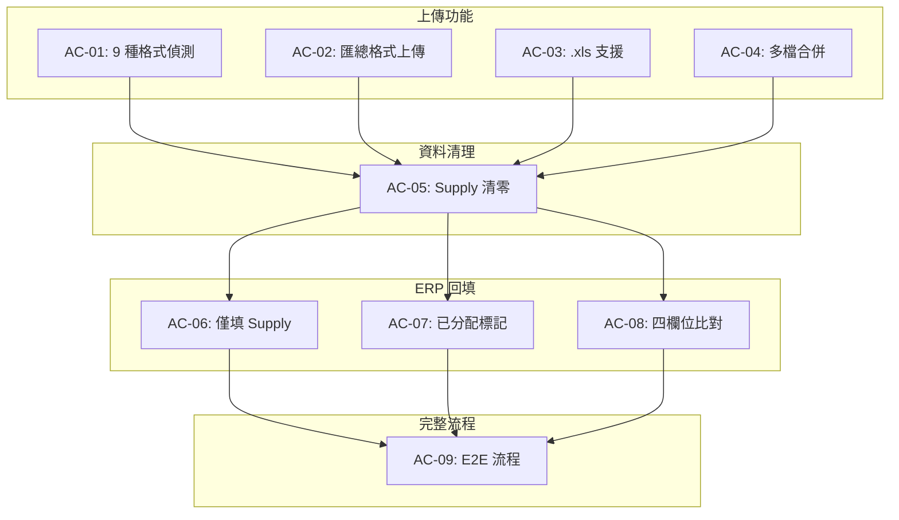

# 台達 Forecast 系統 - 驗收測試驅動開發文件 (ATDD)

##### 版本: 1.0 | 日期: 2026-04-14
##### 專案: 強茂台達 Forecast 業務系統

---

## 一、文件目的

本文件定義台達 Forecast 系統的驗收標準，以客戶角度描述每項功能的驗收條件，確保系統交付時滿足所有業務需求。

---

## 二、驗收流程

---

## 三、驗收標準

### 3.1 上傳功能驗收

#### AC-01: 9 種格式自動偵測

| 項目 | 內容 |
|------|------|
| **驗收條件** | 系統能正確辨識並處理 9 種 Buyer Forecast 格式 |
| **測試方式** | 依序上傳 9 種格式的檔案，確認系統正確偵測 |
| **通過標準** | 9/9 格式全部正確辨識 |

| 步驟 | 操作 | 預期結果 |
|------|------|----------|
| 1 | 上傳 Ketwadee 格式檔案 | 偵測為 Ketwadee，合併成功 |
| 2 | 上傳 Kanyanat 格式檔案 | 偵測為 Kanyanat，合併成功 |
| 3 | 上傳 Weeraya 格式檔案 | 偵測為 Weeraya，合併成功 |
| 4 | 上傳 India IAI1 格式檔案 | 偵測為 India IAI1，合併成功 |
| 5 | 上傳 PSW1+CEW1 格式檔案 | 偵測為 PSW1+CEW1，合併成功 |
| 6 | 上傳 MWC1+IPC1 格式檔案 | 偵測為 MWC1+IPC1，合併成功 |
| 7 | 上傳 NBQ1 格式檔案 | 偵測為 NBQ1，合併成功 |
| 8 | 上傳 SVC1+PWC1 格式檔案 | 偵測為 SVC1+PWC1，合併成功 |
| 9 | 上傳 PSBG 格式檔案 | 偵測為 PSBG，合併成功 |

#### AC-02: 匯總格式直接上傳

| 項目 | 內容 |
|------|------|
| **驗收條件** | 已整理好的匯總格式檔案可直接上傳，跳過合併 |
| **測試方式** | 上傳匯總格式檔案，確認跳過格式偵測 |
| **通過標準** | 系統自動辨識並直接使用，無需合併 |

| 步驟 | 操作 | 預期結果 |
|------|------|----------|
| 1 | 準備已整理好的匯總格式 Forecast 檔案 | 檔案包含正確的表頭結構 |
| 2 | 上傳該檔案 | 系統提示「匯總格式直接上傳」 |
| 3 | 確認後續 Step 2~4 可正常執行 | 清理、映射、回填均正常 |

#### AC-03: .xls 格式支援

| 項目 | 內容 |
|------|------|
| **驗收條件** | 舊版 .xls 格式檔案可正常上傳處理 |
| **測試方式** | 上傳 .xls 格式檔案 |
| **通過標準** | 自動轉換為 .xlsx 並正常處理 |

#### AC-04: 多檔合併上傳

| 項目 | 內容 |
|------|------|
| **驗收條件** | 同時上傳多個 Buyer 檔案，系統正確合併 |
| **測試方式** | 同時上傳 3~5 個不同 Buyer 的檔案 |
| **通過標準** | 合併後料號數 = 各檔案料號數總和 |

---

### 3.2 資料清理驗收

#### AC-05: Supply 列清零

| 項目 | 內容 |
|------|------|
| **驗收條件** | Step 2 執行後，Supply 列所有舊有數據被清除 |
| **測試方式** | 執行 Step 2 後下載檔案，檢查 Supply 列 |
| **通過標準** | Supply 列所有數值欄位為零或空 |

| 步驟 | 操作 | 預期結果 |
|------|------|----------|
| 1 | 完成 Step 1 上傳 | Forecast 含有 Supply 舊值 |
| 2 | 執行 Step 2 清理 | 系統提示清理完成 |
| 3 | 下載 cleaned_forecast.xlsx | Supply 列全部清零 |
| 4 | 檢查 Demand 列 | Demand 列數據保持不變 |
| 5 | 檢查 Balance 列 | Balance 列數據保持不變 |

---

### 3.3 ERP 回填驗收

#### AC-06: ERP 僅填入 Supply 列

| 項目 | 內容 |
|------|------|
| **驗收條件** | Step 4 的 ERP 數據只填入 Supply 列，不影響其他列 |
| **測試方式** | 執行 Step 4 後比對 Demand 列前後差異 |
| **通過標準** | Demand 列 100% 不變，Supply 列含 ERP 數據 |

#### AC-07: 已分配標記

| 項目 | 內容 |
|------|------|
| **驗收條件** | 被使用的 ERP 行標記為「已分配=Y」 |
| **測試方式** | 執行 Step 4 後下載 ERP 檔案，檢查已分配欄位 |
| **通過標準** | 所有被使用的 ERP 行均標記 Y |

| 步驟 | 操作 | 預期結果 |
|------|------|----------|
| 1 | 完成 Step 1~3 | Forecast 和 ERP 已準備就緒 |
| 2 | 執行 Step 4 | 系統提示回填完成 |
| 3 | 下載 forecast_result.xlsx | Supply 列含 ERP 數據 |
| 4 | 下載 integrated_erp.xlsx | 被使用行標記 Y |
| 5 | 檢查 Demand 列 | 與 Step 3 輸出完全一致 |

#### AC-08: 四欄位精準比對

| 項目 | 內容 |
|------|------|
| **驗收條件** | ERP 數據以四欄位鍵值精準填入對應位置 |
| **測試方式** | 確認 ERP 填入位置的 (客戶需求地區+客戶簡稱+送貨地點+客戶料號) 與 ERP 一致 |
| **通過標準** | 100% 填入位置正確 |

---

### 3.4 完整流程驗收

#### AC-09: 端對端流程

| 項目 | 內容 |
|------|------|
| **驗收條件** | Step 1→2→3→4 完整流程執行正確 |
| **測試方式** | 上傳真實 Buyer 檔案，執行完整流程 |
| **通過標準** | 最終輸出報表數據正確 |

| 步驟 | 操作 | 預期結果 |
|------|------|----------|
| 1 | 上傳 Buyer Forecast 檔案 | 合併成功，顯示料號數 |
| 2 | 上傳 ERP 淨需求檔案 | 上傳成功 |
| 3 | 執行 Step 2 清理 | Supply 列清零 |
| 4 | 執行 Step 3 映射 | C/D 欄位填入、ETA 計算 |
| 5 | 執行 Step 4 回填 | Supply 列回填 ERP 數據 |
| 6 | 下載最終報表 | 報表數據正確完整 |

---

## 四、驗收總表

| 編號 | 驗收項目 | 優先級 | 狀態 |
|------|----------|--------|------|
| AC-01 | 9 種格式自動偵測 | 高 | 已完成 |
| AC-02 | 匯總格式直接上傳 | 高 | 已完成 |
| AC-03 | .xls 格式支援 | 中 | 已完成 |
| AC-04 | 多檔合併上傳 | 高 | 已完成 |
| AC-05 | Supply 列清零 | 高 | 已完成 |
| AC-06 | ERP 僅填入 Supply 列 | 高 | 已完成 |
| AC-07 | 已分配標記 | 高 | 已完成 |
| AC-08 | 四欄位精準比對 | 高 | 已完成 |
| AC-09 | 端對端流程 | 高 | 已完成 |

---

*文件版本: 1.0 | 建立日期: 2026-04-14*
