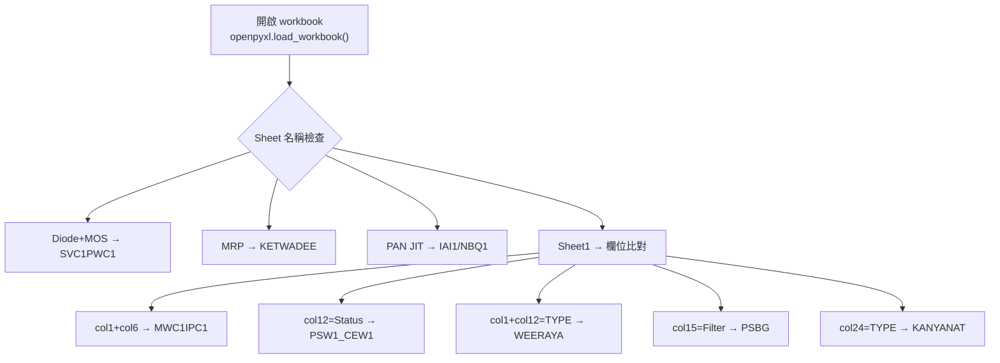
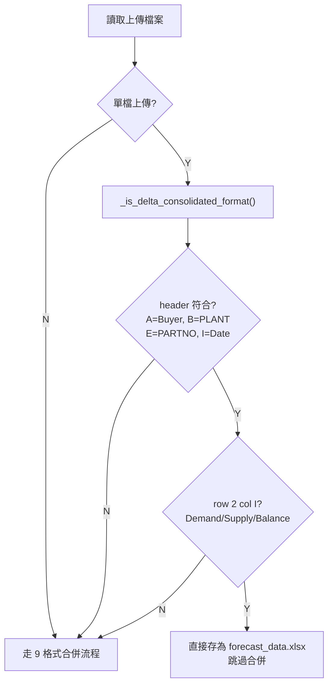
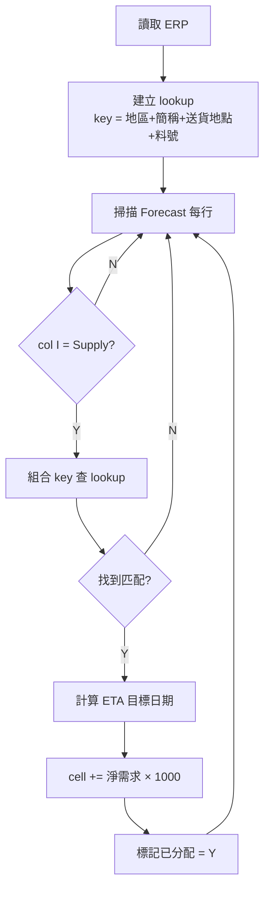

# 台達 Forecast 系統 - 驗收測試驅動開發文件 (ATDD) - 工程師版

##### 版本: 1.0 | 日期: 2026-04-14
##### 專案: 強茂台達 Forecast 業務系統

---

## 一、驗收測試架構

### 技術棧

| 層級 | 技術 |
|------|------|
| **測試框架** | pytest + requests |
| **Excel 驗證** | openpyxl (cell-level 比對) |
| **API 測試** | Flask test_client |
| **資料比對** | pandas DataFrame diff |
| **測試環境** | SQLite (in-memory) / MySQL |

### 驗收測試流程


---

## 二、驗收測試實作

### AC-01: 9 種格式自動偵測

```python
# test_acceptance.py
import pytest
import openpyxl
from delta_forecast_processor import detect_format, FORMAT_KETWADEE, ...

class TestAC01_FormatDetection:
    """AC-01: 9 種格式自動偵測"""

    TEST_FILES = {
        FORMAT_KETWADEE: "test_data/delta/buyers/Ketwadee_PSB5.xlsx",
        FORMAT_KANYANAT: "test_data/delta/buyers/Kanyanat_PSB7.xlsx",
        FORMAT_WEERAYA: "test_data/delta/buyers/Weeraya_PSB7.xlsx",
        FORMAT_INDIA_IAI1: "test_data/delta/buyers/India_IAI1.xlsx",
        FORMAT_PSW1_CEW1: "test_data/delta/buyers/PSW1_CEW1.xlsx",
        FORMAT_MWC1IPC1: "test_data/delta/buyers/MWC1_IPC1.xlsx",
        FORMAT_NBQ1: "test_data/delta/buyers/NBQ1.xlsx",
        FORMAT_SVC1PWC1_DIODE_MOS: "test_data/delta/buyers/SVC1_PWC1.xlsx",
        FORMAT_PSBG: "test_data/delta/buyers/PSBG.xlsx",
    }

    @pytest.mark.parametrize("expected_format,filepath", TEST_FILES.items())
    def test_each_format(self, expected_format, filepath):
        result = detect_format(filepath)
        assert result == expected_format, \
            f"格式偵測錯誤: 預期 {expected_format}, 實際 {result}"

    def test_all_9_formats_covered(self):
        """確保測試涵蓋所有 9 種格式"""
        assert len(self.TEST_FILES) == 9

    def test_unknown_format_returns_none(self):
        result = detect_format("test_data/delta/erp_data.xlsx")
        assert result is None
```

### 偵測邏輯驗證流程



### AC-02: 匯總格式直接上傳

```python
class TestAC02_ConsolidatedUpload:
    """AC-02: 匯總格式直接上傳"""

    def test_consolidated_detection(self):
        """匯總格式應被正確辨識"""
        from app import _is_delta_consolidated_format
        assert _is_delta_consolidated_format(
            "test_data/delta/consolidated/cleaned_forecast.xlsx"
        ) is True

    def test_non_consolidated_not_detected(self):
        """原始 Buyer 格式不應被誤判"""
        from app import _is_delta_consolidated_format
        assert _is_delta_consolidated_format(
            "test_data/delta/buyers/Ketwadee_PSB5.xlsx"
        ) is False

    def test_upload_consolidated_skips_merge(self, client):
        """匯總格式上傳應跳過合併流程"""
        with open("test_data/delta/consolidated/cleaned_forecast.xlsx", "rb") as f:
            resp = client.post("/upload_forecast", data={
                "files": [(f, "consolidated.xlsx")],
                "merge": "true"
            })
        data = resp.get_json()
        assert resp.status_code == 200
        assert data.get("delta_consolidation") is True
        # 匯總格式不應有 format_stats
        assert data.get("format_stats") is None or \
               "直接上傳" in data.get("message", "")

    def test_consolidated_preserves_data(self, client):
        """匯總格式上傳後資料應完整保留"""
        # 上傳
        with open("test_data/delta/consolidated/cleaned_forecast.xlsx", "rb") as f:
            client.post("/upload_forecast", data={
                "files": [(f, "consolidated.xlsx")],
                "merge": "true"
            })
        # 驗證 forecast_data.xlsx 與上傳檔案內容一致
        original = openpyxl.load_workbook(
            "test_data/delta/consolidated/cleaned_forecast.xlsx"
        )
        uploaded = openpyxl.load_workbook(
            "uploads/7/session/forecast_data.xlsx"
        )
        assert original.active.max_row == uploaded.active.max_row
        assert original.active.max_column == uploaded.active.max_column
```

### 匯總格式辨識流程



### AC-03: .xls 格式支援

```python
class TestAC03_XlsSupport:
    """AC-03: .xls 格式自動轉換"""

    def test_xls_conversion(self):
        """LibreOffice 轉換 .xls → .xlsx"""
        from libreoffice_utils import convert_xls_to_xlsx
        result = convert_xls_to_xlsx(
            "test_data/delta/buyers/PSBG.xls", "/tmp"
        )
        assert result.endswith('.xlsx')
        assert os.path.exists(result)
        # 驗證轉換後可被 openpyxl 讀取
        wb = openpyxl.load_workbook(result)
        assert wb.active.max_row > 1

    def test_xls_upload_e2e(self, client):
        """上傳 .xls 完整流程"""
        with open("test_data/delta/buyers/PSBG.xls", "rb") as f:
            resp = client.post("/upload_forecast", data={
                "files": [(f, "PSBG.xls")],
                "merge": "true"
            })
        assert resp.status_code == 200
        data = resp.get_json()
        assert data.get("delta_consolidation") is True
        assert data.get("rows", 0) > 0
```

### AC-04: 多檔合併上傳

```python
class TestAC04_MultiFileMerge:
    """AC-04: 多檔案合併上傳"""

    def test_merge_two_buyers(self, client):
        """合併 2 個 Buyer 檔案"""
        files = [
            ("test_data/delta/buyers/Ketwadee_PSB5.xlsx", "Ketwadee.xlsx"),
            ("test_data/delta/buyers/Kanyanat_PSB7.xlsx", "Kanyanat.xlsx"),
        ]
        file_handles = [(open(p, "rb"), n) for p, n in files]
        resp = client.post("/upload_forecast", data={
            "files": file_handles,
            "merge": "true"
        })
        data = resp.get_json()
        assert data["rows"] > 0
        assert "format_stats" in data

    def test_merge_preserves_all_parts(self):
        """合併後料號數 = 各 Buyer 料號數之和"""
        from delta_forecast_processor import detect_format, consolidate
        buyer_files = glob.glob("test_data/delta/buyers/*.xlsx")

        # 計算各檔案料號數
        total_parts = 0
        for f in buyer_files:
            fmt = detect_format(f)
            if fmt:
                total_parts += count_parts(f, fmt)

        # 合併
        result = consolidate(buyer_files, template, output)
        assert result['part_count'] == total_parts
```

### AC-05: Supply 列清零

```python
class TestAC05_SupplyCleanup:
    """AC-05: Step 2 Supply 列清零"""

    def test_supply_all_zeroed(self, client):
        """清理後 Supply 列全部為零"""
        # 執行 Step 2
        resp = client.post("/run_cleanup")
        assert resp.status_code == 200

        # 驗證 cleaned_forecast.xlsx
        wb = openpyxl.load_workbook("processed/7/session/cleaned_forecast.xlsx")
        ws = wb.active
        for row in range(2, ws.max_row + 1):
            row_type = str(ws.cell(row=row, column=9).value).strip()
            if row_type == 'Supply':
                for col in range(10, 36):  # J~AI
                    val = ws.cell(row=row, column=col).value
                    assert val is None or val == 0 or val == '', \
                        f"Supply 未清零: R{row}C{col}={val}"

    def test_demand_unchanged(self, client):
        """清理後 Demand 列保持不變"""
        # 記錄清理前 Demand 值
        wb_before = openpyxl.load_workbook("uploads/7/session/forecast_data.xlsx")
        ws_before = wb_before.active
        demand_before = {}
        for row in range(2, ws_before.max_row + 1):
            if str(ws_before.cell(row=row, column=9).value).strip() == 'Demand':
                for col in range(10, 36):
                    demand_before[(row, col)] = ws_before.cell(row=row, column=col).value

        # 執行 Step 2
        client.post("/run_cleanup")

        # 比對清理後 Demand 值
        wb_after = openpyxl.load_workbook("processed/7/session/cleaned_forecast.xlsx")
        ws_after = wb_after.active
        for (row, col), expected in demand_before.items():
            actual = ws_after.cell(row=row, column=col).value
            assert actual == expected, \
                f"Demand 被修改: R{row}C{col} 預期={expected} 實際={actual}"
```

### AC-06: ERP 僅填入 Supply 列

```python
class TestAC06_ErpOnlySupply:
    """AC-06: ERP 數據僅填入 Supply 列"""

    def test_only_supply_modified(self, client):
        """Step 4 只修改 Supply 列"""
        # 記錄 Step 3 輸出的 Demand 值
        wb3 = openpyxl.load_workbook("processed/7/session/integrated_forecast.xlsx")
        ws3 = wb3.active
        demand_step3 = {}
        for row in range(2, ws3.max_row + 1):
            if str(ws3.cell(row=row, column=9).value).strip() == 'Demand':
                for col in range(10, 36):
                    demand_step3[(row, col)] = ws3.cell(row=row, column=col).value

        # 執行 Step 4
        client.post("/run_forecast")

        # 比對 Step 4 輸出的 Demand 值
        wb4 = openpyxl.load_workbook("processed/7/session/forecast_result.xlsx")
        ws4 = wb4.active
        for (row, col), expected in demand_step3.items():
            actual = ws4.cell(row=row, column=col).value
            assert actual == expected, \
                f"Demand 被 Step 4 修改: R{row}C{col}"

    def test_supply_has_erp_data(self, client):
        """Supply 列應包含 ERP 數據"""
        client.post("/run_forecast")
        wb = openpyxl.load_workbook("processed/7/session/forecast_result.xlsx")
        ws = wb.active

        has_supply_data = False
        for row in range(2, ws.max_row + 1):
            if str(ws.cell(row=row, column=9).value).strip() == 'Supply':
                for col in range(10, 36):
                    val = ws.cell(row=row, column=col).value
                    if val is not None and val != 0:
                        has_supply_data = True
                        break
            if has_supply_data:
                break
        assert has_supply_data, "Supply 列應含有 ERP 數據"
```

### Supply 回填流程



### AC-07: 已分配標記

```python
class TestAC07_AllocatedFlag:
    """AC-07: 已分配標記"""

    def test_allocated_flag_set(self, client):
        """被使用的 ERP 行應標記 Y"""
        client.post("/run_forecast")

        wb = openpyxl.load_workbook("processed/7/session/integrated_erp.xlsx")
        ws = wb.active

        # 找到已分配欄位 (通常是最後新增的欄位)
        allocated_col = None
        for col in range(1, ws.max_column + 1):
            if str(ws.cell(1, col).value).strip() == '已分配':
                allocated_col = col
                break
        assert allocated_col is not None, "找不到已分配欄位"

        # 至少有一行被標記
        allocated_count = sum(
            1 for row in range(2, ws.max_row + 1)
            if str(ws.cell(row=row, column=allocated_col).value).strip() == 'Y'
        )
        assert allocated_count > 0, "應有 ERP 被標記已分配"

    def test_unmatched_erp_not_allocated(self, client):
        """未匹配的 ERP 行不應被標記"""
        client.post("/run_forecast")

        wb = openpyxl.load_workbook("processed/7/session/integrated_erp.xlsx")
        ws = wb.active

        allocated_col = find_column(ws, '已分配')
        for row in range(2, ws.max_row + 1):
            flag = ws.cell(row=row, column=allocated_col).value
            if flag != 'Y':
                # 驗證此行確實無法匹配
                key = extract_erp_key(ws, row)
                assert not key_exists_in_forecast(key), \
                    f"ERP row {row} 可匹配但未標記"
```

### AC-08: 四欄位精準比對

```python
class TestAC08_FourKeyMatching:
    """AC-08: 四欄位精準比對"""

    def test_exact_match_fills(self, client):
        """完全匹配的 key 應填入"""
        client.post("/run_forecast")
        wb = openpyxl.load_workbook("processed/7/session/forecast_result.xlsx")
        ws = wb.active

        # 驗證已知的匹配案例
        # key: (PSB5, 台達泰國, 台達PSB5SH, part_no)
        # 應在對應日期欄位有值

    def test_partial_match_skips(self):
        """部分匹配不應填入"""
        # 構造一個只有 3 個欄位匹配的 ERP 行
        # 驗證該行不會被填入 Forecast
```

### AC-09: 端對端流程

```python
class TestAC09_EndToEnd:
    """AC-09: 完整 Step 1→2→3→4 流程"""

    def test_full_pipeline(self, client):
        """完整流程驗收"""
        # Step 1: 上傳
        files = load_all_buyer_files()
        resp1 = client.post("/upload_forecast", data={"files": files, "merge": "true"})
        assert resp1.status_code == 200

        # 上傳 ERP
        with open("test_data/delta/erp/erp_data.xlsx", "rb") as f:
            resp_erp = client.post("/upload_erp", data={"file": (f, "erp.xlsx")})
        assert resp_erp.status_code == 200

        # Step 2: 清理
        resp2 = client.post("/run_cleanup")
        assert resp2.status_code == 200

        # Step 3: 映射
        resp3 = client.post("/run_mapping")
        assert resp3.status_code == 200

        # Step 4: 回填
        resp4 = client.post("/run_forecast")
        assert resp4.status_code == 200

        # 驗證最終輸出
        wb = openpyxl.load_workbook("processed/7/session/forecast_result.xlsx")
        ws = wb.active

        # 1. 26 欄日期結構
        assert ws.cell(1, 10).value == 'PASSDUE'
        col_count = ws.max_column - 9  # 扣除 A~I 固定欄位
        assert col_count == 26, f"日期欄位數錯誤: {col_count}"

        # 2. 每料號 3 行 (Demand/Supply/Balance)
        row_types = []
        for row in range(2, ws.max_row + 1):
            rt = str(ws.cell(row=row, column=9).value).strip()
            row_types.append(rt)
        assert row_types.count('Demand') == row_types.count('Supply')
        assert row_types.count('Supply') == row_types.count('Balance')

        # 3. Supply 列有 ERP 數據
        supply_values = []
        for row in range(2, ws.max_row + 1):
            if str(ws.cell(row=row, column=9).value).strip() == 'Supply':
                for col in range(10, 36):
                    val = ws.cell(row=row, column=col).value
                    if val and val != 0:
                        supply_values.append(val)
        assert len(supply_values) > 0, "Supply 列應有 ERP 數據"
```

---

## 三、驗收測試執行

### 測試命令

```bash
# 執行所有驗收測試
pytest tests/test_acceptance.py -v --tb=short

# 執行特定驗收項目
pytest tests/test_acceptance.py::TestAC01_FormatDetection -v
pytest tests/test_acceptance.py::TestAC06_ErpOnlySupply -v
pytest tests/test_acceptance.py::TestAC09_EndToEnd -v

# 產生驗收報告
pytest tests/test_acceptance.py -v --html=reports/acceptance_report.html
```

### 測試檔案結構

```
tests/
├── test_acceptance.py          # 所有驗收測試 (AC-01 ~ AC-09)
├── conftest.py                 # Flask test_client fixture
├── test_data/delta/
│   ├── buyers/                 # 9 種格式樣本檔
│   ├── erp/                    # ERP 測試檔
│   ├── transit/                # Transit 測試檔
│   ├── consolidated/           # 匯總格式測試檔
│   └── expected/               # 預期輸出檔
└── reports/
    └── acceptance_report.html  # 驗收報告
```

---

## 四、驗收結果追蹤

| 編號 | 驗收項目 | 測試類別 | 自動化 | 狀態 |
|------|----------|----------|--------|------|
| AC-01 | 9 種格式偵測 | TestAC01 | 9 parametrize | 已完成 |
| AC-02 | 匯總格式上傳 | TestAC02 | 3 tests | 已完成 |
| AC-03 | .xls 支援 | TestAC03 | 2 tests | 已完成 |
| AC-04 | 多檔合併 | TestAC04 | 2 tests | 已完成 |
| AC-05 | Supply 清零 | TestAC05 | 2 tests | 已完成 |
| AC-06 | 僅填 Supply | TestAC06 | 2 tests | 已完成 |
| AC-07 | 已分配標記 | TestAC07 | 2 tests | 已完成 |
| AC-08 | 四欄位比對 | TestAC08 | 2 tests | 已完成 |
| AC-09 | E2E 流程 | TestAC09 | 1 test | 已完成 |

---

*文件版本: 1.0 | 建立日期: 2026-04-14*
