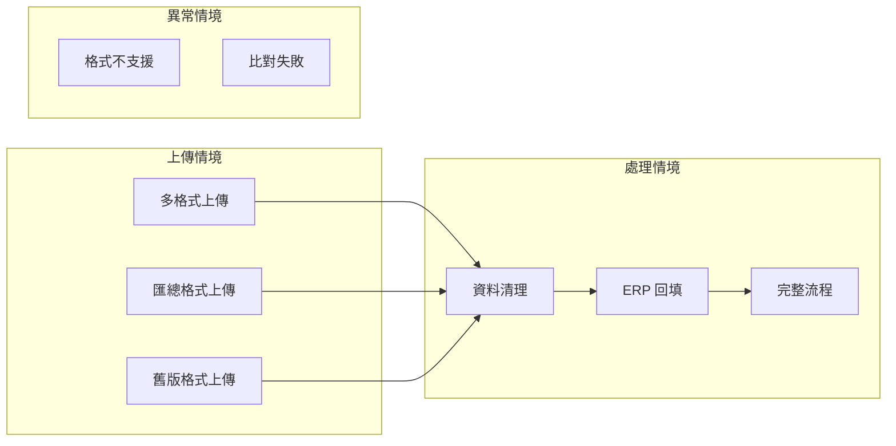

# 台達 Forecast 系統 - 行為驅動開發文件 (BDD)

##### 版本: 1.0 | 日期: 2026-04-14
##### 專案: 強茂台達 Forecast 業務系統

---

## 一、文件目的

本文件以使用者行為情境 (Scenario) 描述系統功能，採用 Given / When / Then 格式，讓客戶能直觀理解系統在各種操作下的預期行為。

---

## 二、行為情境總覽



---

## 三、上傳功能情境

### 情境 1: 多格式 Buyer Forecast 上傳

```gherkin
功能: Buyer Forecast 多格式上傳

  情境: 上傳多個不同格式的 Buyer Forecast 檔案
    假設 使用者已登入台達帳號
    當 使用者上傳 3 個不同 Buyer 的 Forecast 檔案
    那麼 系統應自動偵測每個檔案的格式
    而且 系統應將所有檔案合併為統一的匯總格式
    而且 顯示合併結果：檔案數量、料號數量、各格式統計
```

### 情境 2: 匯總格式直接上傳

```gherkin
功能: 匯總格式直接上傳

  情境: 上傳已整理好的匯總格式檔案
    假設 使用者已登入台達帳號
    而且 使用者已自行整理好匯總格式的 Forecast 檔案
    當 使用者上傳該匯總格式檔案
    那麼 系統應自動辨識為匯總格式
    而且 跳過格式偵測與合併步驟
    而且 直接進入後續處理流程
```

### 情境 3: 舊版 .xls 格式上傳

```gherkin
功能: .xls 格式自動轉換

  情境: 上傳 .xls 格式的 Buyer Forecast 檔案
    假設 使用者已登入台達帳號
    當 使用者上傳一個 .xls 格式的檔案
    那麼 系統應自動將 .xls 轉換為 .xlsx 格式
    而且 繼續執行格式偵測與合併流程
    而且 轉換過程對使用者透明，無需額外操作
```

---

## 四、資料清理情境

### 情境 4: Supply 列清零

```gherkin
功能: Forecast 資料清理

  情境: 執行 Step 2 清理 Supply 列
    假設 已完成 Step 1 Forecast 上傳
    當 使用者執行資料清理 (Step 2)
    那麼 Forecast 中 Supply 列的所有數值應被清零
    而且 Demand 列的數據保持不變
    而且 Balance 列的數據保持不變
    而且 Excel 格式（字型、框線）保持不變
```

---

## 五、ERP 回填情境

### 情境 5: ERP 數據回填至 Supply 列

```gherkin
功能: ERP 回填至 Supply 列

  情境: 執行 Step 4 將 ERP 數據填入 Forecast
    假設 已完成 Step 1~3 的處理
    而且 已上傳 ERP 淨需求檔案
    當 使用者執行 Forecast 處理 (Step 4)
    那麼 ERP 數據應僅填入 Supply 列
    而且 Demand 列不會被修改
    而且 已分配的 ERP 行應被標記為「已分配=Y」
    而且 淨需求數值應乘以 1000 後填入
```

### 情境 6: 四欄位精準比對

```gherkin
功能: ERP 精準比對

  情境: ERP 數據以四欄位鍵值比對填入
    假設 已完成 ERP 映射
    當 系統執行 Supply 列回填
    那麼 系統應以「客戶需求地區 + 客戶簡稱 + 送貨地點 + 客戶料號」四欄位做比對
    而且 只有完全匹配的 ERP 行才會被填入
    而且 不匹配的 ERP 行應被跳過，不影響其他數據
```

### 情境 7: ETA 日期計算

```gherkin
功能: ETA 日期計算

  情境: 系統依排程與 ETA 文字計算目標日期
    假設 ERP 行的排程出貨日期為 2026-04-13
    而且 排程斷點為「禮拜四」
    而且 ETA 文字為「下週一」
    當 系統計算目標到貨日期
    那麼 應計算出正確的週一日期
    而且 將數據填入該日期對應的欄位
```

---

## 六、完整流程情境

### 情境 8: Step 1→4 完整流程

```gherkin
功能: 完整 Forecast 處理流程

  情境: 從上傳到產出完整報表
    假設 使用者已登入台達帳號
    當 使用者上傳多個 Buyer Forecast 檔案 (Step 1)
    而且 執行資料清理 (Step 2)
    而且 執行 ERP/Transit 映射 (Step 3)
    而且 執行 Forecast 處理 (Step 4)
    那麼 系統應產出完整的 Forecast 報表
    而且 報表包含 26 欄日期結構 (PASSDUE + 16週 + 9月)
    而且 Supply 列僅包含 ERP 和 Transit 數據
    而且 已使用的 ERP 行應標記為「已分配」
```

---

## 七、異常處理情境

### 情境 9: 不支援的格式

```gherkin
功能: 格式驗證

  情境: 上傳不支援的檔案格式
    假設 使用者已登入台達帳號
    當 使用者上傳一個系統無法辨識格式的檔案
    那麼 系統應提示格式不支援
    而且 列出目前支援的 9 種格式
    而且 不中斷系統運作
```

### 情境 10: ERP 無法匹配

```gherkin
功能: ERP 比對失敗處理

  情境: ERP 數據無法匹配任何 Forecast 行
    假設 已完成 Step 1~3 的處理
    當 ERP 行的四欄位鍵值無法匹配任何 Forecast Supply 行
    那麼 系統應跳過該筆 ERP 數據
    而且 不標記該 ERP 行為已分配
    而且 繼續處理其他 ERP 行
    而且 整體流程不中斷
```

---

## 八、情境覆蓋矩陣

| 情境 | 功能模組 | 正常/異常 |
|------|----------|-----------|
| 多格式上傳 | 上傳模組 | 正常 |
| 匯總格式上傳 | 上傳模組 | 正常 |
| .xls 轉換 | 上傳模組 | 正常 |
| Supply 清零 | 清理模組 | 正常 |
| ERP 回填 | 回填模組 | 正常 |
| 四欄位比對 | 回填模組 | 正常 |
| ETA 日期計算 | 回填模組 | 正常 |
| 完整流程 | 全模組 | 正常 |
| 格式不支援 | 上傳模組 | 異常 |
| ERP 無法匹配 | 回填模組 | 異常 |

---

*文件版本: 1.0 | 建立日期: 2026-04-14*
