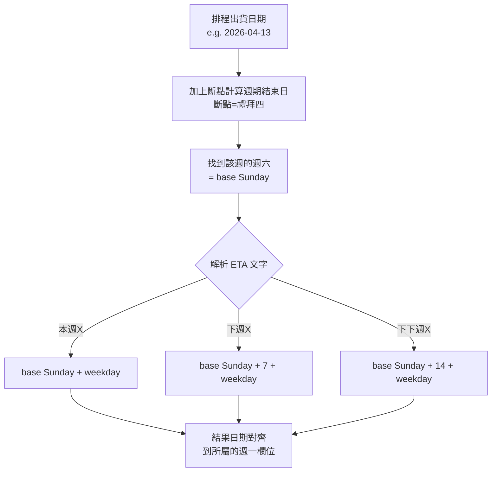

# 台達 Forecast 系統 - 行為驅動開發文件 (BDD) - 工程師版

##### 版本: 1.0 | 日期: 2026-04-14
##### 專案: 強茂台達 Forecast 業務系統

---

## 一、BDD 架構

### 行為測試流程


### 技術棧

| 層級 | 技術 |
|------|------|
| **BDD 框架** | pytest-bdd |
| **Feature 語法** | Gherkin (中文) |
| **Step 實作** | Python + openpyxl |
| **HTTP 測試** | Flask test_client |
| **驗證工具** | pandas + openpyxl |

---

## 二、Feature 檔案與 Step 定義

### 2.1 多格式上傳

**Feature 檔案:** `features/delta_upload.feature`

```gherkin
功能: Buyer Forecast 多格式上傳
  作為台達業務人員
  我希望上傳不同 Buyer 的 Forecast 檔案
  以便系統自動合併為統一匯總格式

  情境大綱: 上傳單一 Buyer 格式
    假設 使用者已登入台達帳號
    當 使用者上傳 "<format>" 格式的 Forecast 檔案
    那麼 系統偵測格式為 "<detected>"
    而且 合併後的料號數應大於 0

    例子:
      | format      | detected                  |
      | Ketwadee    | FORMAT_KETWADEE           |
      | Kanyanat    | FORMAT_KANYANAT           |
      | Weeraya     | FORMAT_WEERAYA            |
      | India_IAI1  | FORMAT_INDIA_IAI1         |
      | PSW1_CEW1   | FORMAT_PSW1_CEW1          |
      | MWC1_IPC1   | FORMAT_MWC1IPC1           |
      | NBQ1        | FORMAT_NBQ1               |
      | SVC1_PWC1   | FORMAT_SVC1PWC1_DIODE_MOS |
      | PSBG        | FORMAT_PSBG               |

  情境: 上傳多個 Buyer 檔案合併
    假設 使用者已登入台達帳號
    當 使用者同時上傳 Ketwadee 和 Kanyanat 格式的檔案
    那麼 系統應將兩個檔案合併
    而且 合併後料號數應等於兩個檔案料號數之和
```

**Step 定義:** `steps/test_delta_upload.py`

```python
from pytest_bdd import scenarios, given, when, then, parsers
from delta_forecast_processor import detect_format, consolidate

scenarios('../features/delta_upload.feature')

@given("使用者已登入台達帳號")
def logged_in_user(client):
    # 模擬台達帳號登入 (user_id=7)
    with client.session_transaction() as sess:
        sess['user_id'] = 7
        sess['customer_name'] = 'delta'

@when(parsers.parse('使用者上傳 "{format_name}" 格式的 Forecast 檔案'))
def upload_single_format(client, format_name, context):
    filepath = f"test_data/delta/buyers/{format_name}.xlsx"
    with open(filepath, "rb") as f:
        resp = client.post("/upload_forecast", data={
            "files": [(f, f"{format_name}.xlsx")],
            "merge": "true"
        })
    context['response'] = resp.get_json()

@then(parsers.parse('系統偵測格式為 "{expected}"'))
def verify_detected_format(context, expected):
    stats = context['response'].get('format_stats', {})
    assert expected in str(stats), f"格式偵測失敗: {stats}"

@then("合併後的料號數應大於 0")
def verify_part_count(context):
    assert context['response']['rows'] > 0
```

### 2.2 匯總格式直接上傳

**Feature 檔案:** `features/delta_consolidated_upload.feature`

```gherkin
功能: 匯總格式直接上傳
  作為台達業務人員
  我希望能直接上傳已整理好的匯總格式檔案
  以便跳過格式偵測與合併步驟

  情境: 上傳匯總格式檔案
    假設 使用者已登入台達帳號
    當 使用者上傳一個匯總格式的 Forecast 檔案
    那麼 系統應辨識為匯總格式
    而且 跳過合併步驟
    而且 Forecast 檔案直接可用

  情境: 上傳非匯總格式仍走合併流程
    假設 使用者已登入台達帳號
    當 使用者上傳一個原始 Buyer 格式的檔案
    那麼 系統應走格式偵測與合併流程
```

**Step 定義:**

```python
@when("使用者上傳一個匯總格式的 Forecast 檔案")
def upload_consolidated(client, context):
    with open("test_data/delta/consolidated/cleaned_forecast.xlsx", "rb") as f:
        resp = client.post("/upload_forecast", data={
            "files": [(f, "consolidated.xlsx")],
            "merge": "true"
        })
    context['response'] = resp.get_json()

@then("系統應辨識為匯總格式")
def verify_consolidated_detection(context):
    msg = context['response'].get('message', '')
    assert '直接上傳' in msg or '匯總格式' in msg

@then("跳過合併步驟")
def verify_skip_merge(context):
    # 匯總格式上傳不應有 format_stats
    assert 'format_stats' not in context['response'] or \
           context['response'].get('format_stats') is None
```

### 2.3 Supply 清零與回填

**Feature 檔案:** `features/delta_supply.feature`

```gherkin
功能: Supply 列處理
  作為台達業務人員
  我希望 Supply 列先清零再回填 ERP 數據
  以確保 Supply 列只包含最新的 ERP/Transit 數據

  情境: Step 2 清零 Supply 列
    假設 已上傳 Forecast 檔案並完成合併
    當 執行資料清理 (Step 2)
    那麼 所有 Supply 列的數值欄位應為零或空
    而且 所有 Demand 列的數值保持不變

  情境: Step 4 ERP 回填至 Supply 列
    假設 已完成 Step 1~3 處理
    而且 ERP 檔案含有 "PSB7" 廠區的淨需求 450
    當 執行 Forecast 處理 (Step 4)
    那麼 PSB7 對應的 Supply 列應填入 450000
    而且 該 ERP 行應標記為「已分配=Y」
```

**Step 定義:**

```python
@then("所有 Supply 列的數值欄位應為零或空")
def verify_supply_cleared(context):
    wb = openpyxl.load_workbook(context['cleaned_file'])
    ws = wb.active
    for row in range(2, ws.max_row + 1):
        if str(ws.cell(row=row, column=9).value).strip() == 'Supply':
            for col in range(10, 36):  # J ~ AI (26 日期欄)
                val = ws.cell(row=row, column=col).value
                assert val is None or val == 0 or val == '', \
                    f"Supply 未清零: row={row}, col={col}, val={val}"

@then("所有 Demand 列的數值保持不變")
def verify_demand_unchanged(context):
    before = context['demand_before']  # Step 1 輸出的 Demand 值
    wb = openpyxl.load_workbook(context['cleaned_file'])
    ws = wb.active
    for row in range(2, ws.max_row + 1):
        if str(ws.cell(row=row, column=9).value).strip() == 'Demand':
            for col in range(10, 36):
                key = (row, col)
                assert ws.cell(row=row, column=col).value == before.get(key), \
                    f"Demand 被修改: row={row}, col={col}"

@then(parsers.parse('PSB7 對應的 Supply 列應填入 {expected:d}'))
def verify_erp_fill_value(context, expected):
    wb = openpyxl.load_workbook(context['result_file'])
    ws = wb.active
    # 找到 PSB7 + Supply 行的目標欄位
    found = False
    for row in range(2, ws.max_row + 1):
        plant = ws.cell(row=row, column=2).value
        row_type = ws.cell(row=row, column=9).value
        if str(plant).strip() == 'PSB7' and str(row_type).strip() == 'Supply':
            # 檢查對應日期欄位
            for col in range(10, 36):
                val = ws.cell(row=row, column=col).value
                if val == expected:
                    found = True
                    break
    assert found, f"未找到 PSB7 Supply 列值 {expected}"
```

### 2.4 ERP 四欄位比對

**Feature 檔案:** `features/delta_erp_matching.feature`

```gherkin
功能: ERP 四欄位精準比對
  作為系統
  我需要以四欄位鍵值精準比對 ERP 與 Forecast
  以確保數據填入正確位置

  情境: 完全匹配的 ERP 應填入
    假設 Forecast 有 Supply 行 key = (PSB5, 台達泰國, 台達PSB5SH, ABC123)
    而且 ERP 有行 key = (PSB5, 台達泰國, 台達PSB5SH, ABC123) 淨需求 = 100
    當 執行 Step 4 回填
    那麼 該 Supply 行對應日期欄位應填入 100000

  情境: 部分匹配的 ERP 不應填入
    假設 Forecast 有 Supply 行 key = (PSB5, 台達泰國, 台達PSB5SH, ABC123)
    而且 ERP 有行 key = (PSB7, 台達泰國, 台達PSB5SH, ABC123) 淨需求 = 200
    當 執行 Step 4 回填
    那麼 該 Supply 行不應有任何新增數據
    而且 該 ERP 行不應被標記為已分配
```

**Step 定義:**

```python
@then("該 ERP 行不應被標記為已分配")
def verify_not_allocated(context):
    wb = openpyxl.load_workbook(context['erp_file'])
    ws = wb.active
    # 檢查指定 ERP 行的已分配欄位
    for row in range(2, ws.max_row + 1):
        if match_erp_key(ws, row, context['erp_key']):
            flag = ws.cell(row=row, column=context['allocated_col']).value
            assert flag != 'Y', "部分匹配的 ERP 不應被標記"
```

---

## 三、ETA 日期計算行為

### Feature 檔案: `features/delta_eta.feature`

```gherkin
功能: ETA 日期計算
  作為系統
  我需要依排程出貨日期與 ETA 文字計算目標到貨日期

  情境大綱: 各種 ETA 文字計算
    假設 排程出貨日期為 "2026-04-13"
    而且 排程斷點為 "禮拜四"
    當 ETA 文字為 "<eta_text>"
    那麼 計算出的目標日期應為 "<expected_date>"

    例子:
      | eta_text  | expected_date |
      | 本週三    | 2026-04-15    |
      | 本週五    | 2026-04-17    |
      | 下週一    | 2026-04-20    |
      | 下週三    | 2026-04-22    |
      | 下下週一  | 2026-04-27    |
      | 下下週五  | 2026-05-01    |
```

### ETA 計算流程



---

## 四、完整流程行為

### Feature 檔案: `features/delta_e2e.feature`

```gherkin
功能: 完整 Forecast 處理流程
  作為台達業務人員
  我希望系統能從上傳到產出完整處理

  情境: 9 種格式全流程
    假設 使用者已登入台達帳號
    而且 已準備 9 種 Buyer Forecast 檔案
    而且 已準備 ERP 淨需求檔案
    當 上傳所有 Buyer Forecast 檔案 (Step 1)
    而且 執行資料清理 (Step 2)
    而且 執行 ERP/Transit 映射 (Step 3)
    而且 執行 Forecast 處理 (Step 4)
    那麼 合併後的料號數應等於各 Buyer 料號數之和
    而且 Supply 列僅包含 ERP/Transit 數據
    而且 Demand 列數據與原始上傳一致
    而且 Balance 列包含 Excel 公式
    而且 報表日期結構為 26 欄 (PASSDUE + 16週 + 9月)
```

---

## 五、.xls 轉換行為

### Feature 檔案: `features/delta_xls.feature`

```gherkin
功能: .xls 自動轉換
  作為台達業務人員
  我希望上傳 .xls 格式時系統能自動處理

  情境: .xls 格式自動轉換並偵測
    假設 使用者已登入台達帳號
    當 使用者上傳 "PSBG.xls" 格式的檔案
    那麼 系統應自動轉換為 .xlsx
    而且 偵測格式為 FORMAT_PSBG
    而且 合併後的料號數應大於 0
```

**Step 定義:**

```python
@when(parsers.parse('使用者上傳 "{filename}" 格式的檔案'))
def upload_xls_file(client, filename, context):
    filepath = f"test_data/delta/buyers/{filename}"
    with open(filepath, "rb") as f:
        resp = client.post("/upload_forecast", data={
            "files": [(f, filename)],
            "merge": "true"
        })
    context['response'] = resp.get_json()
    assert resp.status_code == 200

@then("系統應自動轉換為 .xlsx")
def verify_auto_conversion(context):
    # 轉換成功 = 上傳成功且無格式錯誤
    assert 'error' not in context['response'] or \
           context['response'].get('error') is None
```

---

## 六、測試執行

```bash
# 執行所有 BDD 測試
pytest tests/features/ -v --bdd

# 執行特定 Feature
pytest tests/features/test_delta_upload.py -v

# 產生 BDD 報告
pytest tests/features/ --gherkin-terminal-reporter -v
```

### 測試檔案結構

```
tests/
├── features/
│   ├── delta_upload.feature
│   ├── delta_consolidated_upload.feature
│   ├── delta_supply.feature
│   ├── delta_erp_matching.feature
│   ├── delta_eta.feature
│   ├── delta_e2e.feature
│   └── delta_xls.feature
└── steps/
    ├── test_delta_upload.py
    ├── test_delta_supply.py
    ├── test_delta_erp.py
    └── test_delta_e2e.py
```

---

*文件版本: 1.0 | 建立日期: 2026-04-14*
