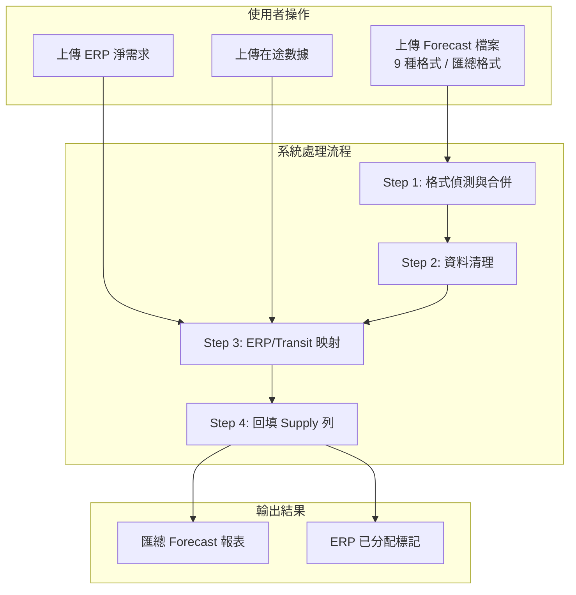
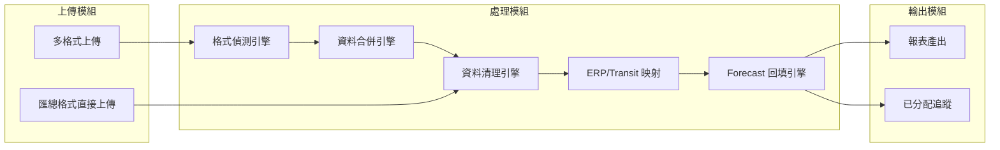
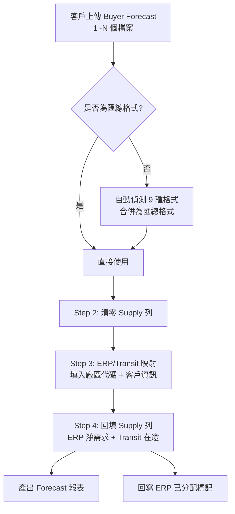

# 台達 Forecast 系統 - 軟體設計文件 (SDD)

##### 版本: 1.0 | 日期: 2026-04-14
##### 專案: 強茂台達 Forecast 業務系統

---

## 一、文件目的

本文件說明台達 Forecast 系統的整體設計架構與功能模組規劃，協助客戶了解系統運作方式與各模組之間的關係。

---

## 二、系統概覽

### 系統目標

將台達電子 9 種不同格式的 Buyer Forecast 檔案，自動合併為統一匯總格式，並回填 ERP 訂單與在途數據至 Supply 列，產出完整的 Forecast 報表。

### 系統架構圖

---

## 三、功能模組設計

### 模組關係圖

### 3.1 上傳模組

| 功能 | 說明 |
|------|------|
| 多格式上傳 | 支援 9 種 Buyer Forecast 格式，系統自動偵測並合併 |
| 匯總格式直接上傳 | 客戶自行整理好的匯總檔案可直接上傳，跳過合併步驟 |
| .xls 自動轉換 | 舊版 Excel 檔案自動轉換為新版格式 |
| 原始檔案保留 | 合併前自動備份所有原始上傳檔案 |

### 3.2 資料清理模組

| 功能 | 說明 |
|------|------|
| Supply 列清零 | 清除 Forecast 中 Supply 列的舊有數據 |
| 格式保留 | 清理後保留原始 Excel 格式 |

### 3.3 ERP/Transit 映射模組

| 功能 | 說明 |
|------|------|
| 廠區代碼映射 | 依送貨地點自動對應廠區代碼 (PLANT) |
| 客戶資訊填入 | 自動填入客戶簡稱與送貨地點欄位 |
| 日期計算 | 依排程出貨日期與 ETA 文字計算目標到貨日期 |

### 3.4 Forecast 回填模組

| 功能 | 說明 |
|------|------|
| Supply 列回填 | ERP/Transit 數據僅填入 Supply 列 |
| 精準比對 | 四欄位鍵值比對確保填入正確位置 |
| 已分配追蹤 | 填入後標記已分配，避免重複 |

---

## 四、資料流程

### 完整資料流程圖

---

## 五、匯總格式說明

### 固定 26 欄日期結構

| 區段 | 欄位 | 說明 |
|------|------|------|
| 固定欄位 | A~I | Buyer、PLANT、客戶簡稱、送貨地點、PARTNO、VENDOR PART、STOCK、ON-WAY、Date |
| PASSDUE | J | 逾期需求 |
| 週別 (W1~W16) | K~Z | 16 個週一日期 |
| 月份 (M1~M9) | AA~AI | 9 個月份 (如 JUL, AUG, ..., MAR) |

### 每料號 3 行結構

| 行別 | 說明 |
|------|------|
| Demand | 客戶需求數量 (來自 Buyer Forecast) |
| Supply | 供應數量 (由 ERP/Transit 回填) |
| Balance | 餘額 (Excel 公式自動計算: 前期餘額 + Supply - Demand) |

---

## 六、支援格式一覽

| 格式 | Buyer | 說明 |
|------|-------|------|
| Ketwadee | PSB5 | MRP sheet, 3 rows/part |
| Kanyanat | PSB7 | 4 rows/part |
| Weeraya | PSB7 | 5 rows/part |
| India IAI1 | IAI1/UPI2/DFI1 | 多廠區 |
| PSW1+CEW1 | PSW1/CEW1 | 多廠區 |
| MWC1+IPC1 | MWC1/IPC1 | 多廠區 |
| NBQ1 | NBQ1 | 單廠區 |
| SVC1+PWC1 | SVC1/PWC1 | Diode & MOS 雙 sheet |
| PSBG | PSB5 | PANJIT 格式 |

---

*文件版本: 1.0 | 建立日期: 2026-04-14*
