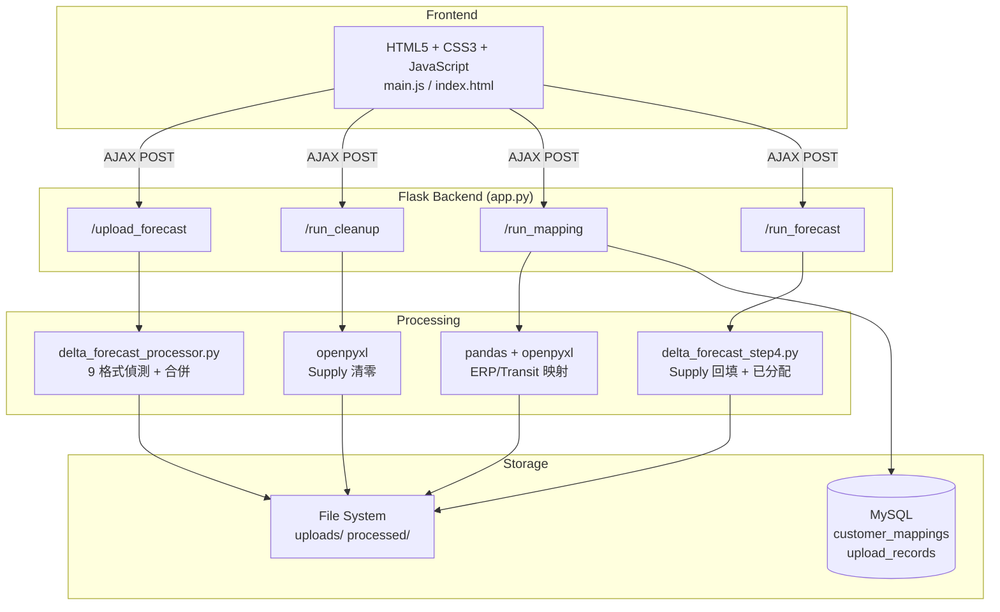
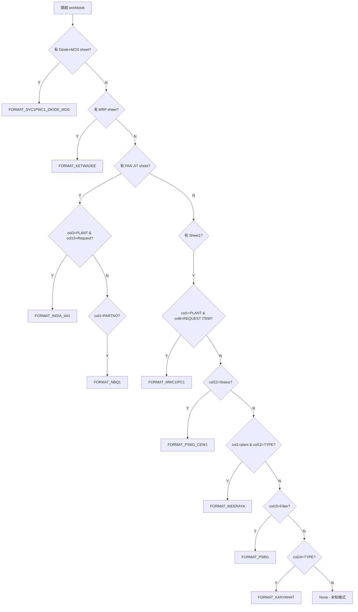
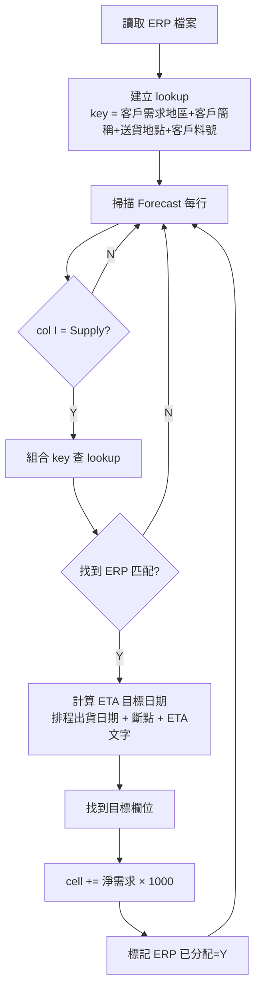
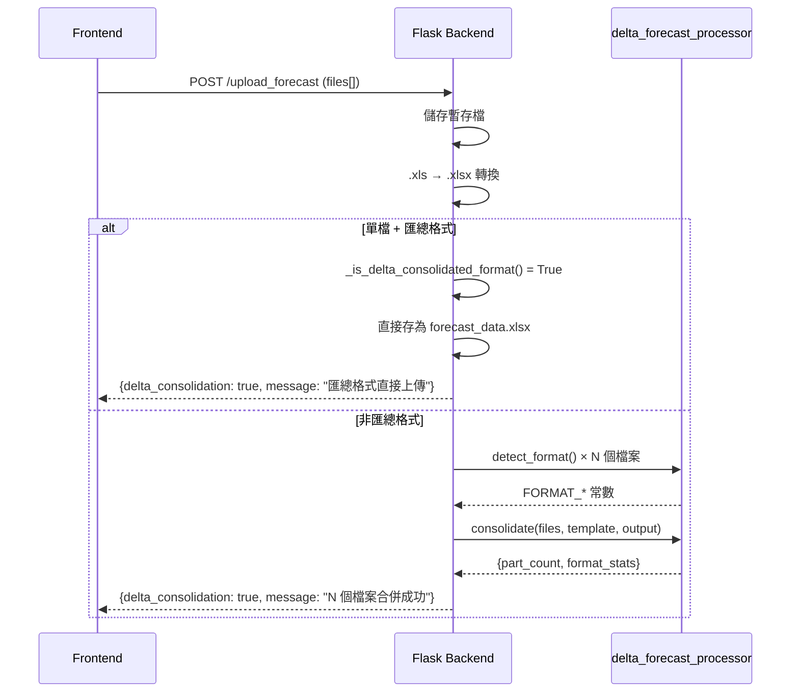

# 台達 Forecast 系統 - 軟體設計文件 (SDD) - 工程師版

##### 版本: 1.0 | 日期: 2026-04-14
##### 專案: 強茂台達 Forecast 業務系統

---

## 一、系統架構

### 技術架構圖



### 檔案結構

```
business_forecasting_cyntec/
├── app.py                          # Flask 主程式 (路由 + 業務邏輯)
├── delta_forecast_processor.py     # Step 1: 9 格式偵測 + 合併
├── delta_forecast_step4.py         # Step 4: ERP/Transit 回填
├── database.py                     # MySQL ORM
├── libreoffice_utils.py            # .xls → .xlsx 轉換
├── compare/delta/
│   └── consolidated_template.xlsx  # 匯總格式模板 (樣式參考)
├── uploads/{user_id}/{session}/
│   ├── forecast_data.xlsx          # 合併後的 Forecast
│   ├── erp_data.xlsx               # 上傳的 ERP
│   ├── transit_data.xlsx           # 上傳的 Transit
│   └── originals/                  # 原始上傳檔案備份
└── processed/{user_id}/{session}/
    ├── cleaned_forecast.xlsx       # Step 2 輸出
    ├── integrated_forecast.xlsx    # Step 3 輸出
    ├── integrated_erp.xlsx         # Step 3 ERP 映射後
    └── forecast_result.xlsx        # Step 4 最終輸出
```

---

## 二、核心模組設計

### 2.1 格式偵測引擎 (`detect_format`)



### 2.2 匯總格式直接上傳偵測 (`_is_delta_consolidated_format`)

```python
def _is_delta_consolidated_format(filepath):
    # 檢查 header: A=Buyer, B=PLANT, E=PARTNO, I=Date
    # 檢查 row 2 col I: Demand/Supply/Balance
    # True → 跳過合併, False → 走 9 格式偵測
```

### 2.3 日期欄位結構 (固定 26 欄)

```mermaid
graph LR
    subgraph 固定欄位 A~I
        A[Buyer] --> B[PLANT] --> C[客戶簡稱] --> D[送貨地點]
        D --> E[PARTNO] --> F[VENDOR] --> G[STOCK] --> H[ON-WAY] --> I[Date]
    end

    subgraph 日期欄位 J~AI
        J[PASSDUE]
        K["W1<br/>20260406"] --> L["W2<br/>20260413"] --> M["..."] --> Z["W16<br/>20260720"]
        Z --> AA["JUL"] --> AB["AUG"] --> AC["..."] --> AI["MAR"]
    end
```

**日期對齊演算法:**
1. 掃描所有 Buyer 檔案找最早的 YYYYMMDD → 對齊到該週一 (W1)
2. W1~W16: 連續 16 個週一
3. M1~M9: W16 之後的月份，取 3 字母縮寫
4. 來源日期 < W1 → 歸入 PASSDUE; > M9 → 捨棄並警告

### 2.4 ERP 回填演算法 (`fill_erp_into_forecast`)



**ETA 日期計算:**
```
排程出貨日期 → 加上斷點(禮拜X)算出週期結束日
→ 找到該週的週六 → 定義為 base Sunday
→ 解析 ETA 文字:
  "本週X" → base Sunday + weekday offset
  "下週X" → base Sunday + 7 + weekday offset
  "下下週X" → base Sunday + 14 + weekday offset
→ 結果日期對齊到所屬的週一欄位
```

### 2.5 Supply 回填限制

```python
# 只掃描 Supply 列 (column I == "Supply")
for r in range(2, ws.max_row + 1):
    row_type = ws.cell(row=r, column=9).value
    if str(row_type).strip() != 'Supply':
        continue  # 跳過 Demand 和 Balance 列
```

---

## 三、API 路由設計

| 路由 | Method | 說明 | 關鍵參數 |
|------|--------|------|----------|
| `/upload_forecast` | POST | Forecast 上傳 + 合併 | files[], merge (bool) |
| `/upload_erp` | POST | ERP 上傳 | file |
| `/upload_transit` | POST | Transit 上傳 | file |
| `/run_cleanup` | POST | Step 2: Supply 清零 | - |
| `/run_mapping` | POST | Step 3: ERP/Transit 映射 | - |
| `/run_forecast` | POST | Step 4: 回填 Supply | - |

### Delta 上傳流程 (`/upload_forecast`)



---

## 四、資料庫設計

### customer_mappings 表 (Delta 使用欄位)

| 欄位 | 型別 | 說明 |
|------|------|------|
| user_id | INT | 使用者 ID (Delta = 7) |
| region | VARCHAR | 客戶需求地區 (e.g. PSB5, PSB7) |
| customer_name | VARCHAR | 客戶簡稱 (e.g. 台達泰國) |
| delivery_location | VARCHAR | 送貨地點 (e.g. 台達PSB5SH) |
| breakpoint | VARCHAR | 排程斷點 (e.g. 禮拜四) |
| eta_text | VARCHAR | ETA 文字範本 |
| date_algorithm | VARCHAR | 日期算法 (ETD/ETA) |

---

## 五、錯誤處理

| 場景 | 處理方式 |
|------|----------|
| .xls 轉換失敗 | 使用原始 .xls 嘗試，失敗則報錯 |
| 格式無法辨識 | 回傳格式驗證錯誤，列出 9 種支援格式 |
| ERP key 無法匹配 | 跳過該筆，不中斷流程 |
| ETA 文字無法解析 | 跳過該筆 ERP，記錄 warning |
| 目標日期超出 26 欄範圍 | 跳過該筆，記錄 warning |

---

*文件版本: 1.0 | 建立日期: 2026-04-14*
