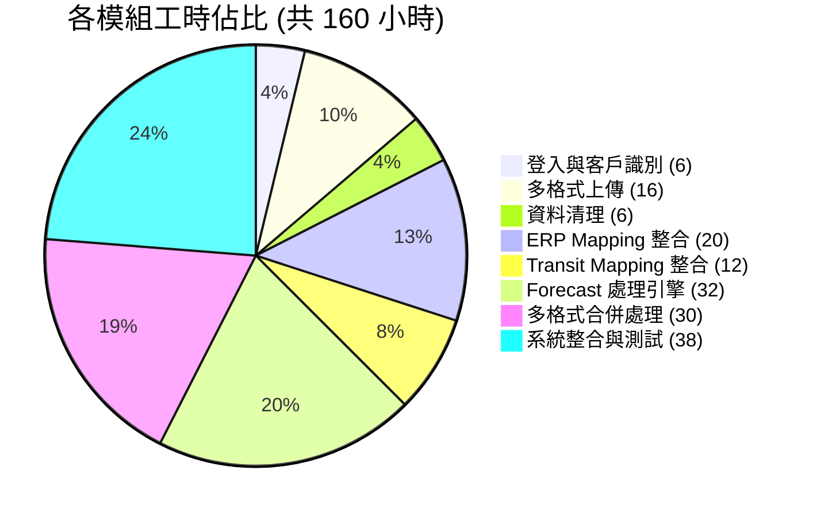
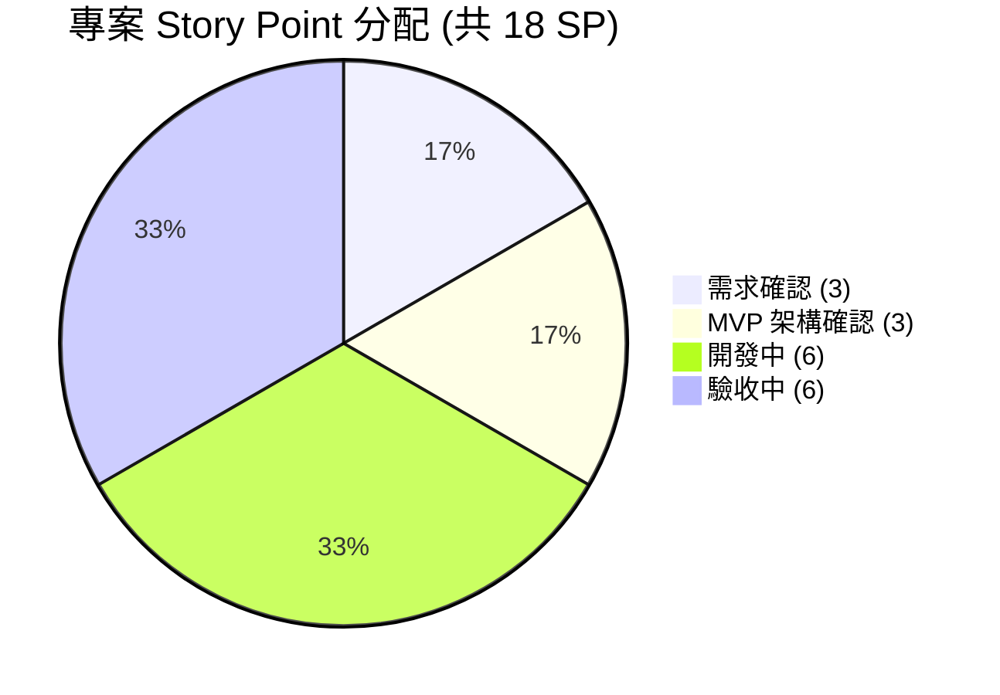

# 強茂台達 Forecast 業務系統

本系統為強茂台達 Forecast 業務系統，基於現有 FORECAST 數據處理平台進行台達電子 (Delta) 客製化擴展，支援 9 種 Buyer Forecast 格式自動偵測與合併、固定 26 欄日期模板 (PASSDUE + 16 週 + 9 月)、ERP/Transit 回填至 Supply 列，大幅提升台達供應鏈管理之作業效率並降低人工錯誤。

##### 專案開發人員 : 智合科技 - 張文雄
##### 專案連結 : 開發中

---

## 一、技術模組

| 層級 | 技術 |
|------|------|
| **後端框架** | Flask 3.0.3 |
| **資料庫** | MySQL 5.7+ / 8.0 |
| **資料處理** | pandas, numpy, openpyxl |
| **前端** | 原生 HTML5 + CSS3 + JavaScript |
| **Web 服務器** | Nginx |
| **Office 整合** | LibreOffice (.xls → .xlsx 自動轉換) |

---

## 二、核心功能模組 (8 大模組)

| 模組 | 複雜度 | 說明 |
|------|--------|------|
| **1. 登入與客戶識別** | 低 | 新增台達帳號、環境變數控制登入客戶顯示、客戶自動識別 |
| **2. 多格式上傳系統** | 高 | 9 種 Buyer Forecast 格式自動偵測、.xls 自動轉換、多檔合併上傳 |
| **3. 資料清理引擎** | 中 | Supply 列清零、格式保留、原始檔案備份 |
| **4. ERP Mapping 整合** | 高 | 送貨地點→客戶需求地區映射、4 欄位比對鍵、C/D 欄位自動填入 |
| **5. Transit Mapping 整合** | 中高 | Transit 數據整合、廠區代碼映射、ETA 日期計算 |
| **6. Forecast 處理引擎** | 高 | ERP/Transit 回填 Supply 列、已分配追蹤、淨需求×1000 換算 |
| **7. 多格式合併處理** | 高 | 9 種格式讀取器、固定 26 欄模板輸出、Balance 公式自動產生 |
| **8. 系統整合與測試** | 中高 | 前後端整合、E2E 測試、部署上線 |

---

## 三、專案特色與亮點

1. **9 種格式自動偵測** - 自動識別 Ketwadee / Kanyanat / Weeraya / India IAI1 / PSW1+CEW1 / MWC1+IPC1 / NBQ1 / SVC1+PWC1 / PSBG 等格式
2. **固定 26 欄日期模板** - PASSDUE + 16 週 (W1~W16) + 9 月 (M1~M9)，統一所有 Buyer 的日期欄位
3. **Supply 列專屬回填** - ERP/Transit 僅回填 Supply 列，Demand 與 Balance 不受影響
4. **已分配追蹤機制** - ERP 數據填入後自動標記「已分配=Y」並回寫 ERP 檔案
5. **四欄位精準比對** - (客戶需求地區 + 客戶簡稱 + 送貨地點 + 客戶料號) 四重鍵值比對
6. **.xls 自動轉換** - LibreOffice 整合，舊版 .xls 格式自動轉換為 .xlsx 後處理
7. **原始檔案保留** - 合併前自動備份客戶原始上傳檔案至 originals 資料夾

---

## 四、功能模組說明

### A. 登入與客戶識別

| 功能項目 | 說明 |
|----------|------|
| 新增台達帳號 | 建立台達電子客戶帳號，系統自動識別啟用專屬處理邏輯 |
| 環境變數登入控制 | 透過環境變數控制登入頁面顯示的客戶清單 |

### B. 多格式上傳系統

| 功能項目 | 說明 |
|----------|------|
| 9 種格式偵測 | 自動偵測上傳檔案屬於哪種 Buyer 格式 (Sheet 名稱 + 表頭欄位比對) |
| .xls 自動轉換 | 上傳 .xls 格式時自動透過 LibreOffice 轉為 .xlsx |
| 多檔合併上傳 | 支援 1~N 個 Buyer Forecast 檔案同時上傳並合併 |
| 原始檔案備份 | 合併前保留所有原始上傳檔案至 originals 子資料夾 |
| 檔案格式驗證 | 自動驗證 Forecast 格式、ERP/Transit 欄位完整性 |

### C. 資料清理引擎

| 功能項目 | 說明 |
|----------|------|
| Supply 列清零 | 清除 Forecast 中 Supply 列 (I 欄 = "Supply") 的所有數值欄位 |
| 格式保留處理 | 清理後保留原始 Excel 格式（字型、框線、數字格式） |

### D. ERP Mapping 整合

| 功能項目 | 說明 |
|----------|------|
| 客戶需求地區映射 | 依送貨地點 (AG 欄) 對應 Mapping 表的客戶需求地區 (PLANT) |
| 排程斷點計算 | 依排程出貨日期 (AD 欄) 計算所屬週期斷點 |
| ETA 日期映射 | 解析中文 ETA 文字 (本週X/下週X/下下週X) 計算目標到貨日期 |
| Mapping UI | 前端動態表格支援 Mapping 欄位之顯示、編輯與儲存 |

### E. Transit Mapping 整合

| 功能項目 | 說明 |
|----------|------|
| Transit 數據整合 | Transit 檔案自動標註廠區代碼與 ETA 映射 |
| 廠區代碼標註 | 自動為 Transit 數據標註對應之 Forecast 廠區代碼 |
| 異常處理 | 無法比對時標記並記錄，不中斷整體處理流程 |

### F. Forecast 處理引擎

| 功能項目 | 說明 |
|----------|------|
| Supply 列回填 | ERP/Transit 數據僅填入 Supply 列 (I 欄 = "Supply") |
| 四欄位比對 | 以 (客戶需求地區 + 客戶簡稱 + 送貨地點 + 客戶料號) 做精準比對 |
| ETA 目標日期 | 排程出貨日期 + 排程斷點 + ETA 文字 → 計算填入的目標日期欄位 |
| 淨需求換算 | ERP 淨需求 × 1000 填入 Supply 列對應日期欄位 |
| Transit 填入 | Transit 數量 × 1000 填入 Supply 列對應 ETA 日期欄位 |
| 已分配追蹤 | 填入後標記 ERP「已分配=Y」，回寫 ERP 檔案避免重複分配 |

### G. 多格式合併處理

| 功能項目 | 說明 |
|----------|------|
| 9 種格式讀取器 | 每種 Buyer 格式有獨立讀取器，統一輸出 (buyer, plant, part_no, demand, supply) |
| 固定 26 欄模板 | 輸出 PASSDUE + 16 週 + 9 月之固定欄位結構 |
| Balance 公式 | Balance 列使用 Excel 公式自動計算 (前期餘額 + Supply - Demand) |
| 日期欄位對齊 | 不同 Buyer 檔案的日期自動對齊至 26 欄模板 |
| PLANT 自動識別 | 單 PLANT 格式從檔名比對、多 PLANT 格式從每列欄位讀取 |

### H. 系統整合與測試

| 功能項目 | 說明 |
|----------|------|
| 前後端整合 | API 路由擴展、前端格式統計顯示、處理結果摘要 |
| UI 介面調整 | 上傳格式偵測回饋、合併結果顯示、下載區塊 |
| E2E 測試 | Step 1 合併 → Step 2 清理 → Step 3 映射 → Step 4 回填完整測試 |
| 部署上線 | 系統部署、環境設定、客戶帳號建立 |

---

## 五、工時總計

### 工時分佈圖

| 模組 | 小時 |
|------|------|
| A. 登入與客戶識別 | 6 |
| B. 多格式上傳系統 | 16 |
| C. 資料清理引擎 | 6 |
| D. ERP Mapping 整合 | 20 |
| E. Transit Mapping 整合 | 12 |
| F. Forecast 處理引擎 | 32 |
| G. 多格式合併處理 | 30 |
| H. 系統整合與測試 | 38 |
| **合計** | **160 小時** |

---

### 專案 Story Point 分配

本專案總計 **18 SP**，各階段分配如下：

| 階段 | SP | 佔比 |
|------|:--:|------|
| 需求確認 | 3 | 16.7% |
| MVP 架構確認 | 3 | 16.7% |
| 開案確認 | 0 | 0% |
| 開發中 | 6 | 33.3% |
| 驗收中 | 6 | 33.3% |
| 已結案 | 0 | 0% |
| **合計** | **18** | **100%** |

---

## 六、交付項目

1. 完整的台達 Forecast 業務系統（客製化擴展）
2. 系統操作手冊

---

*報告日期: 2026-04-14*
