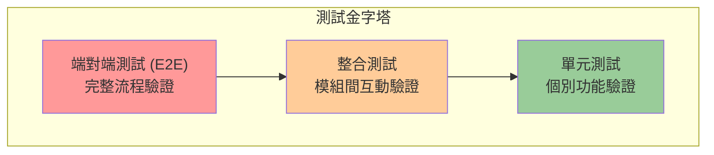
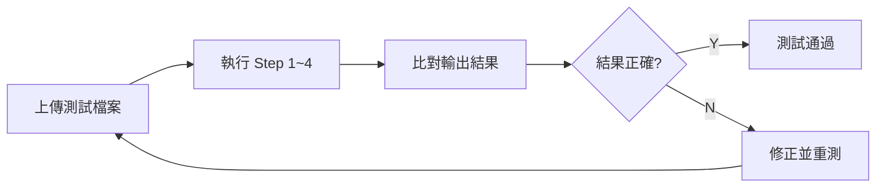

# 台達 Forecast 系統 - 測試驅動開發文件 (TDD)

##### 版本: 1.0 | 日期: 2026-04-14
##### 專案: 強茂台達 Forecast 業務系統

---

## 一、文件目的

本文件說明台達 Forecast 系統的測試策略與品質保證方式，確保系統各功能模組的正確性與穩定性。

---

## 二、測試策略

### 測試層次圖

---

## 三、測試範圍

### 3.1 上傳功能測試

| 測試項目 | 預期結果 |
|----------|----------|
| 上傳 9 種 Buyer 格式 | 系統正確偵測格式並合併 |
| 上傳匯總格式檔案 | 系統跳過合併，直接使用 |
| 上傳 .xls 舊版格式 | 系統自動轉換為 .xlsx |
| 上傳不支援的格式 | 系統提示格式不支援 |
| 同時上傳多個檔案 | 正確合併所有檔案 |

### 3.2 資料清理測試

| 測試項目 | 預期結果 |
|----------|----------|
| Supply 列清零 | Supply 列所有數值欄位歸零 |
| Demand 列不受影響 | Demand 列數據保持不變 |
| Balance 列不受影響 | Balance 列數據保持不變 |

### 3.3 ERP 回填測試

| 測試項目 | 預期結果 |
|----------|----------|
| ERP 填入 Supply 列 | 僅 Supply 列被修改 |
| 已分配標記 | 被分配的 ERP 行標記為 Y |
| 四欄位比對 | 只填入 key 完全匹配的行 |
| ETA 日期計算 | 正確對應到匯總格式的日期欄位 |

### 3.4 完整流程測試

| 測試項目 | 預期結果 |
|----------|----------|
| Step 1→2→3→4 完整流程 | 最終輸出數據正確 |
| 料號數量一致 | 合併後料號數 = 各 Buyer 料號總和 |
| Supply 只含 ERP/Transit 數據 | 無殘留舊值 |

---

## 四、測試流程

---

## 五、品質指標

| 指標 | 目標 |
|------|------|
| 格式偵測準確率 | 100% (9 種格式) |
| 料號合併正確率 | > 99.5% |
| ERP 回填準確率 | 100% (僅 Supply 列) |
| 已分配標記完整率 | 100% |

---

*文件版本: 1.0 | 建立日期: 2026-04-14*
