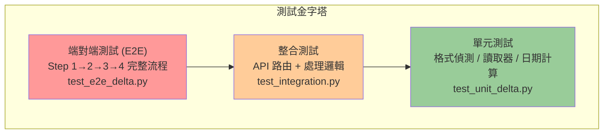
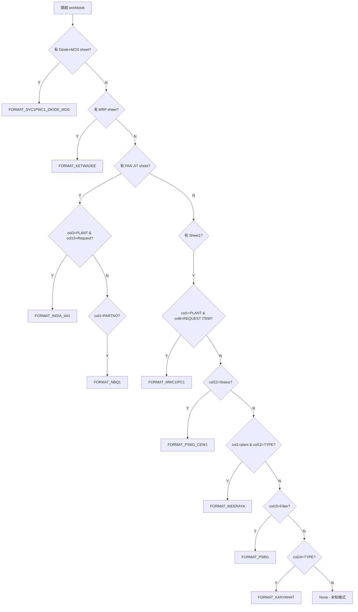
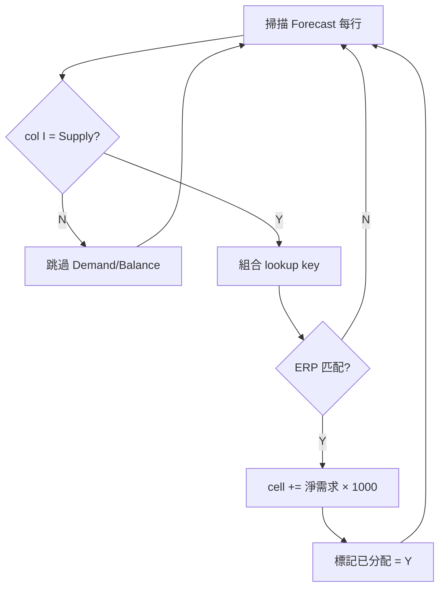

# 台達 Forecast 系統 - 測試驅動開發文件 (TDD) - 工程師版

##### 版本: 1.0 | 日期: 2026-04-14
##### 專案: 強茂台達 Forecast 業務系統

---

## 一、測試架構

### 測試技術棧

| 層級 | 技術 |
|------|------|
| **測試框架** | Python unittest / pytest |
| **Excel 驗證** | openpyxl (讀取產出檔案比對) |
| **HTTP 測試** | Flask test_client / requests |
| **資料比對** | pandas DataFrame assert |
| **測試資料** | 真實 Buyer Forecast 樣本檔 |

### 測試層次圖



---

## 二、單元測試

### 2.1 格式偵測測試 (`detect_format`)

```python
# test_unit_delta.py
import pytest
from delta_forecast_processor import detect_format, FORMAT_KETWADEE, FORMAT_KANYANAT, ...

@pytest.mark.parametrize("filename,expected_format", [
    ("Ketwadee_PSB5.xlsx", FORMAT_KETWADEE),
    ("Kanyanat_PSB7.xlsx", FORMAT_KANYANAT),
    ("Weeraya_PSB7.xlsx", FORMAT_WEERAYA),
    ("India_IAI1.xlsx", FORMAT_INDIA_IAI1),
    ("PSW1_CEW1.xlsx", FORMAT_PSW1_CEW1),
    ("MWC1_IPC1.xlsx", FORMAT_MWC1IPC1),
    ("NBQ1.xlsx", FORMAT_NBQ1),
    ("SVC1_PWC1.xlsx", FORMAT_SVC1PWC1_DIODE_MOS),
    ("PSBG.xlsx", FORMAT_PSBG),
])
def test_detect_format(filename, expected_format):
    filepath = f"test_data/delta/{filename}"
    result = detect_format(filepath)
    assert result == expected_format
```

### 偵測邏輯流程



### 2.2 匯總格式偵測測試

```python
def test_consolidated_format_detection():
    """已匯總的檔案應回傳 True"""
    result = _is_delta_consolidated_format("test_data/delta/cleaned_forecast.xlsx")
    assert result is True

def test_non_consolidated_format():
    """原始 Buyer 檔案應回傳 False"""
    result = _is_delta_consolidated_format("test_data/delta/Ketwadee_PSB5.xlsx")
    assert result is False

def test_erp_file_not_consolidated():
    """ERP 檔案不應被誤判為匯總格式"""
    result = _is_delta_consolidated_format("test_data/delta/erp_data.xlsx")
    assert result is False
```

### 2.3 日期對齊測試

```python
def test_date_alignment():
    """驗證 26 欄日期結構: PASSDUE + W1~W16 + M1~M9"""
    from delta_forecast_processor import consolidate
    result = consolidate(files, template, output)

    wb = openpyxl.load_workbook(output)
    ws = wb.active
    # col J = PASSDUE
    assert ws.cell(1, 10).value == 'PASSDUE'
    # col K = W1 (最早週一)
    w1 = ws.cell(1, 11).value  # e.g. 20260406
    assert isinstance(w1, (int, str))
    # col Z = W16
    # col AA~AI = 月份縮寫 (JUL, AUG, ...)
    assert ws.cell(1, 27).value in ('JAN','FEB','MAR','APR','MAY','JUN',
                                     'JUL','AUG','SEP','OCT','NOV','DEC')

def test_passdue_aggregation():
    """來源日期 < W1 的數據應歸入 PASSDUE"""
    # 驗證 PASSDUE 欄位累加值
```

### 2.4 ETA 日期計算測試

```python
def test_eta_this_week():
    """本週X → base Sunday + weekday offset"""
    from delta_forecast_step4 import parse_eta_date
    # 排程出貨日 2026-04-13 (週一), 斷點=禮拜四
    result = parse_eta_date("本週三", "2026-04-13", "禮拜四")
    assert result == datetime(2026, 4, 15)  # 本週三

def test_eta_next_week():
    """下週X → base Sunday + 7 + weekday offset"""
    result = parse_eta_date("下週一", "2026-04-13", "禮拜四")
    assert result == datetime(2026, 4, 20)  # 下週一

def test_eta_next_next_week():
    """下下週X → base Sunday + 14 + weekday offset"""
    result = parse_eta_date("下下週五", "2026-04-13", "禮拜四")
    assert result == datetime(2026, 5, 1)  # 下下週五
```

### 2.5 .xls 轉換測試

```python
def test_xls_to_xlsx_conversion():
    """舊版 .xls 應自動轉為 .xlsx"""
    from libreoffice_utils import convert_xls_to_xlsx
    result = convert_xls_to_xlsx("test_data/sample.xls", "/tmp")
    assert result.endswith('.xlsx')
    assert os.path.exists(result)
```

---

## 三、整合測試

### 3.1 上傳 API 測試

```python
def test_upload_single_buyer(client):
    """單一 Buyer 檔案上傳"""
    with open("test_data/delta/Ketwadee_PSB5.xlsx", "rb") as f:
        resp = client.post("/upload_forecast", data={
            "files": [(f, "Ketwadee.xlsx")],
            "merge": "true"
        })
    data = resp.get_json()
    assert resp.status_code == 200
    assert data["delta_consolidation"] is True
    assert data["rows"] > 0
    assert len(data["columns"]) > 0

def test_upload_multiple_buyers(client):
    """多個 Buyer 檔案合併上傳"""
    files = [
        open("test_data/delta/Ketwadee_PSB5.xlsx", "rb"),
        open("test_data/delta/Kanyanat_PSB7.xlsx", "rb"),
    ]
    resp = client.post("/upload_forecast", data={
        "files": [(f, f"buyer_{i}.xlsx") for i, f in enumerate(files)],
        "merge": "true"
    })
    data = resp.get_json()
    assert data["delta_consolidation"] is True
    assert "format_stats" in data

def test_upload_consolidated_format(client):
    """匯總格式直接上傳應跳過合併"""
    with open("test_data/delta/cleaned_forecast.xlsx", "rb") as f:
        resp = client.post("/upload_forecast", data={
            "files": [(f, "consolidated.xlsx")],
            "merge": "true"
        })
    data = resp.get_json()
    assert resp.status_code == 200
    assert "直接上傳" in data.get("message", "") or data.get("delta_consolidation")

def test_upload_xls_format(client):
    """上傳 .xls 格式應自動轉換"""
    with open("test_data/delta/PSBG.xls", "rb") as f:
        resp = client.post("/upload_forecast", data={
            "files": [(f, "PSBG.xls")],
            "merge": "true"
        })
    assert resp.status_code == 200

def test_upload_unsupported_format(client):
    """.csv 等不支援格式應報錯"""
    resp = client.post("/upload_forecast", data={
        "files": [(io.BytesIO(b"data"), "bad.csv")],
        "merge": "true"
    })
    assert resp.status_code in (400, 200)
    # 檢查錯誤訊息
```

### 3.2 Step 2~4 API 測試

```python
def test_step2_cleanup(client):
    """Step 2: Supply 清零"""
    resp = client.post("/run_cleanup")
    assert resp.status_code == 200
    # 驗證 cleaned_forecast.xlsx 存在
    # 驗證 Supply 列所有數值 = 0 或空

def test_step3_mapping(client):
    """Step 3: ERP/Transit 映射"""
    resp = client.post("/run_mapping")
    assert resp.status_code == 200
    # 驗證 integrated_forecast.xlsx 存在
    # 驗證 C/D 欄位已填入

def test_step4_fill(client):
    """Step 4: Supply 回填"""
    resp = client.post("/run_forecast")
    assert resp.status_code == 200
    # 驗證 forecast_result.xlsx 存在
    # 驗證 ERP 已分配標記
```

---

## 四、端對端測試

### E2E 測試流程


### 4.1 完整流程測試

```python
def test_e2e_full_pipeline():
    """完整 Step 1→2→3→4 流程"""
    # Step 1: 上傳並合併
    upload_resp = client.post("/upload_forecast", data={...})
    assert upload_resp.status_code == 200

    # Step 2: 清零
    cleanup_resp = client.post("/run_cleanup")
    assert cleanup_resp.status_code == 200

    # Step 3: 映射
    mapping_resp = client.post("/run_mapping")
    assert mapping_resp.status_code == 200

    # Step 4: 回填
    forecast_resp = client.post("/run_forecast")
    assert forecast_resp.status_code == 200

    # 驗證最終輸出
    wb = openpyxl.load_workbook("processed/.../forecast_result.xlsx")
    ws = wb.active
    verify_output(ws)
```

### 4.2 資料正確性驗證

```python
def verify_output(ws):
    """驗證最終輸出檔案"""
    for row in range(2, ws.max_row + 1):
        row_type = ws.cell(row=row, column=9).value

        if str(row_type).strip() == 'Supply':
            # Supply 列只應含 ERP/Transit 數據
            for col in range(10, 36):  # J~AI
                val = ws.cell(row=row, column=col).value
                if val is not None and val != 0:
                    # 確認此值來自 ERP 或 Transit
                    assert val > 0, f"Supply 值不應為負: row={row}, col={col}"

        elif str(row_type).strip() == 'Demand':
            # Demand 列不應被修改
            pass

        elif str(row_type).strip() == 'Balance':
            # Balance 列應為公式
            pass
```

### 4.3 ERP 已分配驗證

```python
def test_erp_allocated_flag():
    """驗證 ERP 已分配標記"""
    wb = openpyxl.load_workbook("processed/.../integrated_erp.xlsx")
    ws = wb.active

    allocated_count = 0
    for row in range(2, ws.max_row + 1):
        flag = ws.cell(row=row, column=allocated_col).value
        if str(flag).strip() == 'Y':
            allocated_count += 1

    assert allocated_count > 0, "應有 ERP 被標記為已分配"
```

### 4.4 料號數量一致性

```python
def test_part_count_consistency():
    """合併後料號數 = 各 Buyer 料號總和"""
    # 讀取各 Buyer 檔案的料號數
    buyer_parts = set()
    for filepath in buyer_files:
        fmt = detect_format(filepath)
        reader = FORMAT_READERS[fmt]
        parts = reader(filepath, date_cols, ...)
        for p in parts:
            buyer_parts.add((p['buyer'], p['plant'], p['part_no']))

    # 讀取合併後檔案的料號數
    wb = openpyxl.load_workbook(consolidated)
    ws = wb.active
    merged_parts = set()
    for row in range(2, ws.max_row + 1):
        if ws.cell(row=row, column=9).value == 'Demand':
            key = (ws.cell(row=row, column=1).value,
                   ws.cell(row=row, column=2).value,
                   ws.cell(row=row, column=5).value)
            merged_parts.add(key)

    assert len(merged_parts) == len(buyer_parts)
```

---

## 五、Supply 回填專屬測試

### 回填限制驗證



```python
def test_only_supply_rows_modified():
    """Step 4 只應修改 Supply 列"""
    # 記錄 Step 3 輸出的 Demand 列值
    before = read_demand_values("integrated_forecast.xlsx")

    # 執行 Step 4
    run_step4()

    # 比對 Step 4 輸出的 Demand 列值
    after = read_demand_values("forecast_result.xlsx")
    assert before == after, "Demand 列不應被修改"

def test_erp_multiply_1000():
    """ERP 淨需求應乘以 1000"""
    # 已知 ERP: 淨需求=450, key=(PSB7, 台達泰國, ...)
    # 預期: Supply 列填入 450,000
    wb = openpyxl.load_workbook("forecast_result.xlsx")
    ws = wb.active
    # 找到對應 Supply 行和日期欄
    assert cell_value == 450 * 1000

def test_four_key_matching():
    """四欄位比對: 客戶需求地區+客戶簡稱+送貨地點+客戶料號"""
    # 只有完全匹配才填入
    # key = (region, customer_name, delivery_location, part_no)
```

---

## 六、測試資料管理

### 測試資料結構

```
test_data/delta/
├── buyers/
│   ├── Ketwadee_PSB5.xlsx
│   ├── Kanyanat_PSB7.xlsx
│   ├── Weeraya_PSB7.xlsx
│   ├── India_IAI1.xlsx
│   ├── PSW1_CEW1.xlsx
│   ├── MWC1_IPC1.xlsx
│   ├── NBQ1.xlsx
│   ├── SVC1_PWC1.xlsx
│   └── PSBG.xls
├── erp/
│   └── erp_data.xlsx
├── transit/
│   └── transit_data.xlsx
├── consolidated/
│   └── cleaned_forecast.xlsx
└── expected/
    └── forecast_result.xlsx
```

---

## 七、品質指標與門檻

| 指標 | 目標 | 驗證方式 |
|------|------|----------|
| 格式偵測準確率 | 100% (9 種格式) | 9 個 parametrize 測試 |
| 料號合併正確率 | > 99.5% | 料號數量一致性測試 |
| ERP 回填準確率 | 100% (僅 Supply 列) | Demand 不變 + Supply 值比對 |
| 已分配標記完整率 | 100% | ERP allocated flag 測試 |
| 日期對齊正確率 | 100% | 26 欄結構驗證 |
| .xls 轉換成功率 | 100% | .xls 上傳 E2E 測試 |

### 測試執行

```bash
# 執行所有 Delta 單元測試
pytest tests/test_unit_delta.py -v

# 執行整合測試
pytest tests/test_integration.py -v -k "delta"

# 執行 E2E 測試
pytest tests/test_e2e_delta.py -v

# 產生覆蓋率報告
pytest --cov=delta_forecast_processor --cov=delta_forecast_step4 --cov-report=html
```

---

*文件版本: 1.0 | 建立日期: 2026-04-14*
