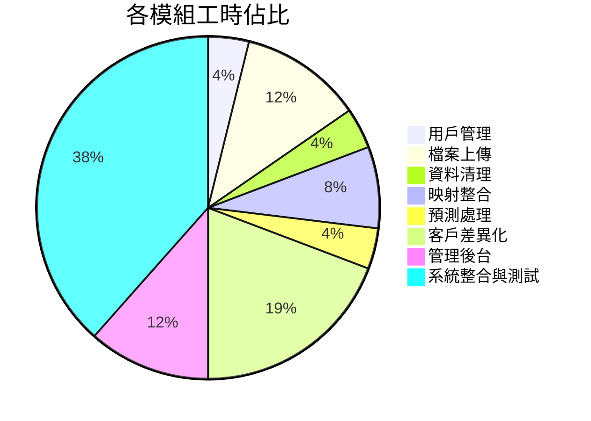
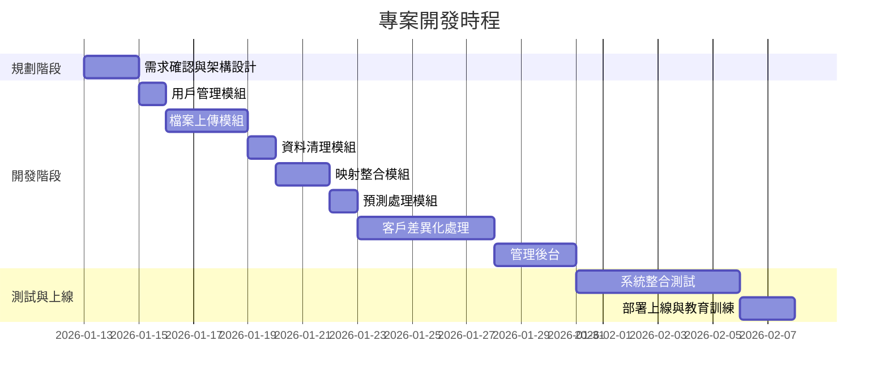
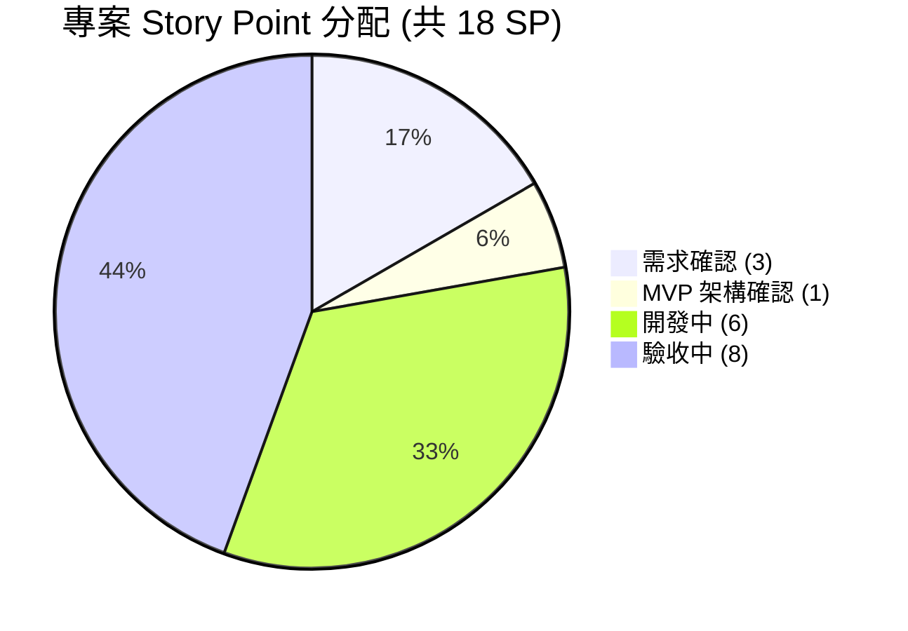

# 供應鏈預測管理系統 - 專案報價單

---

## 一、專案概述

本系統為供應鏈預測數據處理平台，協助企業自動化處理 ERP 淨需求、預測文件與在途資料，大幅提升作業效率並降低人工錯誤。

---

## 二、功能清單與開發工時

### A. 用戶管理模組

| 功能項目 | 說明 | 預估人天 |
|----------|------|---------|
| 登入/登出系統 | 安全的帳號密碼驗證機制 | 2 |
| 權限管理 | 管理員、IT人員、一般用戶三種角色 | 3 |
| 用戶管理介面 | 新增、編輯、停用帳號功能 | 3 |
| **小計** | | **8** |

### B. 檔案上傳模組

| 功能項目 | 說明 | 預估人天 |
|----------|------|---------|
| ERP 淨需求上傳 | 支援 Excel 檔案上傳與驗證 | 3 |
| 預測文件上傳 | 支援多檔案上傳與合併 | 4 |
| 在途文件上傳 | 依廠區分類處理 | 3 |
| 格式驗證功能 | 自動檢查欄位是否符合規範 | 4 |
| **小計** | | **14** |

### C. 資料清理模組

| 功能項目 | 說明 | 預估人天 |
|----------|------|---------|
| 自動清理引擎 | 依規則自動清空指定欄位數據 | 5 |
| 格式保留處理 | 清理後保留原始 Excel 格式與公式 | 4 |
| **小計** | | **9** |

### D. 映射整合模組

| 功能項目 | 說明 | 預估人天 |
|----------|------|---------|
| 客戶映射設定 | 設定客戶簡稱對應的地區與出貨資訊 | 5 |
| 日期計算邏輯 | 自動計算 ETD/ETA 目標日期 | 4 |
| 映射管理介面 | 新增、編輯、刪除映射設定 | 4 |
| **小計** | | **13** |

### E. 預測處理模組

| 功能項目 | 說明 | 預估人天 |
|----------|------|---------|
| 數據匹配引擎 | 自動比對客戶料號與地區 | 6 |
| 數量累加計算 | 相同條件的數值自動累加 | 4 |
| 結果輸出 | 產出處理完成的 Excel 報表 | 3 |
| **小計** | | **13** |

### F. 客戶差異化處理

| 功能項目 | 說明 | 預估人天 |
|----------|------|---------|
| 廣達專用流程 | 多檔案合併模式 | 5 |
| 和碩專用流程 | 獨立處理模式、廠區檢查 | 5 |
| **小計** | | **10** |

### G. 管理後台

| 功能項目 | 說明 | 預估人天 |
|----------|------|---------|
| 操作日誌查詢 | 追蹤所有用戶操作記錄 | 3 |
| 上傳記錄查詢 | 查看歷史上傳檔案資訊 | 2 |
| 處理規則管理 | 設定各階段處理規則 | 5 |
| **小計** | | **10** |

### H. 系統整合與測試

| 功能項目 | 說明 | 預估人天 |
|----------|------|---------|
| 前端介面開發 | 10 個操作頁面設計與製作 | 15 |
| 系統整合測試 | 功能測試與問題修正 | 8 |
| 部署上線 | 系統安裝與環境設定 | 3 |
| **小計** | | **26** |

---

## 三、工時總計

| 模組 | 人天 |
|------|------|
| A. 用戶管理模組 | 1 |
| B. 檔案上傳模組 | 3 |
| C. 資料清理模組 | 1 |
| D. 映射整合模組 | 2 |
| E. 預測處理模組 | 1 |
| F. 客戶差異化處理 | 5 |
| G. 管理後台 | 3 |
| H. 系統整合與測試 | 10 |
| **合計** | **26 人天** |

### 工時分佈圖

---

## 四、專案時程規劃

| 階段 | 工作內容 | 預估天數 |
|------|----------|---------|
| **第一階段** | 需求確認、系統架構設計 | 2 天 |
| **第二階段** | 用戶管理、檔案上傳功能開發 | 4 天 |
| **第三階段** | 資料清理、映射整合功能開發 | 3 天 |
| **第四階段** | 預測處理、客戶差異化開發 | 6 天 |
| **第五階段** | 管理後台開發 | 3 天 |
| **第六階段** | 系統整合測試、修正調整 | 6 天 |
| **第七階段** | 部署上線、教育訓練 | 2 天 |
| **合計** | | **26 天 (約 1 個月)** |

### 專案甘特圖

---

## 五、交付項目

1. 完整的供應鏈預測管理系統
2. 系統操作手冊
3. 管理員操作指南
4. 系統部署文件

---

## 六、售後服務

| 項目 | 說明 |
|------|------|
| 保固期間 | 上線後 3 個月免費維護 |
| 問題修復 | 保固期內 Bug 免費修正 |
| 技術支援 | 提供電話/線上諮詢服務 |

---

## 七、備註

- 以上報價不含主機與資料庫租用費用
- 新增客戶類型需另行評估開發費用
- 重大功能變更需重新評估工時

---

## 八、專案 Story Point 分配

本專案總計 **18 SP**，各階段分配如下：

| 階段 | SP | 佔比 |
|------|:--:|------|
| 需求確認 | 3 | 16.7% |
| MVP 架構確認 | 1 | 5.6% |
| 開案確認 | 0 | 0% |
| 開發中 | 6 | 33.3% |
| 驗收中 | 8 | 44.4% |
| 已結案 | 0 | 0% |
| **合計** | **18** | **100%** |

---

*報價日期: 2026-01-12*
*報價有效期: 30 天*
