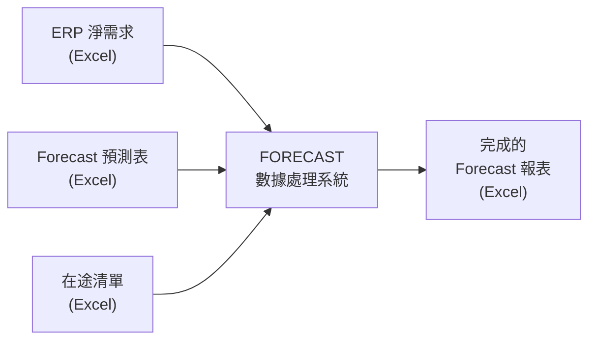
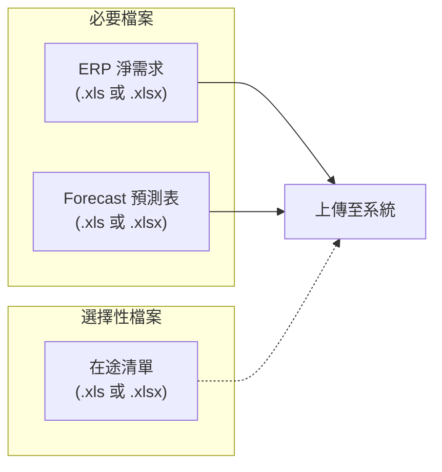
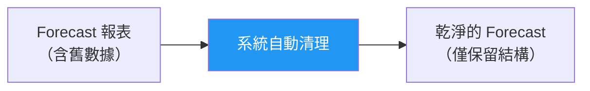
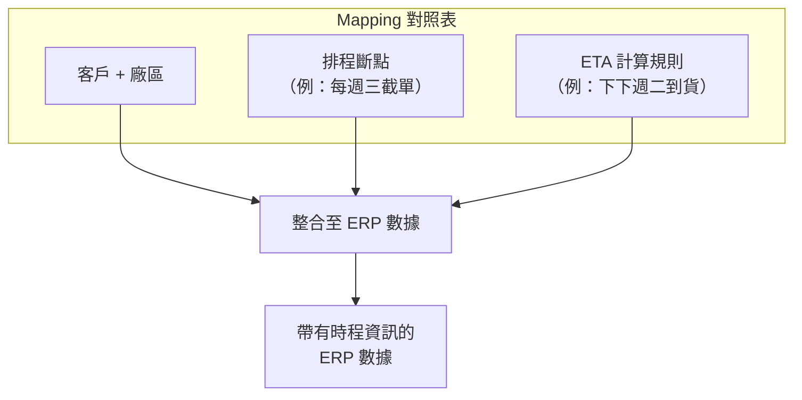
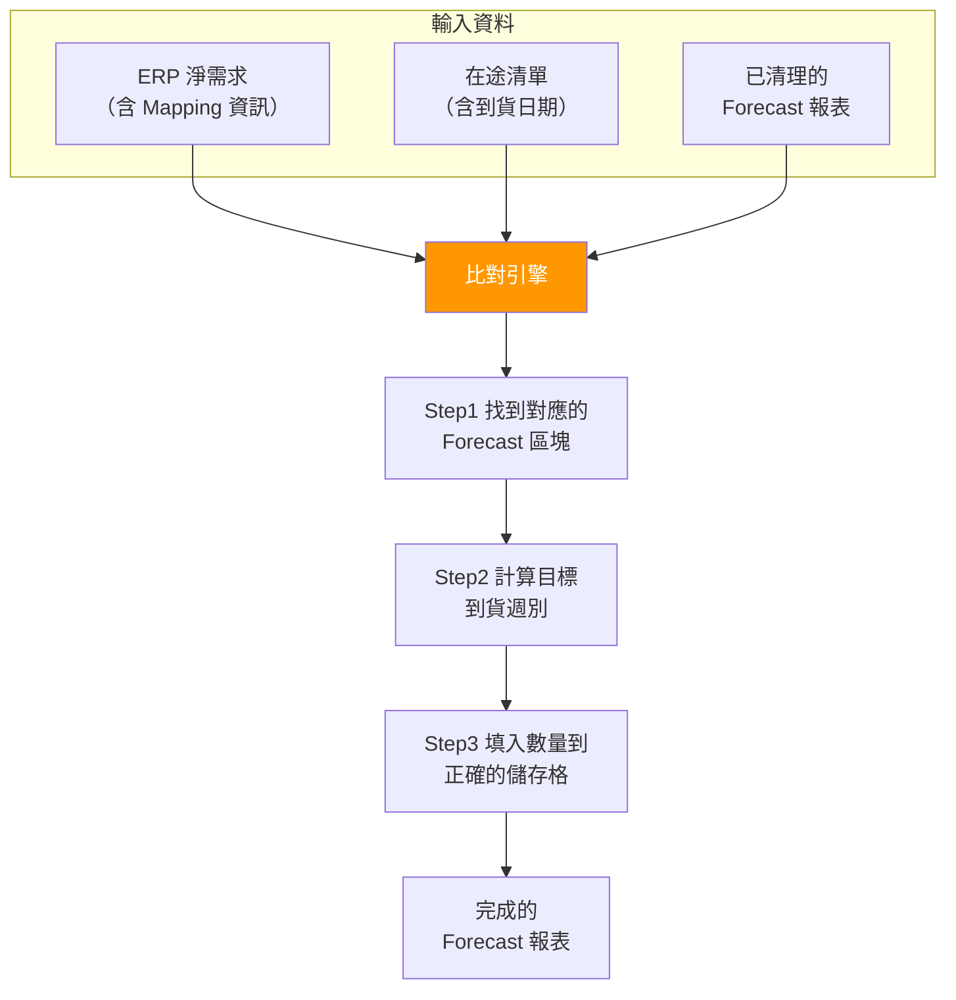
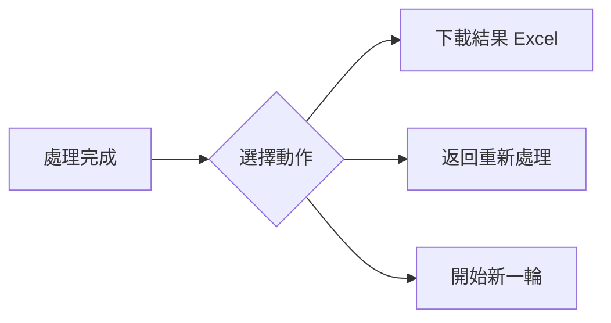
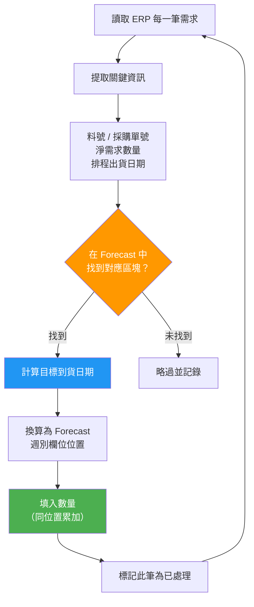
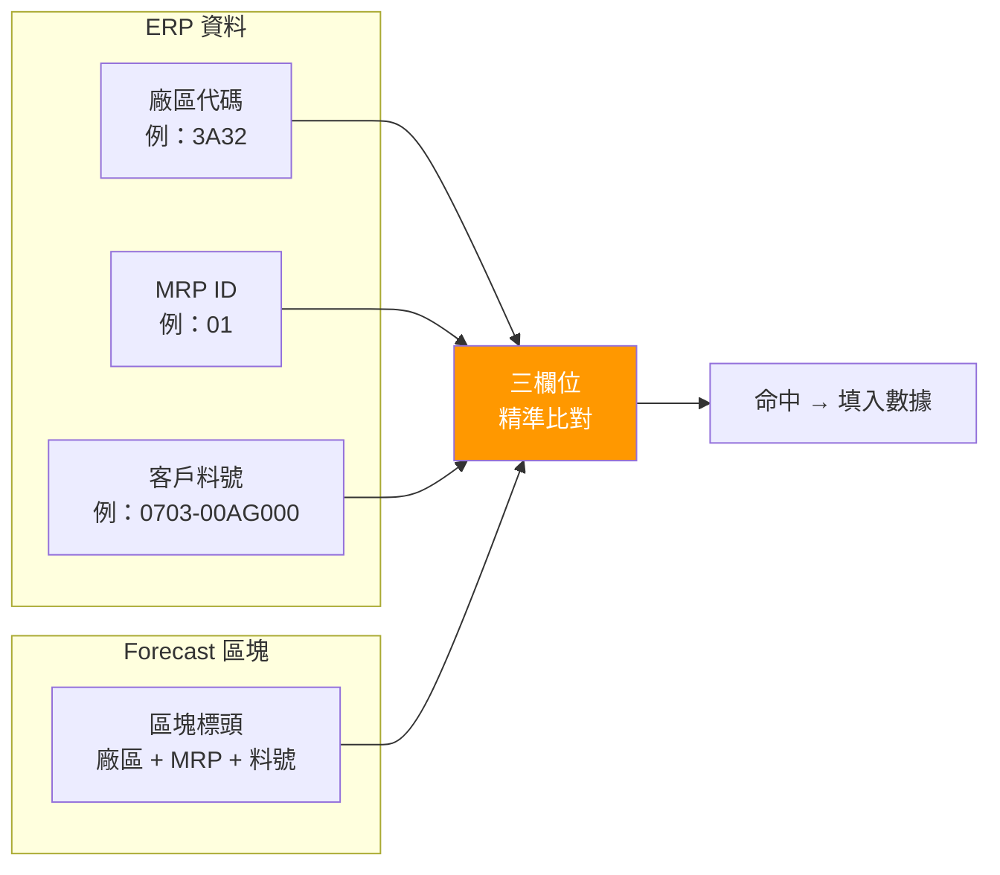
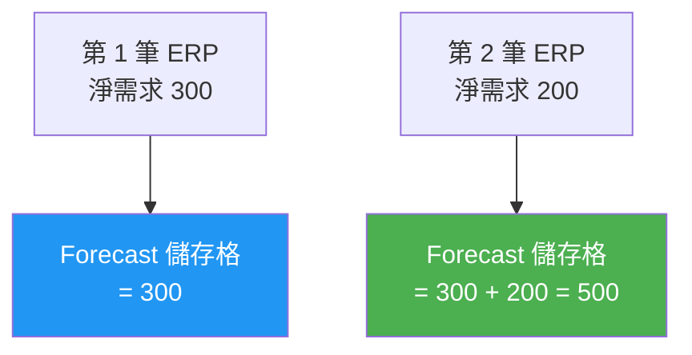
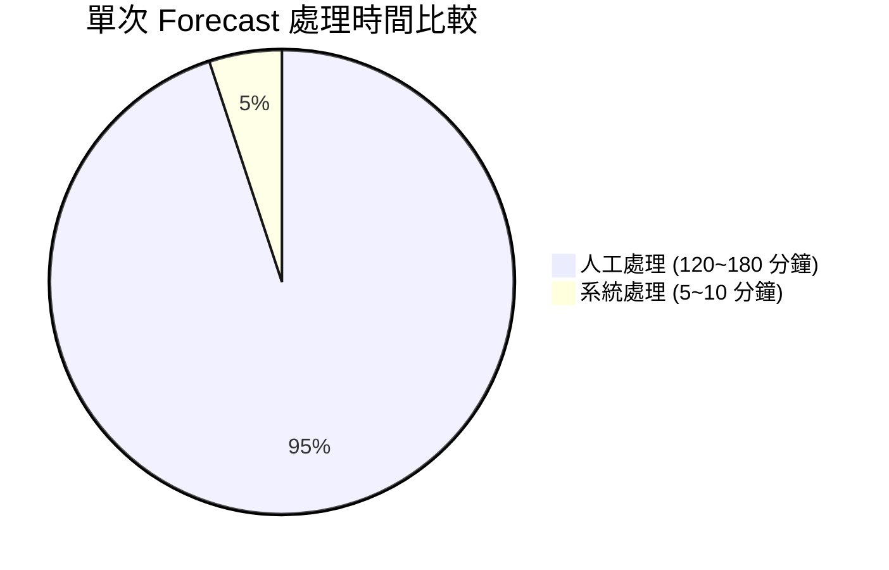

# FORECAST 數據處理系統 — 操作流程與效益說明書

**文件版本**: v1.0
**建立日期**: 2026-03-05
**適用對象**: 客戶端使用者（非技術人員）

---

## 目錄

1. [系統簡介](#1-系統簡介)
2. [操作流程總覽](#2-操作流程總覽)
3. [Step 1：上傳檔案](#3-step-1上傳檔案)
4. [Step 2：數據清理](#4-step-2數據清理)
5. [Step 3：Mapping 整合](#5-step-3mapping-整合)
6. [Step 4：Forecast 預測處理](#6-step-4forecast-預測處理)
7. [Step 5：下載結果](#7-step-5下載結果)
8. [系統如何精準計算數據](#8-系統如何精準計算數據)
9. [時間效益分析](#9-時間效益分析)
10. [常見問題 FAQ](#10-常見問題-faq)

---

## 1. 系統簡介

### 1.1 這套系統做什麼？

FORECAST 數據處理系統是一套**自動化 Excel 報表處理工具**，幫助您：

- 將 **ERP 淨需求** 和 **在途數據** 自動填入 **Forecast 預測報表**
- 取代過去需要人工逐筆比對、手動輸入的繁瑣作業
- 確保數據正確性，避免人工錯誤

### 1.2 誰需要使用？

| 角色 | 使用場景 |
|------|---------|
| **操作人員** | 日常 Forecast 報表處理（上傳 → 處理 → 下載） |
| **管理員** | 管理使用者帳號、查看系統使用紀錄 |
| **IT 人員** | 系統測試、除錯、監控 |

---

## 2. 操作流程總覽

整個操作分為 **5 個步驟**，其中 Step 2~4 為系統自動處理，您只需按下按鈕即可：

> **綠色** = 需要您操作 ｜ **藍色** = 系統自動處理

### 操作時間概覽

| 步驟 | 您需要做的事 | 所需時間 |
|------|------------|---------|
| 登入 | 輸入帳號密碼 | 10 秒 |
| Step 1 | 選擇並上傳 Excel 檔案 | 2～3 分鐘 |
| Step 2 | 按下「開始清理」 | 系統自動（數秒） |
| Step 3 | 按下「開始整合」 | 系統自動（數秒） |
| Step 4 | 按下「開始處理」 | 系統自動（數秒～2 分鐘） |
| Step 5 | 點擊下載 | 10 秒 |
| **合計** | | **約 5～6 分鐘** |

---

## 3. Step 1：上傳檔案

### 3.1 需要準備的檔案

| 檔案名稱 | 說明 | 是否必要 |
|----------|------|---------|
| **ERP 淨需求** | 包含客戶料號、淨需求數量、排程出貨日期等資訊 | 必要 |
| **Forecast 預測表** | 需要被填入數據的目標報表（含週別欄位） | 必要 |
| **在途清單** | 已出貨在途的訂單明細（含 ETA 日期） | 視需求而定 |

### 3.2 操作方式

1. 點擊各區塊的「**選擇檔案**」按鈕
2. 從電腦中選擇對應的 Excel 檔案
3. 系統會自動檢查檔案格式是否正確
4. 全部上傳完成後，點擊「**下一步**」

### 3.3 常見提示

| 情況 | 系統回應 |
|------|---------|
| 格式正確 | 顯示綠色勾勾，可以進行下一步 |
| 缺少必要欄位 | 顯示紅色警告，告知缺少哪個欄位 |
| 檔案格式錯誤 | 提示僅支援 .xls 及 .xlsx 格式 |

> **小提示**：Forecast 支援同時上傳多個檔案，系統會自動合併。

---

## 4. Step 2：數據清理

### 4.1 這一步做什麼？

系統會自動清除 Forecast 報表中**上一輪留下的舊數據**，確保本次處理是乾淨的。

### 4.2 清理範圍

| 清理項目 | 說明 |
|---------|------|
| 供應數量欄位 | 清除上一輪的 ETA QTY 數值 |
| 庫存數量欄位 | 清除上一輪的庫存數據 |
| 報表格式 | 完整保留（字型、框線、顏色不受影響） |

### 4.3 操作方式

點擊「**開始清理**」→ 等待數秒 → 完成後自動進入下一步

---

## 5. Step 3：Mapping 整合

### 5.1 什麼是 Mapping？

Mapping 是一張**對照表**，告訴系統：

> 「某個客戶 / 某個廠區的貨，運送時程是怎麼算的？」

### 5.2 Mapping 設定（僅首次需要）

第一次使用時需設定 Mapping 對照表：

| 欄位 | 範例 | 說明 |
|------|------|------|
| 客戶 / 廠區 | 3A32 | 對應到 Forecast 報表中的區塊 |
| 排程斷點 | 週三 | 每週幾截單（用來計算出貨週期） |
| ETD（出發日） | 下週一 | 預計出發日 |
| ETA（到貨日） | 下下週二 | 預計到貨日 |

> 設定完成後會自動儲存，下次使用不需重新設定。

### 5.3 操作方式

1. （首次）點擊「**配置映射表**」進行設定
2. 點擊「**開始整合**」
3. 系統將 Mapping 資訊加入 ERP 數據中

---

## 6. Step 4：Forecast 預測處理

### 6.1 這是最核心的步驟

系統會根據 ERP 需求和在途數據，**自動計算並填入** Forecast 報表的對應位置。

### 6.2 系統幫您做了什麼？

以下是系統自動完成的工作（過去需要人工處理）：

| 動作 | 過去（人工） | 現在（系統自動） |
|------|------------|----------------|
| 找到對應的 Forecast 區塊 | 肉眼搜尋比對料號 | 自動以料號 + 廠區精準比對 |
| 計算到貨日期 | 手算「下下週二是幾號？」 | 自動由排程斷點 + ETA 規則計算 |
| 找到正確的週別欄位 | 數格子找到對的週 | 自動對應日期到正確欄位 |
| 填入數量 | 手動輸入數字 | 自動填入並累加 |
| 標記已處理的記錄 | 自己做記號 | 自動標記避免重複 |

### 6.3 操作方式

點擊「**開始 FORECAST 處理**」→ 等待處理完成 → 查看處理結果摘要

---

## 7. Step 5：下載結果

### 7.1 操作方式

1. 處理完成後，畫面顯示結果下載區
2. 點擊「**下載**」即可取得完成的 Excel 報表
3. 可選擇返回任一步驟重新處理，或開始新的一輪

---

## 8. 系統如何精準計算數據

### 8.1 整體運算流程

### 8.2 比對邏輯：怎麼找到正確的區塊？

Forecast 報表由多個「區塊」組成，每個區塊代表一個客戶 + 廠區 + 料號的組合。

系統使用**多重欄位比對**，確保資料填入正確位置：

> 就像用「身分證字號」比對一樣——用廠區 + MRP + 料號三個條件，確保 100% 對到正確位置。

### 8.3 日期計算：到貨日怎麼算？

這是系統最核心的智慧計算之一。過去需要人工在腦中換算，現在系統自動完成。

**舉例說明**：

| 已知資訊 | 值 | 意義 |
|---------|-----|------|
| 排程出貨日期 | 2025/02/10（週一） | 這筆訂單的排程日 |
| 排程斷點 | 週三 | 每週三截單結算 |
| ETA 規則 | 下下週二 | 到貨預計在截單後的第二週的週二 |

**換算過程**：
1. 排程出貨日 2/10（週一）→ 該週的「週三」截單 = **2/12**
2. ETA 規則「下下週二」→ 從 2/12 往後推 2 週 = **2/25（週二）**
3. 系統在 Forecast 報表中找到 **2/24～3/2 這一週的欄位**
4. 將淨需求數量填入該欄位

### 8.4 數量累加機制

當多筆 ERP 記錄對應到 Forecast 同一個儲存格時：

> 系統不會覆蓋，而是**自動累加**——確保所有需求都被計入。

### 8.5 防止重複處理

> 每筆記錄處理後會被打上標記，即使重新執行也不會重複計算。

---

## 9. 時間效益分析

### 9.1 效益總覽

### 9.2 各環節時間對比

| 工作環節 | 人工處理 | 系統自動 | 節省時間 |
|---------|:-------:|:-------:|:-------:|
| 比對料號找到 Forecast 區塊 | 30～40 分鐘 | 瞬間完成 | **40 分鐘** |
| 計算 ETA 到貨日期 | 20～30 分鐘 | 瞬間完成 | **30 分鐘** |
| 找到對應週別欄位 | 15～20 分鐘 | 瞬間完成 | **20 分鐘** |
| 手動輸入數量 | 30～45 分鐘 | 瞬間完成 | **45 分鐘** |
| 檢查有無遺漏 / 重複 | 15～20 分鐘 | 自動標記 | **20 分鐘** |
| 格式修正 / 錯誤修正 | 10～20 分鐘 | 無需修正 | **20 分鐘** |
| **合計** | **120～175 分鐘** | **5～10 分鐘** | **約 150 分鐘** |

### 9.3 每月效益估算

以每月處理 **4 次** Forecast 為例：

| 指標 | 人工 | 系統 | 效益 |
|------|:----:|:----:|:----:|
| 單次處理時間 | 2.5 小時 | 8 分鐘 | 節省 95% 時間 |
| 每月處理時間 | 10 小時 | 32 分鐘 | **每月省下 9.5 小時** |
| 每年處理時間 | 120 小時 | 6.4 小時 | **每年省下 114 小時** |
| 出錯率 | 5～10%（人為疏失） | < 0.1%（系統比對） | **錯誤率降低 98%** |

### 9.4 效益示意圖

### 9.5 核心價值

---

## 10. 常見問題 FAQ

### Q1：支援什麼格式的 Excel？
> 支援 **.xls**（舊版 Excel）和 **.xlsx**（新版 Excel）兩種格式。

### Q2：Forecast 可以同時上傳多個檔案嗎？
> 可以。系統支援多檔上傳，會自動合併成一份進行處理。

### Q3：處理後原本的格式（顏色、框線）會不見嗎？
> 不會。系統只修改數值，**完整保留**原始報表的所有格式設定。

### Q4：如果上傳了錯誤的檔案怎麼辦？
> 可以隨時返回 Step 1 重新上傳，不會影響先前的數據。

### Q5：同一筆資料會不會被重複處理？
> 不會。系統會自動標記已處理的記錄，即使重新執行也不會重複計算。

### Q6：Mapping 設定後需要每次重新設定嗎？
> 不需要。Mapping 設定會自動儲存，除非客戶廠區或運送時程有變更，否則一次設定即可持續使用。

### Q7：處理速度大概多快？
> 500 筆 ERP 資料的處理時間通常在 **5 秒以內**，1000 筆以上約 1～2 分鐘。

### Q8：如果系統計算結果跟預期不符？
> 請確認：
> 1. Mapping 對照表是否正確（特別是 ETA 規則）
> 2. ERP 檔案中的排程日期和斷點欄位是否有值
> 3. Forecast 報表的週別日期是否涵蓋到貨日期範圍

---

*本文件為客戶使用指引，如有系統操作上的問題，請聯繫系統管理員。*
