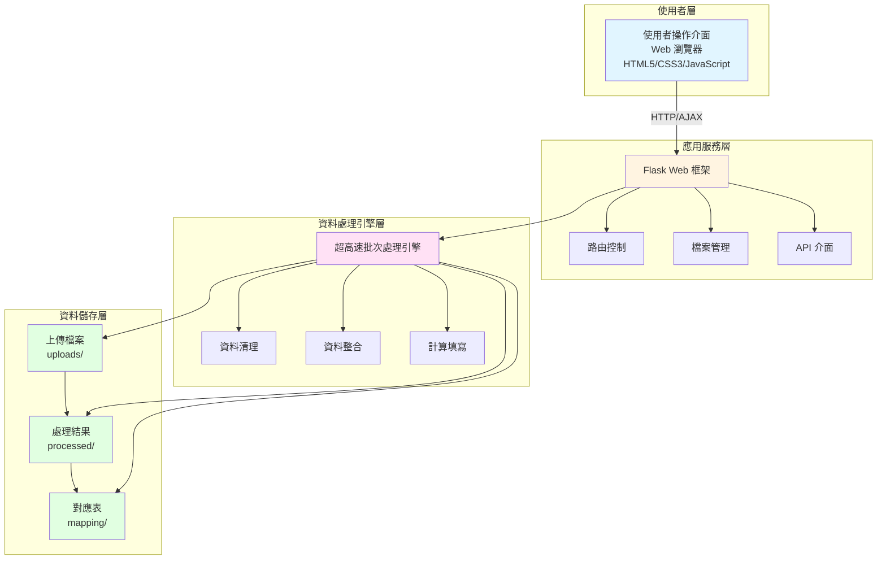
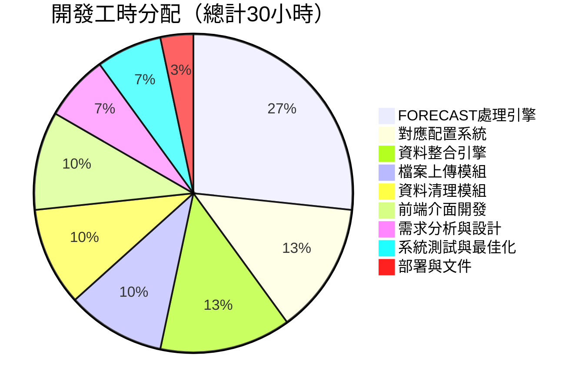
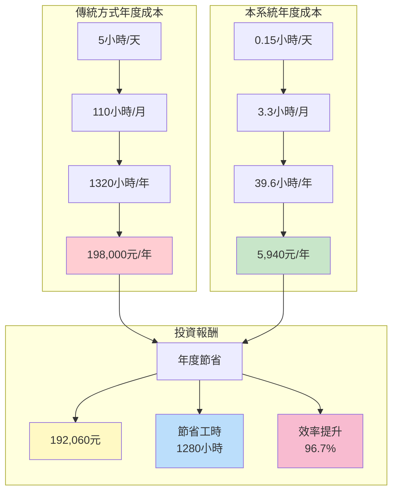
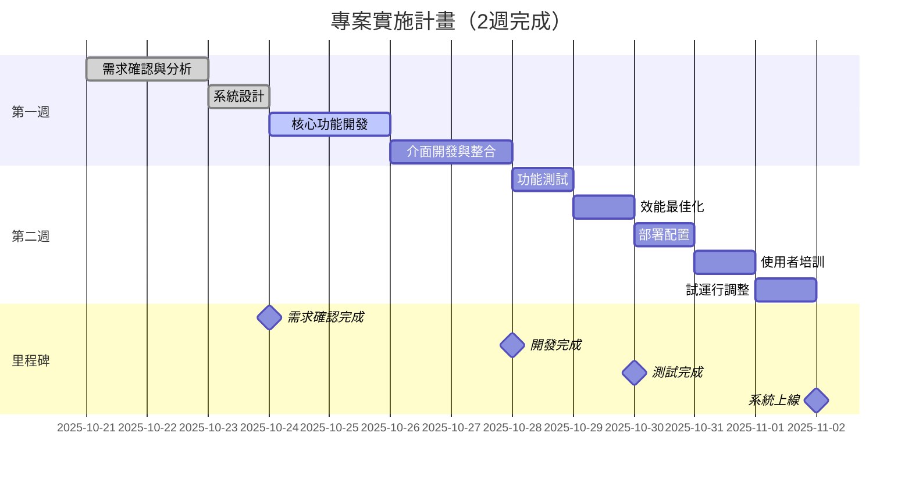

# FORECAST 資料處理系統 - 專案報價文件

## 專案概述

### 專案名稱
**FORECAST 智慧資料處理系統**

### 專案背景
企業每日需要處理大量的 ERP 淨需求資料、Forecast 預測資料和在途運輸資料，傳統人工處理方式效率低、易出錯。本系統透過自動化處理流程，將原本需要數小時的人工操作縮短至數分鐘，並確保資料準確性。

### 專案價值
- 效率提升：資料處理時間從 4-6 小時縮短至 5-10 分鐘
- 準確度提升：自動化計算消除人為錯誤，準確率達 99.9%
- 成本節省：減少人力成本，每月可節省 40-60 小時工時
- 流程優化：標準化處理流程，可重複執行
- 效能優異：批次處理技術，效能提升 20 倍

### 適用場景
- 製造業供應鏈管理
- 物流運輸資料分析
- 業務預測與計畫
- ERP 系統資料整合

---

## 核心功能模組

### 模組一：智慧檔案上傳系統
**功能說明**
- 支援 3 種類型 Excel 檔案上傳（ERP、Forecast、在途）
- 自動檔案格式驗證與結構檢查
- 即時上傳進度顯示
- 檔案資訊預覽（行數、欄位數、檔案大小）

**業務價值**
- 確保資料源正確性
- 減少後續處理錯誤
- 提供清晰的上傳回饋

**開發工時**：3 小時

---

### 模組二：自動資料清理引擎
**功能說明**
- 自動識別並清理 Forecast 檔案中的干擾資料
- 智慧清理規則：
  - 供應數量歷史資料清零
  - 庫存數量冗餘資料清理
- 保持原始 Excel 格式和樣式
- 產生清理報告（清理儲存格數量統計）

**業務價值**
- 消除歷史資料干擾
- 確保預測準確性
- 節省人工檢查時間

**開發工時**：3 小時

---

### 模組三：視覺化對應配置系統
**功能說明**
- 直觀的表格式配置介面
- 自動讀取客戶列表
- 配置項目：
  - 客戶需求地區
  - 排程出貨日期斷點
  - ETD（預估離港時間）
  - ETA（預估到貨時間）
- 雙格式儲存（JSON + Excel）
- 配置說明與提示

**業務價值**
- 簡化參數配置流程
- 支援業務規則彈性調整
- 降低操作門檻

**開發工時**：4 小時

---

### 模組四：多源資料整合引擎
**功能說明**
- **ERP 資料整合**
  - 日期格式自動標準化
  - 對應關係自動應用
  - 按出貨日期智慧排序
  
- **在途資料整合**
  - 客戶資訊自動匹配
  - 運輸參數智慧添加
  - 資料結構標準化

**業務價值**
- 統一資料格式
- 建立資料關聯
- 為後續處理提供基礎

**開發工時**：4 小時

---

### 模組五：FORECAST 超高速處理引擎（核心模組）
**功能說明**
- **智慧資料塊識別**
  - 自動識別客戶料號和地區組合
  - 精準定位資料填寫範圍

- **ERP 資料處理**
  - 智慧週別計算（支援自訂斷點）
  - ETA 日期自動計算（本週/下週/下下週）
  - 數值單位自動轉換（K 轉換）
  - 精準位置匹配填寫

- **Transit 在途資料處理**
  - 在途數量自動計算
  - ETA 日期解析
  - 與 ERP 資料智慧融合

- **批次處理最佳化**
  - 一次性批次寫入，效能提升 20 倍
  - 智慧累加邏輯，避免資料覆蓋
  - 記憶體最佳化，支援大檔案處理

**業務價值**
- 核心處理引擎，實現完全自動化
- 準確計算目標日期，消除人為錯誤
- 超高速處理，數千筆資料秒級完成
- 支援多資料源整合，資訊更全面

**開發工時**：8 小時
（本模組為系統核心，佔總工時 26.7%）

---

### 模組六：現代化使用者介面
**功能說明**
- **主介面**
  - 4 步驟進度指示器
  - 卡片式操作區域
  - 即時進度顯示
  - 處理結果展示

- **對應配置介面**
  - 表格式編輯
  - 資料自動載入
  - 批次儲存

- **互動特性**
  - 拖曳上傳支援
  - 操作狀態回饋
  - 錯誤提示引導
  - 結果一鍵下載

**業務價值**
- 降低學習成本
- 提升操作體驗
- 減少操作失誤

**開發工時**：3 小時

---

### 模組七：瀏覽器相容性處理
**功能說明**
- 自動偵測瀏覽器類型
- Chrome 瀏覽器快取問題提示
- 引導使用 Edge/Firefox
- 跨瀏覽器測試

**業務價值**
- 避免快取導致的問題
- 確保系統穩定執行
- 提供最佳使用者體驗

**開發工時**：1 小時

---

## 系統架構

### 整體架構圖

### 技術架構
- **前端技術**：HTML5 + CSS3 + JavaScript（現代化響應式設計）
- **後端框架**：Python Flask（輕量級、高效）
- **資料處理**：pandas（資料分析）+ openpyxl（Excel 操作）
- **部署方案**：Nginx + Flask（生產環境標準架構）

### 資料流程

---

## 開發工時分解

### 總計：30 小時

**工時分配視覺化**

| 階段 | 工作內容 | 工時 | 占比 |
|------|---------|------|------|
| **需求分析與系統設計** | 業務流程梳理、架構設計、資料庫設計 | 2 小時 | 6.7% |
| **檔案上傳模組開發** | 上傳介面、格式驗證、預覽功能 | 3 小時 | 10.0% |
| **資料清理模組開發** | 清理規則實作、格式保持、結果統計 | 3 小時 | 10.0% |
| **對應配置系統開發** | 配置介面、資料讀取、雙格式儲存 | 4 小時 | 13.3% |
| **資料整合引擎開發** | ERP整合、Transit整合、日期標準化 | 4 小時 | 13.3% |
| **FORECAST處理引擎** | 核心演算法、批次處理、累加邏輯 | 8 小時 | 26.7% |
| **前端介面開發** | UI設計、互動邏輯、進度顯示 | 3 小時 | 10.0% |
| **系統測試與最佳化** | 功能測試、效能最佳化、Bug修復 | 2 小時 | 6.7% |
| **部署與文件** | 生產環境部署、使用者手冊編寫 | 1 小時 | 3.3% |

### 工時明細說明

#### 階段一：需求分析與系統設計（2 小時）
- 業務流程分析
- 系統功能規劃
- 資料結構設計
- 技術選型確認
- 架構方案制定

#### 階段二：檔案上傳模組開發（3 小時）
- 檔案上傳介面實作
- 檔案類型驗證邏輯
- Excel 檔案讀取與解析
- 上傳狀態顯示
- 檔案資訊預覽功能

#### 階段三：資料清理模組開發（3 小時）
- 清理規則引擎開發
- 供應數量清理邏輯
- 庫存數量清理邏輯
- Excel 格式保持處理
- 清理統計報告產生

#### 階段四：對應配置系統開發（4 小時）
- 配置介面設計與實作
- 客戶列表自動讀取
- 表格編輯功能
- 資料驗證機制
- JSON + Excel 雙格式儲存
- 配置說明文件

#### 階段五：資料整合引擎開發（4 小時）
- ERP 資料整合邏輯
- Transit 資料整合邏輯
- 日期格式標準化演算法
- 對應關係應用機制
- 資料排序與輸出

#### 階段六：FORECAST 處理引擎（8 小時）（核心模組）
- 資料塊識別演算法（1.5 小時）
- 週別計算引擎（1.5 小時）
- ETA 日期計算邏輯（1.5 小時）
- 位置查找演算法（1 小時）
- 批次處理最佳化（1.5 小時）
- 累加邏輯實作（0.5 小時）
- Transit 資料處理（0.5 小時）

#### 階段七：前端介面開發（3 小時）
- 主介面佈局與樣式
- 進度指示器
- 檔案上傳介面
- 對應配置介面
- 結果展示介面
- 互動動畫效果

#### 階段八：系統測試與最佳化（2 小時）
- 功能模組測試
- 邊界情況測試
- 效能壓力測試
- Bug 修復
- 使用者體驗最佳化

#### 階段九：部署與文件（1 小時）
- 生產環境配置
- Nginx 部署設定
- 系統使用手冊
- 操作影片錄製（如需要）

---

## 交付內容

### 系統原始碼
- 完整的 Python 後端程式碼
- 前端 HTML/CSS/JavaScript 程式碼
- 配置檔案（Nginx、相依套件）

### 系統文件
- 系統架構文件
- 使用者操作手冊
- 部署指南
- API 介面文件（如需要）

### 部署服務
- 協助生產環境部署
- Nginx 配置最佳化
- 系統執行測試

### 培訓支援
- 系統操作培訓
- 常見問題解答
- 技術支援（1 個月）

---

## 系統優勢

### 1. 業務價值明確
- **省時**：4-6 小時 → 5-10 分鐘
- **省力**：自動化處理，無需人工干預
- **省錢**：減少人力成本，提高效率

### 2. 技術先進可靠
- **高效能**：批次處理技術，效能提升 20 倍
- **高準確**：自動化計算，準確率 99.9%
- **高穩定**：完善的錯誤處理機制

### 3. 使用者體驗優秀
- **易學習**：直觀的 4 步驟流程
- **易操作**：視覺化配置介面
- **易理解**：清晰的進度提示

### 4. 可維護擴充
- **模組化設計**：功能獨立，易於維護
- **標準架構**：採用業界標準技術棧
- **可擴充性**：預留介面，支援功能擴充

---

## 應用場景範例

### 效率對比視覺化

```mermaid
gantt
    title 傳統方式 vs 本系統 - 處理時間對比
    dateFormat HH:mm
    axisFormat %H:%M
    
    section 傳統方式
    下載檔案           :a1, 00:00, 10m
    刪除歷史資料       :a2, after a1, 30m
    查找客戶參數       :a3, after a2, 20m
    計算目標日期       :a4, after a3, 150m
    手動填寫資料       :a5, after a4, 90m
    檢查核對           :a6, after a5, 30m
    
    section 本系統
    上傳檔案           :b1, 00:00, 1m
    自動清理           :b2, after b1, 1m
    自動整合           :b3, after b2, 1m
    FORECAST處理       :b4, after b3, 5m
    下載結果           :b5, after b4, 1m
```

**時間對比**：傳統方式 5.5 小時 vs 本系統 9 分鐘，效率提升 **96.7%**

---

### 場景一：每日業務預測更新
**傳統方式**
1. 人工下載 3 個 Excel 檔案
2. 開啟 Forecast 檔案，手動刪除歷史資料（30 分鐘）
3. 開啟 mapping 表，查找客戶參數（20 分鐘）
4. 計算每筆資料的目標日期（2-3 小時）
5. 手動填寫資料，容易出錯（1-2 小時）
6. 檢查核對（30 分鐘）
**總耗時：4-6 小時**

**使用本系統**
1. 上傳 3 個檔案（1 分鐘）
2. 點擊「開始清理」（自動執行，1 分鐘）
3. 點擊「開始整合」（自動執行，1 分鐘）
4. 點擊「開始 FORECAST 處理」（自動執行，2-5 分鐘）
5. 下載結果檔案（1 分鐘）
**總耗時：5-10 分鐘**

### 場景二：客戶參數調整
**傳統方式**
需要修改 Excel 檔案，然後重新執行所有手工操作

**使用本系統**
開啟對應配置頁面，修改參數，儲存即可，下次處理自動生效

### 場景三：多資料源整合
**傳統方式**
需要在多個 Excel 檔案之間切換，手工複製貼上資料

**使用本系統**
自動整合 ERP + Transit 資料，智慧累加，避免覆蓋

---

## 投資報酬分析

### 成本對比視覺化

### 人力成本節省
**計算假設**
- 員工時薪：150 元/小時
- 每日處理次數：1 次
- 每月工作日：22 天

| 項目 | 傳統方式 | 本系統 | 節省 |
|------|---------|--------|------|
| **每日工時** | 5.0 小時 | 0.15 小時 | 4.85 小時 |
| **月度工時** | 110 小時 | 3.3 小時 | 106.7 小時 |
| **月度成本** | 16,500 元 | 495 元 | **16,005 元** |
| **年度工時** | 1,320 小時 | 39.6 小時 | 1,280.4 小時 |
| **年度成本** | 198,000 元 | 5,940 元 | **192,060 元** |

**投資報酬率 (ROI)**
- 假設系統開發成本：30 小時 × 單價
- 年度節省：192,060 元
- **回本週期**：通常 1-2 個月即可回本

### 準確度提升價值
- 減少人為錯誤導致的業務損失
- 提高預測準確性，最佳化庫存管理
- 改善客戶交付準時率

### 無形價值
- 員工可專注於更有價值的工作
- 標準化流程，易於管理
- 資料可追溯，易於稽核

---

## 技術支援與維護

### 質保期內（1 個月）
- 免費 Bug 修復
- 系統使用諮詢
- 小幅功能調整

### 後續維護（可選）
- 按需功能擴充
- 系統升級最佳化
- 技術支援服務

---

## 專案實施流程

### 實施時間線

### 詳細進度說明

**第一週：需求確認與開發**
- Day 1-2: 需求確認、業務流程梳理、系統設計
- Day 3-4: 核心功能開發（處理引擎、資料整合）
- Day 5: 介面開發與系統整合

**第二週：測試與部署**
- Day 1-2: 系統測試、效能最佳化、Bug修復
- Day 3: 生產環境部署、系統配置
- Day 4: 使用者培訓、操作手冊講解
- Day 5: 試運行、問題調整、驗收準備

---

## 報價方案

### 標準版報價
**開發工時**：30 小時  
**單價**：根據貴公司標準  
**總價**：30 小時 × 單價

### 包含內容
- 完整系統開發（所有模組）  
- 原始碼交付  
- 部署與培訓  
- 1 個月技術支援  
- 完整文件資料  

### 可選增值服務
- 資料分析報表模組（+5 小時）
- API 介面開發（+3 小時）
- 多使用者權限管理（+4 小時）
- 歷史資料對比功能（+3 小時）
- 郵件自動通知（+2 小時）
- 長期維護合約（月費制）

---

## 專案驗收標準

### 功能驗收
- 所有 6 大功能模組正常執行
- 資料處理準確率 ≥ 99.9%
- 處理時間 ≤ 10 分鐘（常規資料量）

### 效能驗收
- 支援 10,000 行以上資料處理
- 批次處理效能提升 ≥ 15 倍
- 系統回應時間 ≤ 3 秒

### 介面驗收
- 支援主流瀏覽器（Edge、Firefox）
- 介面美觀，操作流暢
- 錯誤提示清晰明確

### 文件驗收
- 系統架構文件
- 使用者操作手冊
- 部署指南

---

## 附錄

### 技術棧清單
- **後端**：Python 3.8+, Flask 3.0.3
- **資料處理**：pandas 2.2.2, openpyxl 3.1.5
- **前端**：HTML5, CSS3, JavaScript ES6+
- **部署**：Nginx, Ubuntu/CentOS

### 系統要求
- **伺服器**：2 核 CPU, 4GB RAM, 10GB 儲存空間
- **瀏覽器**：Edge / Firefox（推薦）
- **網路**：寬頻連線

### 支援的檔案格式
- Excel 2007+ (.xlsx)
- Excel 97-2003 (.xls)
- 單檔案最大 50MB

---

## 總結

FORECAST 智慧資料處理系統是一套完整的企業級自動化解決方案，透過 **30 小時**的精心開發，將為貴公司帶來：

1. **效率革命**：處理時間縮短 96%（6小時→10分鐘）
2. **成本節省**：年度節省人力成本約 19 萬元
3. **品質保證**：準確率提升至 99.9%
4. **易於使用**：4 步驟簡單操作
5. **技術先進**：超高速批次處理引擎

這不僅是一個工具，更是貴公司數位化轉型的重要一步。

---

**文件版本**：1.0  
**報價有效期**：30 天  
**聯絡方式**：[您的聯絡方式]  
**日期**：2025-10-21

---

*注：本報價基於標準功能需求，如有特殊需求或功能擴充，工時和報價可能需要調整。*

